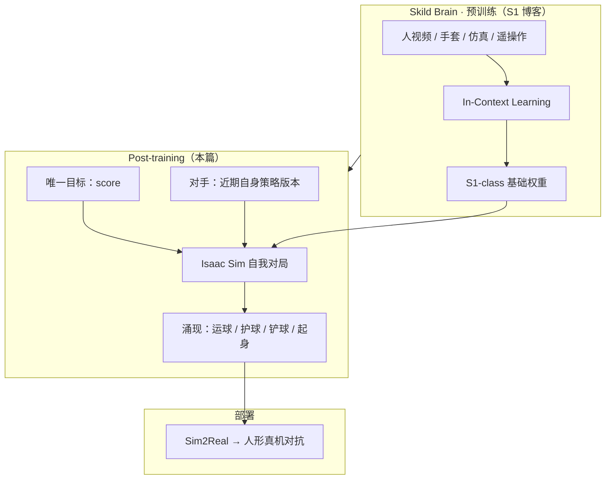

# Skild Physical Self-Play（后训练自博弈）

| 字段 | 内容 |
|------|------|
| **机构** | 斯齐尔德（Skild AI） |
| **类型** | 产业官方博客（非 peer-reviewed 论文） |
| **基础模型** | **S1-class** 机器人基础模型（预训练 + ICL，见 [S1](./skild-s1.md)） |
| **发布** | 2026-09-23 |
| **仿真** | NVIDIA **Isaac Sim** |
| **开源** | **确认未开源**（无代码 / 权重 / 环境；`github.com/skild-ai` 仍 0 公开仓） |

## 一句话定义

**Physical Self-Play** 是 Skild 在 **Skild Brain** 框架里、接在 [S1](./skild-s1.md) 预训练与 ICL 之后的 **post-training**：用 **单一得分目标**，让策略在仿真中与 **自身近期版本** 对抗，涌现高动态灵巧行为（足球场景），并在 **超长仿真对局** 后 **Sim2Real** 到人形真机。

## 英文缩写速查

| 缩写 | 英文全称 | 简要说明 |
|------|----------|----------|
| RL | Reinforcement Learning | 本篇 post-training 机制；自改进 via self-play |
| ICL | In-Context Learning | S1 预训练阶段；本篇之前的能力底座 |
| Sim2Real | Simulation to Reality | 140 年仿真策略迁入真机对抗 |
| RLVR | RL from Verifiable Rewards | 数字域更简单的主流后训练；本篇对照其「自博弈复兴」叙事 |
| AGI | Artificial General Intelligence | 作者将 physical self-play 定位为 physical AGI 点火器 |

## 为什么重要

- **补全 Skild 技术栈叙事：** [S1](./skild-s1.md) 解决 **人类数据上限内的 ICL**；本篇给出 **超越人类演示** 的 post-training 路径——与「预训练只服务 ICL」形成 **两阶段闭环**。
- **自博弈回归物理域：** 把 AlphaGo / AlphaStar 式 **对手随能力共进化** 搬到 **Isaac Sim 人形动态任务**，且 **不显式奖励运球/铲球**（仅 score）。
- **Sim2Real 信号：** 作者将 **仿真→真机足球对抗** 与任务 **动态复杂度** 并列为 physical self-play 的 **green flag**。
- **闭源边界：** 无 benchmark 表、无环境定义；当 **产业方向样本**，不当可复现基线。

## 流程总览

## 核心机制

### 1. 在 Skild Brain 中的位置

| 阶段 | 能力 | 资料 |
|------|------|------|
| Pre-training + ICL | 从上下文示范学任务；受人类数据上限约束 | [S1 实体](./skild-s1.md) |
| **Self-play post-training** | 与近期自我对抗、RL 自改进；宣称可超人类 | **本页** |
| 未来（预告） | 多智能体、协作操纵、城市级导航 | 博客 *At Scale* 节 |

### 2. 训练设定（博客披露粒度）

- **奖励：** 仅 **score**；无 dribble / tackle 等手工 shaping。
- **对手池：** **recent versions of itself** — 能力增益同时抬高对手强度（经典 self-play curriculum）。
- **时间线（作者叙事）：** 仿真「最初数月」几乎不会走 → 「大学年龄」可 **倒地起身** → **约 140 年** 对局后迁真机。
- **涌现技能：** 过人运球、护球、铲抢 — 因有助于 **得分** 而自然出现。

### 3. 为何选足球

- 现有 **robot soccer cup** 性能仍远低于人类；同时考验 **身体控制 + 策略**。
- 作者强调方法 **不绑定体育**，正扩展到 **日常机器人任务**。
- 本库对照：[RoboStriker](./paper-notebook-robostriker.md) 是 **学术侧** 人形拳击 self-play + motion tracking；Skild 是 **闭源产业** 足球 + S1 底座 + Isaac Sim。

### 4. 与数字域 self-play 复兴叙事

博客回顾 AlphaGo Zero / AlphaStar / OpenAI Five，并对比 **RLVR** 在 LLM 时代的简便性；主张 physical self-play 应成为 **physical AGI** 的下一波 **fire-starter**，而非数字 AI  relic。

## 工程实践

| 项 | 实践要点 |
|----|----------|
| **复现入口** | **无官方代码**；开源替代见 [RoboStriker](./paper-notebook-robostriker.md)、Isaac Lab 人形 RL 样例 |
| **仿真栈** | 文中仅点名 [Isaac Sim](./isaac-sim.md)；环境 / 观测 / 动作空间未公开 |
| **评测** | 无公开成功率表；仅有演示视频与定性能力曲线 |
| **Sim2Real** | 与 [sim2real](../concepts/sim2real.md) 主线一致，但 **gap 度量 / 随机化配方** 未披露 |
| **源码运行时序图** | **不适用** — 确认未开源 |
| **与 S1 关系** | 部署前需区分：**ICL 分钟级任务指定** vs **self-play 后训练策略** — 产品文档未说明是否同一权重 |

## 局限与风险

- **确认未开源：** 140 年仿真、score-only 奖励、对手采样策略均 **不可独立验证**。
- **足球演示 ≠ 通用操纵：** 「扩展到日常任务」为 **路线图声明**，无定量迁移表。
- **超长仿真叙事：** 「century-scale」 sim 是 **营销时间线**，不等价于公开可跑的工程 recipe。
- **安全：** 对抗性动态接触（铲球、倒地）在真机侧需 **额外安全层**，博客未讨论。
- **与 RLVR 关系未量化：** 未给出同一底座上 RLVR vs self-play 的对照实验。

## 关联页面

- [Skild AI（公司）](./skild-ai.md)
- [S1：机器人 In-Context Learning](./skild-s1.md) — 预训练 / ICL 前一阶段
- [Reinforcement Learning](../methods/reinforcement-learning.md)
- [Deep RL 游戏里程碑](../concepts/deep-rl-game-milestones.md)
- [Sim2Real](../concepts/sim2real.md)
- [Loco-Manipulation](../tasks/loco-manipulation.md)
- [Isaac Sim](./isaac-sim.md)
- [RoboStriker（人形拳击 self-play）](./paper-notebook-robostriker.md)
- [Bitter Lesson](../concepts/bitter-lesson.md) — 自对弈作为 scaling 范式

## 参考来源

- [Physical Self-Play（博客归档）](../../sources/blogs/skild_physical_self_play_2026-09-23.md)
- [Skild AI 公司站点归档](../../sources/sites/skild-ai.md)

## 推荐继续阅读

- 原文：<https://www.skild.ai/blogs/physical-self-play>
- 前序：[S1: In-Context Learning for Robotics](https://www.skild.ai/blogs/s1)
- Silver et al., *Mastering the game of Go without human knowledge*（AlphaGo Zero 自博弈背景）
