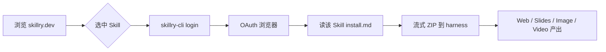

# Skillry

**Skillry**（[skillry.dev](https://skillry.dev)）是 **交付物导向的 Agent Skill 市场**： curated 工作流帮助 Claude Code、Codex、Cursor 等代理产出 **网页、演示文稿、图片与视频**，而非仅约束「怎么写 React」。用户 **先浏览 Skill 页上的示例与安装量**，再通过官方 CLI 安装完整包。

## 一句话定义

用 **订阅制 Skill 目录 + 浏览器登录 CLI**，把代理从「写代码」切换到 **可安装的成品工作流**（landing、deck、OG、片头等），按 **产出类型** 选 Skill，而不是按仓库 star 搜 prompt。

## 英文缩写速查

| 缩写 | 英文全称 | 简要说明 |
|------|----------|----------|
| CLI | Command-Line Interface | `skillry-cli` 负责 login / status |
| OAuth | Open Authorization | 浏览器授权，非粘贴 API key |
| UI | User Interface | Web Skill 主要交付 landing / marketing 页 |
| LLM | Large Language Model | 执行 Skill 内指令的 coding agent |
| ZIP | ZIP archive | 登录后 entitlement 校验通过的私有 Skill 包 |

## 为什么重要（对本知识库读者）

- **与本站 `docs/` 的关系：** 知识在 `wiki/`，读者首触在 **静态站**；若用 agent 做 **一次性高完成度营销页或 deck**，Skillry 偏 **买模板式 Skill**；若长期维护站点设计系统，更宜 [Impeccable](impeccable.md) + [Taste Skill](taste-skill.md)（见 [对比页](../comparisons/skillry-taste-skill-impeccable.md)）。
- **与 skills.sh / find-skills 的分工：** [find-skills](find-skills-skill.md) 教代理在 **公开 Git** 生态检索；Skillry 是 **独立商业目录**，安装路径 **因 Skill 而异**（见官方 `install/agent.md`）。
- **安全模型：** 官方文档要求把 Skill 包与网页视为 **不可信内容** — 与本仓库「Skill 是提示级规约、仍须审计」一致。

## 核心结构

| 层次 | 内容 |
|------|------|
| **发现** | skillry.dev 目录：Featured、Free、Top-rated（Web/Slides/Video/Image） |
| **连接** | `npx --yes skillry-cli@latest login` → 浏览器批准 → `status` |
| **安装** | 每 Skill 独立 `/skills/<slug>/install.md`；Free/Premium 均需登录与 entitlement |
| **定价** | 页显 **$9.99/月**（founding price 文案）；年付选项 |
| **规模** | 用户描述与站点规模约 **~150** 精选 Skill（随库增长） |
| **协议** | Skill 包 **非开源**；服务条款以站点为准 |

### 流程总览（连接 → 安装 → 交付）

## 常见误区或局限

- **误区：Skillry 会替代设计系统文档。** 它交付 **单次任务流**；持续迭代同一产品 UI 仍需 `DESIGN.md` / token（见 Impeccable）。
- **误区：与 `npx skills add` 完全等价。** Skillry 使用 **自有 CLI 与私有包**，不是 skills.sh 公开仓一键 add。
- **局限：** 闭源 Skill **无法像 MIT 仓一样 diff 规则**；企业合规场景需单独评估数据出站与订阅条款。
- **局限：** 机器人仿真 / Isaac 栈 **不在其四品类核心**；价值主要在 **展示层与多媒体交付**。

## 关联页面

- [Taste Skill](taste-skill.md) — 开源生成约束层
- [Impeccable](impeccable.md) — 设计语言 + detector
- [frontend-design（Anthropic）](anthropic-frontend-design-skill.md) — 官方 UI skill 基线
- [find-skills](find-skills-skill.md) — 公开技能发现
- [Skillry vs Taste vs Impeccable](../comparisons/skillry-taste-skill-impeccable.md) — 选型对比
- [前端体验优化清单](../../docs/checklists/frontend-optimization-v1.md) — 本站 docs 工程清单

## 参考来源

- [Skillry 项目页核查（本站）](../../sources/sites/skillry-dev.md)
- [Skillry 安装 agent 指南](https://skillry.dev/install/agent.md)

## 推荐继续阅读

- [Skillry 目录](https://skillry.dev) — 按产出类型浏览与安装量
- [Impeccable 对比案例](https://impeccable.style) — 开源侧 polish/distill 演示
