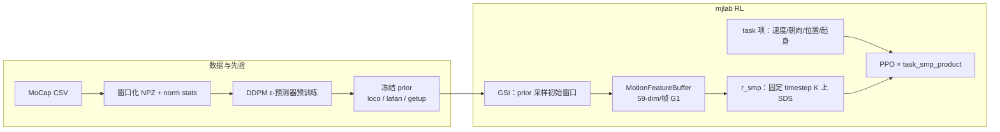

# SMP on G1（mjlab 复现）

**[SUZ-tsinghua/smp](https://github.com/SUZ-tsinghua/smp)** 在 [MimicKit](./mimickit.md) 原版 **未提供 Unitree G1** 配置的前提下，将 [SMP](../methods/smp.md)（Score-Matching Motion Priors）完整移植到 **[mjlab](./mjlab.md)**：运动特征、DDPM 预训练、冻结得分引导、GSI 与 PPO 下游任务一体化，适合作为「**生成式运动先验 + G1 + MuJoCo Warp**」的工程参考实现。

## 为什么重要？

- **方法对照**：与 [AMP_mjlab](./amp-mjlab.md)（对抗判别器 + 参考 clip）并列，展示同一硬件栈上 **扩散先验 / SDS 奖励** 路线的可行管线。
- **开箱训练**：仓库 **内置三套预训练 prior**，环境配置已绑定 checkpoint，可直接 `train` 而无需自跑预训练。
- **奖励设计实验**：采用 **`task × r_smp` 乘性组合**，相对 MimicKit 的加性 `w_task·task + w_smp·r_smp`，减少 task/prior 权重手调（见下文）。

## 流程总览



## 四类任务与 prior 映射

| 任务 ID | 行为 | 默认 prior |
|---------|------|------------|
| `Smp-Forward-G1` | +x 速度跟踪（0.5–5 m/s） | `pretrained_loco.pt` |
| `Smp-Steering-G1` | 速度 + 朝向 | `pretrained_lafan_run.pt` |
| `Smp-Location-G1` | 世界系 xy 目标 | `pretrained_lafan_run.pt` |
| `Smp-Getup-G1` | 跌倒→站立 | `pretrained_getup_f2s2.pt` |

训练 / 回放入口（`uv` 管理依赖）：

```bash
uv sync
uv run scripts/train.py Smp-Forward-G1 --env.scene.num-envs=4096
uv run scripts/play.py Smp-Forward-G1 --wandb-run-path <org>/<project>/<run> --num-envs 4
```

## 乘性奖励：与 MimicKit 的主要分歧

| 形式 | 公式 | 特点 |
|------|------|------|
| **MimicKit 原版** | `r = w_task·task + w_smp·r_smp` | 需调 `task_reward_weight` / `smp_reward_weight` |
| **本复现** | `r = (Σ wᵢ·taskᵢ) × r_smp` | 仅当任务与自然度**同时**高时总得分为高；单边刷分≈0 |

`r_smp` 在固定扩散 timestep 集合 `K` 上计算 ε-预测 MSE，经 `exp(-w_s/|K|·Σ‖ε̂−ε‖²)` 映射；在线特征与预训练一致（G1：**59 维/帧**）。

## GSI 与特征缓冲

- **GSI**：每次 reset 从 prior 预采样 motion window，末帧作为仿真初态，整窗 priming `MotionFeatureBuffer`，使 step 0 起 `r_smp` 有意义。
- **放置不变性**：各 env 重置到各自 scene origin，特征在 **env-origin-relative** 坐标下更新，避免世界网格位置影响引导奖励。

特征布局（与 README 一致）：

`[root_pos(3), root_rot(6), joint_pos(29), ee_pos(15), root_lin_vel(3), root_ang_vel(3)]`

## 与 AMP_mjlab 的选型提示

| 维度 | SMP（本仓） | AMP_mjlab |
|------|-------------|-----------|
| 先验形式 | 冻结扩散模型 + SDS | 在线判别器 + 参考 NPZ |
| 参考数据 | 预训练后 RL 阶段可不碰原始集 | 判别器需 expert rollout |
| 典型强项 | 模块化 prior、无对抗训练 | 成熟 G1 walk+recovery 统一策略 |

方法层对比见 [AMP / ADD / SMP 运动先验变体对比](../comparisons/amp-add-smp-motion-prior-variants.md)。

## 关联页面

- [SMP 方法页](../methods/smp.md)
- [mjlab](./mjlab.md)、[MimicKit](./mimickit.md)
- [AMP_mjlab](./amp-mjlab.md)
- [Unitree G1](./unitree-g1.md)、[LaFAN1](./lafan1-dataset.md)

## 参考来源

- [sources/repos/smp_suz_tsinghua.md](../../sources/repos/smp_suz_tsinghua.md)
- [sources/papers/smp.md](../../sources/papers/smp.md)
- [SUZ-tsinghua/smp](https://github.com/SUZ-tsinghua/smp)
- Mu et al., *SMP: Reusable Score-Matching Motion Priors for Physics-Based Character Control*, arXiv:2512.03028

## 推荐继续阅读

- [MimicKit 原版 SMP 文档](https://github.com/xbpeng/MimicKit/blob/main/docs/README_SMP.md)
- [SMP 论文项目页](https://yxmu.foo/smp-page/)
