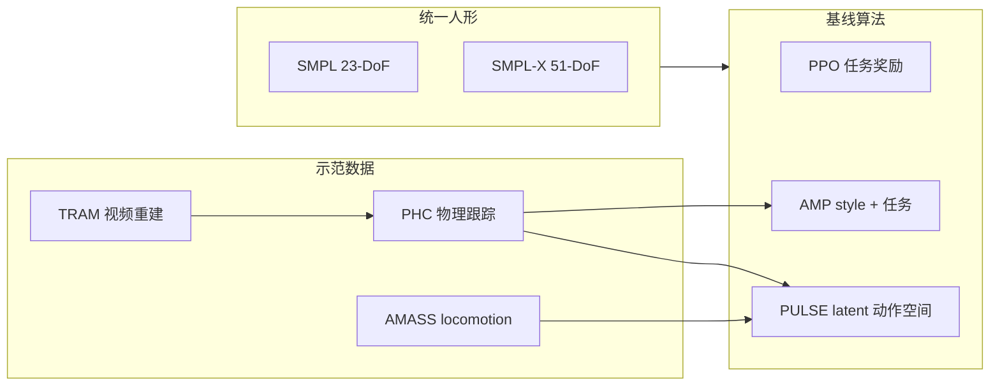

---

type: entity
tags: [benchmark, humanoid, simulation, smpl, sports, reinforcement-learning, isaac-gym, cmu, nvidia]
status: complete
updated: 2026-06-12
arxiv: "2407.00187"
related:
  - ../queries/embodied-eval-benchmark-selection-loop.md
  - ./zhengyi-luo.md
  - ../methods/amp-reward.md
  - ../methods/ase.md
  - ../methods/table-tennis-strategy-skill-learning.md
  - ../tasks/locomotion.md
  - ../concepts/motion-retargeting.md
sources:
  - ../../sources/papers/smplolympics_arxiv_2407_00187.md
  - ../../sources/repos/smplolympics.md
  - ../../sources/sites/smplolympics-github-io.md
summary: "SMPLOlympics：SMPL/SMPL-X 统一仿真人形上的 10 项奥运风格运动 benchmark；提供基线 reward/state 与 PPO/AMP/PULSE 对照，并示范 TRAM→PHC 视频示范管线。"
---

# SMPLOlympics（仿真人形体育环境套件）

**SMPLOlympics**（Luo et al., [arXiv:2407.00187](https://arxiv.org/abs/2407.00187)）在 **Isaac Gym** 中为 **SMPL / SMPL-X 兼容** 的物理人形提供 **10 项奥运风格运动** 的统一训练与评测环境，并给出每项运动的 **goal-conditioned 状态/奖励基线** 与 **PPO、AMP、PULSE** 算法对照。

## 一句话定义

**同一 SMPL 族仿真人形 + 统一 RL 管线下的多运动 benchmark**——用标准化体育任务检验「运动先验 + 简单任务奖励」能否产生类人且可度量的竞技行为。

## 英文缩写速查

| 缩写 | 英文全称 | 简要说明 |
|------|----------|----------|
| SMPL | Skinned Multi-Person Linear Model | 24 关节参数化人体，本套件无指任务人形基底 |
| SMPL-X | SMPL with eXpressions | 含手指的扩展人体模型，用于标枪/篮球等 |
| AMP | Adversarial Motion Prior | 判别器 style reward，体育任务中易与任务奖励冲突 |
| PULSE | Physics-based Universal Latent Space | AMASS 预训练 motion latent，作分层 RL 动作空间 |
| MoCap | Motion Capture | 动捕或视频重建的人类参考运动 |
| RL | Reinforcement Learning | 各运动默认 PPO 族 on-policy 训练 |

## 为什么重要

- **补全 locomotion-only benchmark 空白**：相对 dm_control / OpenAI Gym 人形任务，体育场景同时考察 **操纵、协调、对抗与可解释成绩**（距离、命中率、完赛时间）。
- **SMPL 生态对齐**：人形与视觉/图形社区 **SMPL 参数直接兼容**，可用 **TRAM + PHC** 从转播视频抽示范，降低专项运动数据成本。
- **先验方法对照清晰**：论文系统展示 **PPO vs AMP vs PULSE (+AMP)** 在田赛与球类上的典型失败模式（AMP 站定刷 style、PPO 不自然高分等）。

## 运动清单

| 类型 | 环境 |
|------|------|
| 田赛 | 跳高、跳远、跨栏、标枪、高尔夫 |
| 球类单人/度量 | 网球发球练习、乒乓球练习、足球点球、篮球罚球 |
| 对抗 | 网球 1v1、乒乓球 1v1、击剑、拳击；足球 1v1/2v2 |

竞争性任务含 **交替自博弈**（冻结一方、训练另一方）；足球/篮球团队 reward 为 rudimentary 起点，论文明确弱于专用系统（如 DeepMimic Soccer）。

## 主要技术路线

## 实验结论（归纳）

- **PULSE** 在跨栏、跳高（可自发 Fosbury 式过杆）等田赛上最类人；无专项 MoCap 时长距离受限。
- **PULSE + AMP + 视频示范** 在乒乓球上 **连续回球数** 最佳；纯 AMP 易忽视落点精度。
- **课程学习** 对跳高 1.5 m 杆与 110 m 跨栏完赛必不可少。

## 常见误区

- **不是真机 benchmark**——面向 **物理角色动画 / 仿真人形 RL**；与 [ZEST](../methods/zest.md) 等硬件迁移工作正交。
- **reward 非最优**：论文自述团队运动 reward 仅为起点，不宜直接当作 SOTA 足球/篮球控制器。

## 关联页面

- [Zhengyi Luo](./zhengyi-luo.md) — 第一作者与 PULSE/PHC 主线
- [Table Tennis Strategy & Skill Learning](../methods/table-tennis-strategy-skill-learning.md) — 合作者 Jiashun Wang 的专项乒乓球分层方法
- [AMP & HumanX](../methods/amp-reward.md)
- [ASE](../methods/ase.md)
- [Locomotion](../tasks/locomotion.md)
- [Motion Retargeting](../concepts/motion-retargeting.md)
- [具身大模型评测基准选型闭环](../queries/embodied-eval-benchmark-selection-loop.md) — 本页可归入其 ③ 策略任务成功率评测层：SMPL 人形 10 项运动 benchmark（PPO/AMP/PULSE 基线）

## 参考来源

- [SMPLOlympics 论文摘录](../../sources/papers/smplolympics_arxiv_2407_00187.md)
- [项目页](../../sources/sites/smplolympics-github-io.md)
- [GitHub 仓库](../../sources/repos/smplolympics.md)
- [arXiv:2407.00187](https://arxiv.org/abs/2407.00187)

## 推荐继续阅读

- [PULSE 深读笔记](https://imchong.github.io/Humanoid_Robot_Learning_Paper_Notebooks/papers/01_Foundational_RL/PULSE_Physics-based_Universal_Latent_Space/PULSE_Physics-based_Universal_Latent_Space.html)
- [SMPLOlympics GitHub](https://github.com/SMPLOlympics/SMPLOlympics)
