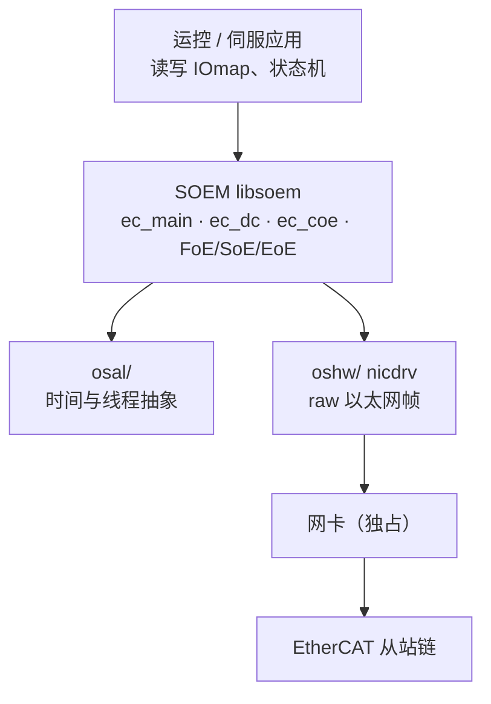
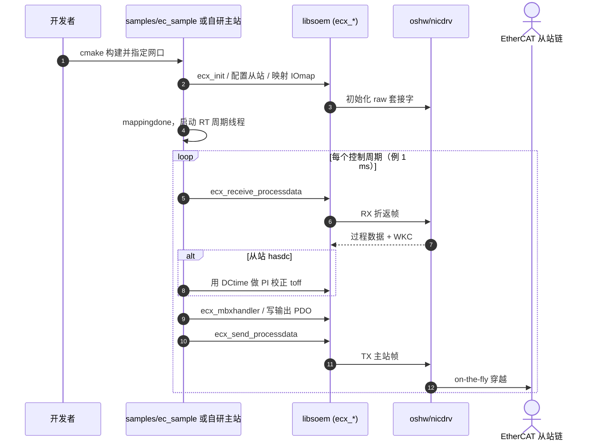

# SOEM

**SOEM（Simple Open EtherCAT Master）** 是面向实时嵌入式与通用 OS 的 **开源 EtherCAT MainDevice 库**：以 ANSI-C 实现用户态主站，通过 raw socket / 平台 nicdrv 独占网口收发过程数据。官方仓 [OpenEtherCATsociety/SOEM](https://github.com/OpenEtherCATsociety/SOEM)；介绍页 [openethercatsociety.github.io](https://openethercatsociety.github.io/)；由 [RT-Labs](http://www.rt-labs.com) 维护文档与商业支持。

## 英文缩写速查

| 缩写 | 英文全称 | 简要说明 |
|------|----------|----------|
| SOEM | Simple Open EtherCAT Master | 本页：用户态开源 EtherCAT 主站库 |
| EtherCAT | Ethernet for Control Automation Technology | 工业以太网现场总线（on-the-fly + DC） |
| CoE | CANopen over EtherCAT | 最常用应用层；对象字典 / PDO / SDO |
| DC | Distributed Clock | 从站硬件级时钟同步 |
| WKC | Working Counter | 帧内工作计数器，判定 PDO 交换是否成功 |
| IgH | IgH EtherCAT Master | EtherLab 内核态主站（与 SOEM 对照） |
| GPL | GNU General Public License | SOEM 开源侧许可（v3）；另有商业许可 |

## 为什么重要

- wiki 在 [EtherCAT 主站优化](../queries/ethercat-master-optimization.md) 与 [总线选型](../comparisons/can-vs-ethercat-joint-bus.md) 中反复写「SOEM vs IgH」，需要 **可编译链接的实体锚点**；SOEM 填补用户态主站侧。
- **轻量、跨平台**：官方支持 Linux / Windows / RT-Kernel；contrib 含 RTEMS、VxWorks、macOS 等——适合工控机原型与嵌入式 MainDevice。
- 与 [CanFestival](./canfestival.md) 正交：CanFestival 管 **CAN 上的 CANopen**；SOEM 管 **以太网上的 CoE 主站**。高端人形「套餐 3」常是 EtherCAT + CoE + PREEMPT_RT，见 [底软协议总览](../overview/motor-drive-firmware-bus-protocols.md)。

## 核心原理

### 栈分层

- **输入：** 网口名 + 从站 ESI/自动发现配置；应用填充 `IOmap` 输出 PDO。
- **机制：** 主站发过程数据帧 → 从站 on-the-fly 读写 → 折返；可选 DC 对齐；邮箱路径跑 CoE SDO 等。
- **输出：** 输入 PDO（位置/力矩反馈等）；`WKC` 与从站状态机（Init / Pre-Op / Safe-Op / Op）。

### 模块与 samples

| 模块 / 示例 | 作用 |
|-------------|------|
| `src/ec_main.c` 等 | 状态机、过程数据、从站列表 |
| `src/ec_dc.c` | 分布式时钟 |
| `src/ec_coe.c` 等 | CoE / FoE / SoE / EoE |
| `samples/slaveinfo` | 扫描总线、打印从站与映射 |
| `samples/ec_sample` | 1 ms 级周期线程 + DC 同步 PI |

典型复现：`cmake -DSOEM_BUILD_SAMPLES=ON` → `slaveinfo <ifname>` 确认拓扑 → 基于 `ec_sample` 接自己的 PDO / CiA 402 状态机。

### 源码运行时序图

对齐 [OpenEtherCATsociety/SOEM](https://github.com/OpenEtherCATsociety/SOEM) 的 `samples/ec_sample`：映射完成后 RT 线程循环 `ecx_receive_processdata` →（可选）DC `ec_sync` → `ecx_send_processdata`。

关键路径：先用 `slaveinfo` 验证 WKC 与 PDO 映射，再把 `ec_sample` 的周期线程接到关节指令；生产环境叠加 PREEMPT_RT / CPU 隔离，见 [主站优化指南](../queries/ethercat-master-optimization.md)。

## 工程实践

| 项 | 建议 |
|----|------|
| 何时选 SOEM | 科研原型、嵌入式 MainDevice、希望 **用户态库** 快速集成；团队暂不想编内核模块 |
| 何时改 IgH | 量产、要压极限抖动、可接受专用网卡驱动与内核维护成本 |
| Linux 权限 | raw socket 通常需 root 或 `CAP_NET_RAW`；网口建议专用于 EtherCAT |
| 实时 | SOEM 实时性取决于应用线程调度；务必配合 PREEMPT_RT、隔离核、禁 `printf` 于热路径 |
| 许可 | 开源产品可用 GPLv3；**闭源商业固件/整机** 按 `LICENSE.md` 评估商业许可 |
| 文档 | `docs.rt-labs.com/soem` 需登录；公开调试以 samples + ETG / 驱动器 ESI 为准 |

## 局限与风险

- **用户态抖动上限：** 相对 IgH 内核路径，调度与网卡中断更易引入抖动；kHz+ 全身环需认真做 RT 调优，不能「链接了 SOEM 就等于工业级」。
- **双许可合规：** GPLv3 传染风险与商业许可费用是产品化硬门槛；勿假设「开源 = 可任意闭源嵌入」。
- **文档门禁：** 官方 Sphinx 文档需 RT-Labs 账号；社区问答与 samples 是公开主入口。
- **不等于 CiA 402 全家桶：** 栈提供 CoE 通信；伺服 Profile / PDO 映射 / 安全回退仍要按驱动器 ESI 与运控自行实现。
- **贡献 CLA：** 上游贡献需签 RT-Labs CLA，fork 长期维护需评估。

## 关联页面

- [EtherCAT 协议基础](../concepts/ethercat-protocol.md) — on-the-fly 与 DC 概念
- [EtherCAT 主站优化指南](../queries/ethercat-master-optimization.md) — SOEM vs IgH 与抖动排查
- [EtherCAT vs EtherNet/IP](../comparisons/ethercat-vs-ethernet-ip.md)
- [CAN vs EtherCAT 关节总线选型](../comparisons/can-vs-ethercat-joint-bus.md)
- [电机驱动器底软通信协议总览](../overview/motor-drive-firmware-bus-protocols.md) — 「高端人形」EtherCAT + CoE 套餐
- [实时运控中间件配置指南](../queries/real-time-control-middleware-guide.md)
- [时钟同步算法](../concepts/clock-synchronization-algorithms.md)
- [CanFestival](./canfestival.md) — CAN 侧 CANopen 栈对照

## 参考来源

- [sources/repos/soem.md](../../sources/repos/soem.md)
- [sources/sites/openethercatsociety-github-io.md](../../sources/sites/openethercatsociety-github-io.md)
- 代码：<https://github.com/OpenEtherCATsociety/SOEM>
- 项目页：<https://openethercatsociety.github.io/>

## 推荐继续阅读

- SOEM 仓库 README 与 `samples/`：<https://github.com/OpenEtherCATsociety/SOEM>
- 姊妹从站栈 SOES：<https://github.com/OpenEtherCATsociety/SOES>
- EtherCAT Technology Group：<https://www.ethercat.org/>
- RT-Labs（文档与商业许可）：<http://www.rt-labs.com>
