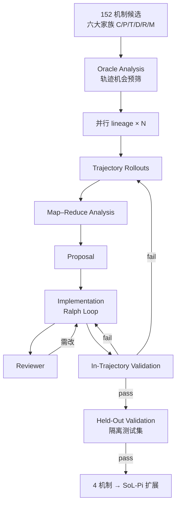
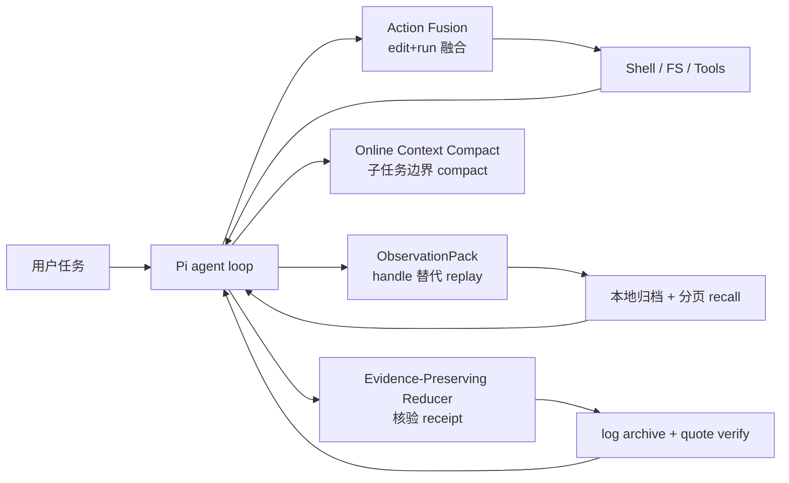
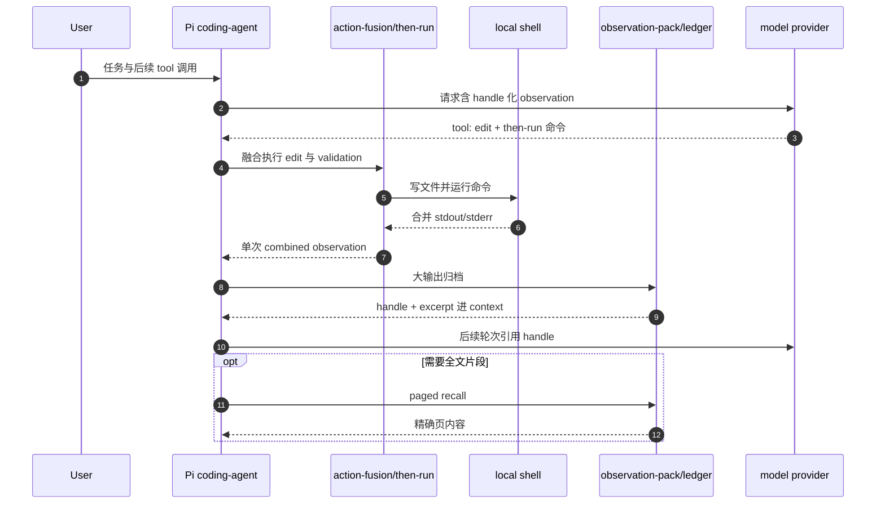

# SoL-Pi（Scaling Auto-Research Loops for Efficient Agent Harnesses）

**SoL-Pi** 是 [NVIDIA NVLabs](https://nvlabs.github.io/SoL-Pi/) 在 **[Pi](https://github.com/earendil-works/pi)** coding-agent harness 上，通过 **规模化 auto-research 环** 搜索并打包的四条 **token 效率机制** 的开源扩展（[NVlabs/SoL-Pi](https://github.com/NVlabs/SoL-Pi)，MIT）。核心命题：在放大 **递归自改进（RSI）** 之前，先让 **harness 本身更省** — 少重复 turn、少 replay 大 observation、少用 frontier 读整段 log，且 **不牺牲验证与证据**。

## 一句话定义

用 **并行 auto-research lineage + capability floor** 在公开轨迹与可执行环境里搜索 harness 杠杆，把 survive 的四条机制做成 **Pi 公共 extension API 上的 opt-in 插件**，在长时程 agent 任务上 **显著降 token/API 成本** 同时 **近似保留 Pi 任务质量**。

## 英文缩写速查

| 缩写 | 英文全称 | 简要说明 |
|------|----------|----------|
| SoL-Pi | Scaling auto-research Loops for Pi | 本页 harness 扩展与 auto-research 管线总称 |
| RSI | Recursive Self-Improvement | AI 改 AI 研发栈；本工作先攻 harness 效率再谈放大 RSI |
| BFS | Breadth-First Search | 多 idea 并行 lineage；页面报告 ~1/40 起点 survive |
| API | Application Programming Interface | 评测用官方 API 等价定价计成本 |
| Pi | Pi coding agent | `@earendil-works/pi-coding-agent`；SoL-Pi 为其扩展，非官方发行 |
| EdgeBench | EdgeBench benchmark | 51 任务长时程 held-out；搜索与最终评测隔离 |

## 核心信息

| 项 | 内容 |
|----|------|
| **机构** | 英伟达（NVIDIA / NVLabs） |
| **项目页** | <https://nvlabs.github.io/SoL-Pi/> |
| **代码** | <https://github.com/NVlabs/SoL-Pi> |
| **许可** | MIT |
| **开源结论** | **已开源** — 四 extension + 配置文档；**非 Pi 官方包** |
| **基底 harness** | Pi 0.84.2（README 测试版）；机制默认 **全关**，显式配置才启用 |
| **预印本** | 截至入库日 **无** SoL-Pi 专用 arXiv；以项目页 + 仓库为主 |

## 为什么重要

- **Harness 层复利：** 与 [HarnessBank](./paper-harnessbank.md) 同轴 — 冻结或昂贵 backbone 时，**改 harness 比改权重便宜**；SoL-Pi 强调 **跨任务可复用的交互浪费**（replay、冗余 turn、全文 log），降低 benchmark 过拟合式「偷答案」风险。
- **Auto-research 可扩展实例：** 152 候选 → 4 机制、535 训练环境、**disposable skill loop** 编排，是 [AI Auto-Research](../concepts/ai-auto-research.md) **S3** 在 **harness 研究** 上的工业级对照，显式引用 [karpathy/autoresearch](./karpathy-autoresearch.md) 环。
- **RSI 前置问题：** 页面与 [递归自改进](../concepts/recursive-self-improvement.md) 对话 — RSI 也耗 token；**efficiency for efficiency** 指更省 harness 可支撑更大搜索预算。
- **对本库机器人读者：** 真机/仿真 [autoresearch 闭环](../queries/real-robot-policy-autoresearch-harness.md) 与 [ENPIRE](../methods/enpire.md) 依赖 **长轨迹 coding agent**；SoL-Pi 是 **通用软件 harness 效率包**，可叠在 Pi 类宿主上降 overnight 实验成本，但 **不** 替代 reset/verify 环境工程。

## 核心原理

### Auto-research 管线（152 → 4）

- **Capability floor：** 能力指标在预声明容忍带内，且至少一项效率指标改进；拒绝早停、跳过验证、藏证据式「省钱」。
- **环境：** 495 GitHub issue–PR 轨迹环境 + 40 verifier 合成；**EdgeBench 不参与搜索**，仅 held-out 评测。
- **编排：** 从 compiled YAML workflow → 长寿命 coordinator 代码 → **单次实验 disposable skill loop 模板**（可并行数百 lineage）。

### 四条机制（Composable extensions）

| 区域 | 机制 | 要点 |
|------|------|------|
| Tools | **Action Fusion** | 编辑/写入 + 后续 bash 本地融合为 **一次 tool call**；省中间 model turn |
| Context | **Online Context Compact** | **子任务完成** 为 compaction 候选点，结合窗口/经济检查触发 Pi 原生 compact |
| Observations | **ObservationPack** | 大 tool 输出 **归档 + handle**；按需 **分页精确 recall**，避免全文进每轮 prompt |
| Delegation | **Evidence-Preserving Reducer** | 廉价 agent 读长 log → **receipt**；frontier 只收 **逐行可核验** 引用 |

共享规则：**不改 Pi 源码**；缺配置即关；失败 **fail-open** 保留原 observation；模型/认证仍由 Pi 管。

### 流程总览（运行时）

## 源码运行时序图

对齐 [NVlabs/SoL-Pi](https://github.com/NVlabs/SoL-Pi) README 与 `src/sol-pi/extensions/`：`pi install` 后各 extension 在 Pi 公共 hook 上注册；以下以 **Action Fusion + ObservationPack** 组合为例。

复现路径：`npm install -g @earendil-works/pi-coding-agent@0.84.2` → `pi install git:github.com/NVlabs/SoL-Pi` → 按 `docs/configuration.md` 逐项 **opt-in** 启用机制。

## 工程实践

| 项 | 建议 |
|----|------|
| **何时用** | 长时程 Pi 会话（数小时 tool 环）、大 log/大文件输出反复出现、edit→run 模式密集 |
| **宿主** | 仅 **Pi 0.84.x** 测试栈；非 [DeepSeek Harness](./deepseek-harness.md) / [OpenClaw](./openclaw.md) 直接插件 |
| **启用方式** | **默认全关**；生产前在代表任务上 A/B，确认 capability floor 对你的 verifier 仍成立 |
| **与 HarnessBank** | HarnessBank 偏 **冻结 LLM + 语义银行进化**；SoL-Pi 偏 **已验证的四条运行时机制** + auto-research 发现故事 |
| **局限** | Terminal-Bench 4 solve 率低于 Pi/Codex（15/63）；swarm 实验 **单次非随机**；无专用 arXiv |

## 实验与评测（项目页摘要）

- **EdgeBench（held-out，`xhigh`）：** SoL-Pi **~94%** Pi 平均分；相对 Pi **−45–49%** tokens、**~−33%** 成本；相对原生 Codex/Claude Code harness **−35–64%** tokens、**−50–54%** API 等价成本。
- **Terminal-Bench 4（63 CPU）：** 15/63 solved，总成本 **$211** vs Pi **$286** / Codex **$272**；per-solved **$14.07**。
- **Swarm（performance take-home，120 min）：** Sol + 20 SoL-Pi workers **1127 cycles / $60.11** vs stock Pi swarm **1366 / $82.12**（页面自述不可因果归因）。

## 局限与风险

- **任务质量 trade-off：** 组合机制后平均仍 **~6%** 相对 Pi 分数落差；TB4 **solve 数** 未全面领先。
- **Pi 版本钉死：** 扩展依赖 public API；Pi 大版本升级需对照 `docs/compatibility.md`。
- **搜索不可复现全貌：** 152 lineage 与内部环境合成 **非一键复跑**；开源的是 **survivor 机制**，非完整 auto-research 集群。
- **RSI 叙事边界：** 「efficiency for efficiency」为 **长期愿景**；当前证据是 **单次研究 cycle** 的成本/分数曲线。

## 与其他页面的关系

- [karpathy/autoresearch](./karpathy-autoresearch.md) — 页面内环模板；SoL-Pi 将其扩展到 **harness 机制搜索 + 多环境 breadth**。
- [HarnessBank](./paper-harnessbank.md) — 同为 harness 进化；HarnessBank **门控+基因库**，SoL-Pi **四条已落地 Pi 插件**。
- [DeepSeek Harness](./deepseek-harness.md) / [OpenClaw](./openclaw.md) — 其他 coding harness 宿主；机制 **不直接移植**。
- [AI Auto-Research](../concepts/ai-auto-research.md) — 生命周期与验证分层。
- [递归自改进](../concepts/recursive-self-improvement.md) — 「先 efficiency 再 scale RSI」。
- [真机策略 autoresearch 闭环](../queries/real-robot-policy-autoresearch-harness.md) — 机器人侧 reset/verify 前提。

## 参考来源

- [SoL-Pi 项目页（NVLabs）](../../sources/sites/sol-pi-nvlabs.md)
- [NVlabs/SoL-Pi 仓库](../../sources/repos/nvlabs-sol-pi.md)

## 关联页面

- [karpathy/autoresearch](./karpathy-autoresearch.md)
- [HarnessBank](./paper-harnessbank.md)
- [AI Auto-Research](../concepts/ai-auto-research.md)
- [递归自改进](../concepts/recursive-self-improvement.md)
- [DeepSeek Harness](./deepseek-harness.md)

## 推荐继续阅读

- [SoL-Pi 项目页](https://nvlabs.github.io/SoL-Pi/) — 方法、四机制动画与 EdgeBench 曲线
- [NVlabs/SoL-Pi](https://github.com/NVlabs/SoL-Pi) — 安装、`docs/configuration.md`
- [EdgeBench](https://edge-bench.org/) — 长时程 agent 评测套件
- [karpathy/autoresearch program.md](https://github.com/karpathy/autoresearch/blob/master/program.md) — 经典 propose→implement→eval 环
- Kong et al., *AI for Auto-Research* — [arXiv:2605.18661](https://arxiv.org/abs/2605.18661)
