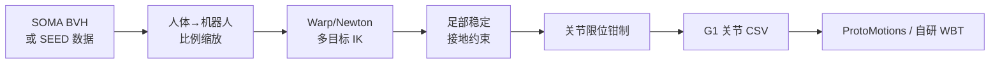

# SOMA Retargeter

**SOMA Retargeter**（<https://github.com/NVIDIA/soma-retargeter>，Apache-2.0）将 **[SOMA-X](./soma-x.md)** 统一比例骨架上的 **BVH 人体运动** 转为 **人形机器人关节 CSV**，使用 [Newton](./newton-physics.md) + NVIDIA Warp 做 GPU 加速多目标 IK，并内置人体–机器人比例缩放、足部稳定与逐 DoF 限位钳制。

## 英文缩写速查

| 缩写 | 英文全称 | 简要说明 |
|------|----------|----------|
| SOMA | Standardized Open Motion Avatar | NVIDIA 标准化人体骨架/网格模型系 |
| IK | Inverse Kinematics | 多目标逆运动学求解 |
| G1 | Unitree G1 Humanoid | 当前官方主推输出机型（29 DoF） |
| BVH | Biovision Hierarchy | 常见动捕骨骼动画文件格式 |
| SEED | Skeletal Everyday Embodiment Dataset | SOMA 骨架大规模人体运动数据集 |

## 为什么重要

- **NVIDIA 人形栈一环**：与 [GENMO](../methods/genmo.md)、[Kimodo](./kimodo.md)、[ProtoMotions](./protomotions.md)、SONIC 并列出现在官方 README「Related Work」。
- **数据闭环**：HuggingFace [SEED](https://huggingface.co/datasets/bones-studio/seed) 中 G1 轨迹即由本工具重定向生成，降低「只有人体数据、没有机器人参考」的摩擦。若已有 **SMPL-X / LAFAN1 CSV** 而非 SOMA BVH，可对照 [robot_retargeter](./robot-retargeter.md)（mink IK + 多机型并排）选型。
- **工程形态清晰**：交互 OpenGL viewer + headless 批处理 `bvh_to_csv_converter.py`，适合资产管线而非在线遥操。

## 流程总览

## 工程要点

- **输入约束**：期望 SOMA 统一比例骨架；非 SOMA BVH 需先对齐骨架定义。
- **输出**：机器人可播放 CSV；可接 ONNX / 仿真训练管线。
- **状态**：活跃开发，API 可能变更；额外机型在 roadmap。

## 关联页面

- [SOMA-X](./soma-x.md)
- [Motion Retargeting](../concepts/motion-retargeting.md)
- [GMR](../methods/motion-retargeting-gmr.md)
- [ProtoMotions](./protomotions.md)
- [Unitree G1](./unitree-g1.md)

## 参考来源

- [SOMA Retargeter 仓库归档](../../sources/repos/soma_retargeter.md)
- [NVlabs/SOMA-X 仓库归档](../../sources/repos/nvlabs-soma-x.md)
- [GENMO 论文归档中的 NVIDIA 栈互链](../../sources/papers/genmo.md)

## 推荐继续阅读

- [机器人论文阅读笔记：GENMO](https://imchong.github.io/Humanoid_Robot_Learning_Paper_Notebooks/papers/14_Human_Motion/GENMO__A_Generalist_Model_for_Human_Motion/GENMO__A_Generalist_Model_for_Human_Motion.html)
- GitHub：<https://github.com/NVIDIA/soma-retargeter>
- SEED 数据集：<https://huggingface.co/datasets/bones-studio/seed>
