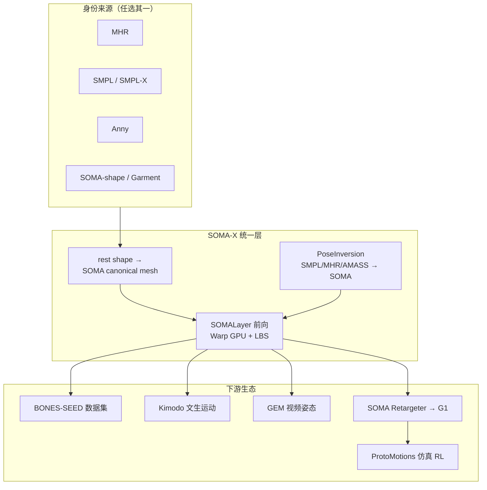

# SOMA-X（统一参数化人体模型）

**SOMA-X**（[NVlabs/SOMA-X](https://github.com/NVlabs/SOMA-X)，PyPI `py-soma-x`，[arXiv:2603.16858](https://arxiv.org/abs/2603.16858)）实现 **SOMA**——**Standardized Open Motion Avatar** 的 canonical **body topology and rig**，作为 SMPL、SMPL-X、MHR、Anny、GarmentMeasurements 等异构参数化人体的 **统一枢纽**：不替换各身份模型，而是把多样 **rest shape** 映射到 **单一共享表示**，使 **身份来源与姿态数据在推理时可自由组合**，全管线在 **NVIDIA Warp** 上 **端到端可微、GPU 加速**。

## 英文缩写速查

| 缩写 | 英文全称 | 简要说明 |
|------|----------|----------|
| SOMA | Standardized Open Motion Avatar | NVIDIA 统一人体拓扑与 rig 表示系 |
| SMPL | Skinned Multi-Person Linear Model | 经典参数化人体网格与姿态模型 |
| MHR | Meta Human Rig（Facebook MHR） | Meta 高保真人体身份模型，SOMA 默认身份 |
| LBS | Linear Blend Skinning | 线性混合蒙皮，SOMA 前向与逆拟合核心 |
| IK | Inverse Kinematics | 姿态逆解；PoseInversion 为顶点级逆 LBS 拟合 |
| SEED | Skeletal Everyday Embodiment Dataset | SOMA 格式大规模人体动捕数据集 |

## 为什么重要

- **消除「每对模型一个 adapter」**：要把 Anny 的年龄控制与 SMPL 运动数据结合、或把 MHR 身份与 AMASS 姿态对齐，传统做法需为 **每一对** 模型写定制转换；SOMA 提供 **单一动画语言**，降低数据管线与下游机器人栈的集成成本。
- **NVIDIA 人形数据栈的表示底座**：与 [GENMO](../methods/genmo.md)/GEM、[Kimodo](./kimodo.md)、[BONES-SEED](https://huggingface.co/datasets/bones-studio/seed)、[SOMA Retargeter](./soma-retargeter.md)、[ProtoMotions](./protomotions.md)、SONIC 形成 **「估计/生成 → 统一骨架 → 重定向/仿真」** 闭环。
- **工程可落地**：`pip install py-soma-x` 即可用；配套 **SMPL/MHR/AMASS→SOMA** 转换与 **Analytical PoseInversion**（单序列可达 **千帧/秒** 量级），适合批量资产管线而非仅论文演示。

## 核心结构

| 模块 | 作用 |
|------|------|
| **`SOMALayer`** | 全身体前向：`identity_model_type`（mhr / smpl / smplx / anny / soma / garment）+ 姿态 `(B, J, 3)` + 可选 scale → 顶点等 |
| **`PoseInversion`** | 从其他模型姿态拟合到 SOMA：**Analytical**（逆 LBS + Newton-Schulz，默认极快）或 **Autograd FK**（6D 旋转优化，更高精度） |
| **`soma.geometry`** | FK、LBS、skeleton fitting、Warp 内核 |
| **`soma.io`** | NPZ / USD 工作流辅助 |
| **统一 Pose Correctives（Beta）** | 为 Anny、GarmentMeasurements 等 **无原生 correctives** 的模型也提供姿态相关形变修正 |

### 支持的身份模型

| 模型 | 特点 |
|------|------|
| **MHR** | 默认；高保真体型 |
| **Anny** | 适合儿童与年龄跨度 |
| **SMPL / SMPL-X** | 与领域标准互操作（需单独许可与模型文件） |
| **SOMA-shape** | 本项目 PCA 体型（128 系数） |
| **GarmentMeasurements** | CAESAR 服装测量 PCA 模型 |

### 流程总览

## 转换与性能（README 级 benchmark）

| 工具 | 典型场景 | 默认 Analytical 速度 | 备注 |
|------|----------|----------------------|------|
| `smpl2soma` | SMPL 动画 → SOMA | ~1279 FPS（402 帧，RTX 5000 Ada） | 可选 `--autograd-iters` 精修 |
| `mhr2soma` | SAM 3D Body / MHR parquet | ~342 FPS（200 样本） | 端到端受 MHR TorchScript 评估主导 |
| `convert_amass_to_soma` | AMASS `.npz` 批量 | ~17393 FPS（A100） | 输出含 `per_vertex_error` 等质量字段 |

输出 NPZ 通常含 `poses`、`root_translation`、`joint_names`、`identity_coeffs`、`scale_params` 等，可直接进入 SEED 生态或 [SOMA Retargeter](./soma-retargeter.md)。

## 工程要点

- **安装**：`pip install py-soma-x`；SMPL 需 `pip install "py-soma-x[smpl]"` 与单独下载 `SMPL_NEUTRAL.pkl`；开发克隆需 **Git LFS** 拉取 `assets/`。
- **文档**：API-first 站点 [nvlabs.github.io/SOMA-X/stable](https://nvlabs.github.io/SOMA-X/stable/) 与仓库 `docs/` 同步。
- **许可分层**：代码 Apache-2.0；SMPL/SMPL-X **模型资产** 受 Max Planck 等第三方许可约束，不可随仓库再分发。

## 常见误区

- **SOMA ≠ 重定向工具**：SOMA-X 解决 **人体表示统一**；机器人关节轨迹需 [SOMA Retargeter](./soma-retargeter.md) 或 GMR 等 **下游** 模块。
- **不等于替换 SMPL**：现有 SMPL 数据与工具链仍可用；SOMA 提供 **枢纽层** 而非废弃 SMPL。
- **Pose Correctives 仍为 Beta**：跨模型 correctives 能力在迭代中，集成前宜核对版本 changelog。

## 关联页面

- [Motion Retargeting](../concepts/motion-retargeting.md)
- [SOMA Retargeter](./soma-retargeter.md)
- [GENMO / GEM](../methods/genmo.md)
- [Kimodo](./kimodo.md)
- [ProtoMotions](./protomotions.md)
- [AMASS](./amass.md)

## 参考来源

- [NVlabs/SOMA-X 仓库归档](../../sources/repos/nvlabs-soma-x.md)
- [SOMA-X 官方文档站归档](../../sources/sites/soma-x-docs.md)
- [SOMA 技术报告（arXiv:2603.16858）](../../sources/papers/soma_arxiv_2603_16858.md)

## 推荐继续阅读

- GitHub：<https://github.com/NVlabs/SOMA-X>
- 文档：<https://nvlabs.github.io/SOMA-X/stable/>
- 论文：<https://arxiv.org/abs/2603.16858>
- SEED 数据集：<https://huggingface.co/datasets/bones-studio/seed>
