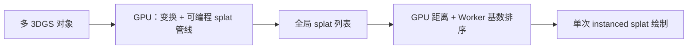

# Spark（Web 3DGS 渲染器）

**Spark** 是 [World Labs](./world-labs.md) 维护的 **开源 3D Gaussian Splatting（3DGS）** 渲染栈，面向 **THREE.js + WebGL2** 生态，覆盖桌面、移动与 VR 浏览器。与 [GS-Playground](./gs-playground.md) 等 **仿真训练用批量 3DGS** 不同，Spark 解决的是 **多对象合成、实时编辑/重光照、4DGS 动画与超大场景流式浏览** 的 Web 交付问题。

## 一句话定义

用 **全局 splat 管线 + Spark 2.0 连续 LoD + .RAD 流式 + 虚拟 splat 显存** 在普通浏览器里稳定渲染 **百万到上亿 splat** 的可组合 3D 世界。

## 为什么重要

- **3DGS 工程词典**：排序、多对象深度合成、LoD、分块流式与显存分页是 2024–2026 产业界反复出现的瓶颈；Spark 2.0 博客给出了可引用的 **公开实现叙事**（含 Tiny-LoD / Bhatt-LoD、RADC 块格式）。
- **与机器人知识库的关系**：不替代物理仿真，但可作为 **Real2Sim 外观预览、数字孪生漫游、数据管线质检** 的轻端查看器；与 [生成式世界模型](../methods/generative-world-models.md) 中「3D 世界生成」分支直接相邻。
- **开源可集成**：文档与示例在 [sparkjs.dev](https://sparkjs.dev/)；`build-lod` CLI 可将常见 3DGS 资产转为流式 **.RAD**。

## 渲染管线（Spark 1.x 主干）

- **多对象全局排序**：避免「对象各自排序、像贴纸叠在一起」的伪影。
- **可编程 splat 处理**：GLSL 或节点图，支持重着色、SDF 裁剪、4DGS 帧插值等，无需改核心渲染循环。

## Spark 2.0 扩展（归纳）

| 模块 | 要点 |
|------|------|
| **LoD splat 树** | 连续 LoD：子 splat 合并为父节点；优先队列按屏幕尺寸遍历，复杂度 ~O(splat budget) |
| **建树** | Web：**Tiny-LoD**（快）；CLI：**Bhatt-LoD**（Bhattacharyya 形状相似度，质量优先） |
| **.RAD 格式** | `RAD0` 元数据 + 64K splat 的 **RADC** 块；列序压缩 + 随机 seek；首块粗预览 |
| **虚拟 splat 内存** | GPU 固定 **16M splat** 池，64K 页 LRU 映射多 .RAD 文件 |
| **实现** | LoD 遍历：**Rust → Wasm**，跑在 Web Worker，不阻塞主线程 |

**Foveated rendering**：通过 `coneFov*` / `behindFoveate` 把 splat 预算偏向视锥中心，在固定 budget 下提高主观清晰度。

## 常见误区或局限

- **≠ 物理仿真器**：高质量 splat 浏览不蕴含接触动力学或可执行约束。
- **WebGL2 排序代价**：距离读回 CPU 再排序是 Web 约束下的工程折中，极端动态场景仍需 profiling。
- **与 [Aholo Viewer](./aholo-viewer.md) 的差异**：Spark 深度绑定 THREE.js 与 World Labs/Marble 管线；Aholo 强调 Chunked Streaming LoD 与 **Mesh 混渲**，见 [对比页](../comparisons/spark-vs-aholo-web-3dgs-renderers.md)。

## 关联页面

- [World Labs](./world-labs.md)
- [Aholo Viewer](./aholo-viewer.md)
- [GS-Playground](./gs-playground.md)
- [Spark vs Aholo（Web 3DGS 渲染选型）](../comparisons/spark-vs-aholo-web-3dgs-renderers.md)
- [生成式世界模型](../methods/generative-world-models.md)

## 英文缩写速查

| 缩写 | 英文全称 | 简要说明 |
|------|----------|----------|
| GPU | Graphics Processing Unit | 图形处理器，大规模并行仿真训练的算力基础 |
| CPU | Central Processing Unit | 中央处理器 |

## 参考来源

- [World Labs Spark 2.0 技术博客归档](../../sources/blogs/worldlabs_spark_2_0_streaming_3dgs.md)
- [World Labs 官方站点归档](../../sources/sites/worldlabs-ai.md)

## 推荐继续阅读

- [Streaming 3DGS worlds on the web（Spark 2.0）](https://www.worldlabs.ai/blog/spark-2.0)
- [Spark 文档](https://sparkjs.dev/)
