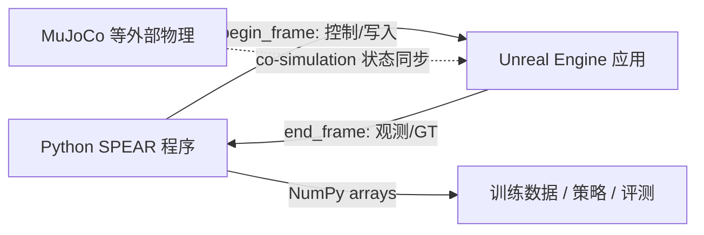

---

type: entity
tags: [repo, simulation, unreal-engine, photorealistic, embodied-ai, synthetic-data, computer-vision, nvidia]
status: complete
updated: 2026-06-21
related:
  - ./airsim.md
  - ./metahuman.md
  - ./mujoco.md
  - ./isaac-gym-isaac-lab.md
  - ../queries/simulator-selection-guide.md
  - ../concepts/simulation-evaluation-infrastructure.md
  - ../concepts/sim2real.md
sources:
  - ../../sources/repos/spear-sim.md
summary: "SPEAR 是把任意 Unreal Engine 项目变成 Python 可编程具身 AI 后端的仿真库：14K+ UE 反射 API、56 FPS 级 1080p 光真实感渲染与 Hypersim 级 GT 模态，并以 begin_frame/end_frame 事务在单帧内确定性执行控制—观测闭环。"
---

# SPEAR（Photorealistic Embodied AI Simulator）

**SPEAR**（[spear-sim/spear](https://github.com/spear-sim/spear)）是面向 **光真实感具身 AI 与合成视觉** 的 **Unreal Engine 可编程仿真库**。它用 Python 经插件 **启动或连接** 任意 UE 应用，把 UE 反射系统可见的 C++ 面暴露为原生式 Python API，并提供高速相机传感器与丰富 ground-truth 图像模态。

## 英文缩写速查

| 缩写 | 英文全称 | 简要说明 |
|------|----------|----------|
| SPEAR | Simulator for Photorealistic Embodied AI Research | 本库全称，ECCV 2026 论文系统 |
| UE | Unreal Engine | Epic 实时 3D 引擎，SPEAR 的运行宿主 |
| GT | Ground Truth | 仿真器提供的真值标注（深度、法线、语义 ID 等） |
| PCG | Procedural Content Generation | UE 程序化内容生成，SPEAR 可脚本驱动 |
| API | Application Programming Interface | 应用程序编程接口 |
| AI | Artificial Intelligence | 人工智能；具身 AI 强调智能体在环境中感知—行动 |

## 为什么重要

现有光真实感仿真器常在 **通用性、可编程性、渲染速度** 上折中：要么绑定固定游戏场景，要么 Python 可调面窄，要么 GT 模态不全。SPEAR 的三条主线回应这些痛点：

1. **通用 UE 后端**：不限于单一机器人或地图；官方示例覆盖 CitySample、StackOBot、CropoutSample、GameAnimationSample、ElectricDreams、MetaHumans 等 **in-the-wild UE 项目**。
2. **可编程面扩大**：官方称暴露 **14K+** 独立 UE 函数，较既有 UE 类仿真器约 **一个数量级**；用户亦可用 `UFUNCTION` / `UPROPERTY` 自行扩展。
3. **合成数据吞吐**：1920×1080 beauty 帧直写 NumPy 约 **56 FPS**，并提供深度、法线、实例/语义 ID、**非漫反射内禀分解**、材质 ID、PBR 参数等 GT——覆盖并扩展 [Hypersim](https://github.com/apple/ml-hypersim) 类模态。

对机器人研究：SPEAR 更适合 **「已有 UE 资产 / 数字人 / 城市场景 + 需要脚本化控制与高速标注渲染」** 的路线，而非替代 [Isaac Lab](./isaac-gym-isaac-lab.md) 的 **万级 GPU 并行 RL 环境**。

## 核心结构/机制

### 1) 实例与事务式帧模型

- `spear.Instance` 根据 `user_config.yaml` **启动新 UE 进程或附着已有进程**。
- **`begin_frame` / `end_frame` 配对**：同一 UE 帧内，前者执行控制/写入（spawn、设变换、下发动作），后者读取观测；Python 返回即副作用在 UE 中立即可见，便于 **单帧确定性** 与具身 **action→observation** 对齐。
- **`call_async.*`**：对 UE 函数发非阻塞调用，在 `end_frame` 用 `future.get()` 取回（如 `K2_GetComponentLocation`）。

### 2) 相机与 GT 管线

可定制相机传感器：beauty + 多类监督模态同步输出到 NumPy，服务 **视觉策略训练、域随机化、内禀/材质监督** 与数据集构建。

### 3) 协同仿真与场景编辑

- **MuJoCo co-sim**：MuJoCo viewer 交互施力，实时查询刚体状态，SPEAR 同步更新对应 UE 场景——适合 **物理在 MuJoCo、视觉在 UE** 的分工。
- **PCG / 光照**：脚本平移 PCG 实体、旋转天光模拟昼夜等。
- **NL 场景编辑**：示例将视觉-语言 coding assistant 生成的 SPEAR 程序用于文本驱动场景操作。

## 流程总览

## 常见误区或局限

- **误区：SPEAR = 又一个 legged_gym** — 官方主线是 **任意 UE 项目的可编程与渲染**，不是开箱即用的万环境 RL 训练栈；大规模 on-policy 并行需自行 orchestration。
- **误区：UE 反射 API 即高保真动力学** — 复杂接触/摩擦仍可能依赖 **MuJoCo 等外环**（官方 co-sim 示例即此分工）。
- **局限：栈重量** — 依赖 UE 工具链与 GPU；工程门槛高于 [MuJoCo](./mujoco.md) / [Genesis](./genesis-sim.md) 类轻量 Python 仿真。
- **局限：生态年轻** — ECCV 2026 论文配套开源；与 RSL-RL / Isaac Lab 的集成成熟度不可直接类比。

## 与其他系统的关系

| 对比对象 | 分工 |
|----------|------|
| [AirSim](./airsim.md) | 同为 UE 视觉仿真；AirSim 偏 **UAV/AD + PX4**，项目已进入维护期；SPEAR 偏 **通用 UE 反射 + 高速 GT + 具身多智能体示例** |
| [Isaac Lab](./isaac-gym-isaac-lab.md) | Isaac 栈强在 **GPU 并行 RL 与传感器仿真**；SPEAR 强在 **绑定现有 Epic 样例与自定义 UE 项目** 的光真实感可编程性 |
| [MuJoCo](./mujoco.md) | 接触物理金标准；SPEAR 示例 **MuJoCo 驱动物理、UE 驱视觉**，适合 sim2sim 式分工 |
| [MetaHuman](./metahuman.md) | 数字人资产与表演；SPEAR 演示 **MetaHumans 多视角同步渲染**，数字人作视觉层、SPEAR 作控制/采集层 |

## 关联页面

- [Locomotion RL 仿真器选型指南](../queries/simulator-selection-guide.md) — 补充「UE 光真实感 / 合成数据」分支
- [仿真评测基础设施](../concepts/simulation-evaluation-infrastructure.md) — 高速闭环渲染与 GT 对评测与数据飞轮的意义
- [Sim2Real](../concepts/sim2real.md) — 合成视觉与域随机化迁移
- [AirSim](./airsim.md) — 经典 UE 机器人视觉仿真对照
- [MetaHuman](./metahuman.md) — UE 数字人资产链

## 参考来源

- [sources/repos/spear-sim.md](../../sources/repos/spear-sim.md)
- [spear-sim/spear](https://github.com/spear-sim/spear)
- Roberts et al., *SPEAR: A Simulator for Photorealistic Embodied AI Research* (ECCV 2026)

## 推荐继续阅读

- [SPEAR Getting Started](https://github.com/spear-sim/spear/blob/main/docs/getting_started.md)
- [Hypersim 数据集](https://github.com/apple/ml-hypersim) — SPEAR GT 模态对齐参考
- [Epic City Sample](https://www.unrealengine.com/en-US/city-sample) — 官方多智能体示例场景之一
