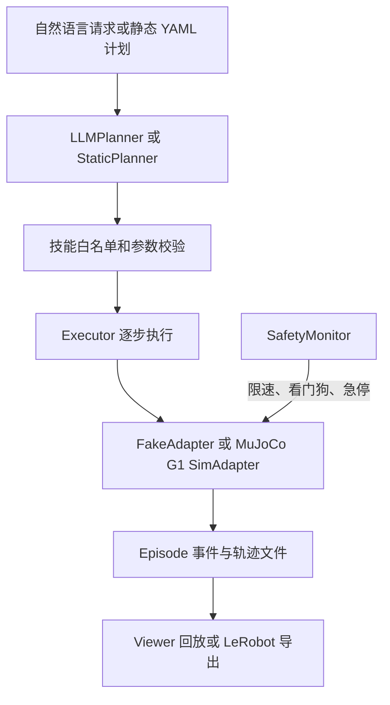

# Spingi（Unitree G1 分层物理 Agent 原型）

## 一句话定义

**Spingi** 是面向人形机器人的 sim-first Physical Agent Runtime：它把自然语言任务或静态 YAML 计划转成可验证的技能步骤，在 MuJoCo 的 Unitree G1 原型上执行，并把过程写成可回放的 episode。

## 英文缩写速查

| 缩写 | 英文全称 | 简要说明 |
|------|----------|----------|
| LLM | Large Language Model | 可选的任务计划生成器，只能提议已登记的技能步骤 |
| G1 | Unitree G1 Humanoid Robot | Spingi 当前 MuJoCo 场景使用的人形机器人模型 |
| JSONL | JSON Lines | episode 中逐事件、逐轨迹样本记录的文本格式 |
| e-stop | Emergency Stop | Runtime 将其视为终止事件，不允许对急停后的机器人重试 |

## 为什么重要

- **把 Agent 与低层控制分层：** LLM 只提交技能计划，Executor 执行已实现的任务技能；模型不直接输出 G1 关节命令或力矩。这为物理 Agent 原型提供了清晰的权限边界。
- **安全和失败处理进入执行流程：** 计划可声明失败后的重试/人工升级策略；Runtime 有限速、围栏、电量、watchdog、deadline 与 terminal e-stop 处理。
- **仿真与数据回放是同一个开发闭环：** 每次执行保存结构化 episode，Viewer 可在浏览器查看轨迹、事件和相机帧；episode 还可转成有限字段的 LeRobot 格式供后续工具读取。
- **容易误读的“物理 Agent”：** 当前重点是任务级规划、技能编排和执行生命周期，不是完整 locomotion policy、全身动力学控制器或已部署的 G1 真机 Agent。

## 核心信息

| 字段 | 内容 |
|------|------|
| 项目 | [ceccode/spingi](https://github.com/ceccode/spingi) |
| 项目页 | [Spingi Viewer](https://spingi-viewer.netlify.app/) |
| 运行时 | Python 包 `spingi`；Python 3.11+、uv |
| 仿真 | MuJoCo Unitree G1；另有 FakeAdapter 用于单元测试 |
| 计划器 | 静态 YAML 或 LLM Planner；README 默认 Anthropic Claude，需 API key |
| 技能 | navigate、detect、pick、place、inspect、wait_for_human、say |
| 项目状态 | README 标注 runtime M3 complete、Viewer v0.2（2026-10-04） |
| 代码许可 | Apache-2.0；仓内 G1 模型资产保留 BSD-3-Clause notices |
| 真机 adapter | 尚未提供；项目 README 将其列为未来 M4 |

## 流程总览



计划是按序步骤列表，不支持自由生成控制代码或任意动作循环。LLM 计划进入 Executor 前会通过与静态 YAML 相同的验证；失败计划被拒绝，不会直接执行。

## 架构与运行边界

### Agent 层与 Runtime 层

LLM Planner 根据用户请求、技能摘要和场景中的符号化信息生成结构化计划。它看不到原始关节遥测或相机帧，也不能修改地理围栏、速度上限等安全参数。计划只允许技能注册表中的技能和对应参数；发生校验错误时可带错误信息重试一次，之后拒绝运行。

Executor 按计划逐步运行技能。失败动作由计划中的策略决定：重试、跳过、终止或请求人工。当前没有通用的规划树、循环执行器或任意代码工具调用；复杂分支需要新的计划。

### MuJoCo G1：运动学原型，不是动态步行控制

Spingi 的 MuJoCo 场景使用 vendored G1 模型，按 20 ms tick 将 pelvis/base 运动学地移向目标，腿维持站立姿态。MuJoCo 主要提供碰撞判断、场景几何和相机渲染；手臂动作和抓取尚未形成真实关节控制。

因此，仿真可用于检查任务计划、路线、事件生命周期、碰撞处理和软件安全逻辑，但不能用来证明步态稳定、跌倒恢复、动力学接触或 G1 真机 Sim2Real 性能。详见仓库 [ADR-0006](https://github.com/ceccode/spingi/blob/main/adr/0006-kinematic-sim-adapter-with-g1-model.md)。

### Episode、Viewer 与 LeRobot

每次 `spingi run` 输出一份 episode，包括执行计划与场景快照、manifest、events.jsonl、trajectory.jsonl，以及可选帧/视频。Viewer 静态解析 ZIP 并重建轨迹，不运行物理仿真；官方说明 episode 在浏览器内读取，不会上传。

LeRobot v3 导出目前是有限的低维记录：10 Hz base x/y/yaw 与 gripper state/action；相机帧不是固定频率连续序列，暂未导出。因此不能把此导出直接当作完整视觉模仿学习数据集。

## 工程实践

在支持 Python 3.11+ 与 uv 的环境中：

```bash
cd runtime
make setup
make demo-sim
```

仓库还提供重复仿真 benchmark，例如对感知加入 false-negative 与位置噪声，再依据成功率、人工请求、fatal runs 和安全违例执行 gate。该 gate 是 Runtime 场景回归标准，不等于真机性能承诺或功能安全认证。

| 检查点 | 阅读 / 使用建议 |
|---------|------------------|
| 计划边界 | 阅读 [ADR-0003](https://github.com/ceccode/spingi/blob/main/adr/0003-llm-proposes-runtime-disposes.md) 和 [ADR-0010](https://github.com/ceccode/spingi/blob/main/adr/0010-llm-planner-structured-output.md)，确认 LLM 只能提议注册技能 |
| 急停 | 阅读 [ADR-0011](https://github.com/ceccode/spingi/blob/main/adr/0011-robot-time-and-terminal-estop.md)；真实机器人仍需硬件 SDK command timeout |
| 运行记录 | 以 [Episode Format](https://github.com/ceccode/spingi/blob/main/docs/episode-format.md) 为 Runtime/Viewer 交换契约 |
| 开源状态 | Runtime 与 Viewer 源码已公开；没有真机 adapter，也没有随仓库发布的模型权重或训练数据集 |

## 与相邻系统的区别

| 对照对象 | 区别 |
|----------|------|
| 人形低层 locomotion / WBC | Spingi 把任务拆成 navigate/pick/place 等技能；没有输出 G1 关节级 gait 或全身控制策略 |
| MuJoCo | MuJoCo 是物理引擎；Spingi 在其上实现计划执行、技能、安全监控与 episode 管理 |
| LeRobotDataset v3 | LeRobot 定义数据格式；Spingi Runtime 负责生成 episode，当前导出只覆盖低维 state/action |
| G1 真机栈 | Spingi 当前提供的是 FakeAdapter 与 MuJoCo SimAdapter；真机硬件 adapter 尚未交付 |

## 局限与风险

- **仿真控制近似：** G1 base 被运动学移动，四肢保持站立模型；不能从视频回放推断动态行走或抓取已经实现。
- **真机部署未具备：** 仓库现有材料没有 Unitree G1 硬件 adapter、低层电机接口或真机实验结果。
- **安全边界：** 软件围栏、看门狗与 e-stop 是 Runtime 的设计/仿真行为；ADR 指出 watchdog 与主运行时同进程，实际系统仍须硬件侧命令超时兜底。
- **LeRobot 导出信息有限：** 只有低维 base/gripper 数据，没有固定帧率相机序列，不足以据此声称已形成大规模视觉训练数据。
- **LLM 计划器依赖 API：** 默认 Claude 计划需要外部 API key；静态 YAML 和 FakeAdapter/MuJoCo 路径无需调用 LLM。

## 关联页面

- [Unitree G1](./unitree-g1.md) — 当前仿真本体
- [MuJoCo](./mujoco.md) — Spingi 的场景与碰撞模拟器
- [机器人安全状态机](../concepts/robot-safety-state-machine.md) — 软件运行时安全监控与硬件安全链的边界
- [LeRobotDataset v3](../concepts/lerobot-dataset-v3.md) — 当前 episode 导出的目标数据格式

## 参考来源

- [Spingi GitHub 仓库归档](../../sources/repos/spingi.md)
- [Spingi Viewer 项目页核查](../../sources/sites/spingi-viewer.md)

## 推荐继续阅读

- [Spingi GitHub README](https://github.com/ceccode/spingi)
- [Spingi Runtime README](https://github.com/ceccode/spingi/blob/main/runtime/README.md)
- [Episode Format](https://github.com/ceccode/spingi/blob/main/docs/episode-format.md)
- [项目 Viewer](https://spingi-viewer.netlify.app/)
