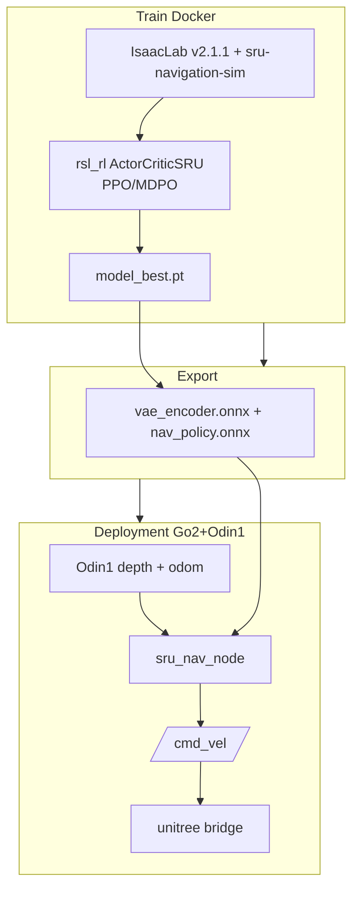

# SRU-Odin（SRU × Odin1 部署套件）

**SRU-Odin**（[ManifoldTechLtd/SRU-Odin](https://github.com/ManifoldTechLtd/SRU-Odin)）把 [SRU 论文](./paper-sru-spatially-enhanced-recurrent-memory.md) 的 **无地图循环导航策略** 工程化到 **Unitree Go2 + Odin1 空间记忆传感器**：用 **单颗 Odin1** 同时提供上游所需的 **深度图** 与 **高频里程计**，替代原论文 **ZedX + DLIO** 组合；仓库拆分 **`Train/`（Docker 训练）**、**`Deployment/`（真机验证 ROS1 包）** 与 **`Prompt/`（LLM 六步移植指南）**，目标 **半天内在真机跑通** SRU 级导航。

## 一句话定义

**把 IJRR SRU 论文塞进 Go2 + Odin1 可维护部署栈**——训练、导出、ROS 节点与 LLM 复现提示词打包在一个仓里。

## 英文缩写速查

| 缩写 | 英文全称 | 简要说明 |
|------|----------|----------|
| SRU | Spatially-Enhanced Recurrent Unit | 上游论文的核心循环记忆模块 |
| ONNX | Open Neural Network Exchange | 部署期无 PyTorch 的跨平台推理格式 |
| VAE | Variational Autoencoder | 深度图 → 低维 latent 的编码器 |
| ROS | Robot Operating System | 机器人中间件；本仓部署为 ROS1 Noetic |
| RL | Reinforcement Learning | PPO/MDPO 训练导航策略 |
| Isaac Lab | NVIDIA Isaac Lab | Omniverse 机器人学习框架 |
| EP | Execution Provider | ONNX Runtime 的 CPU/GPU 推理后端 |

## 为什么重要

- **传感器一体化范例：** Odin1 **深度 + 里程计** 双输出，把上游 **外感知 + 状态估计** 硬件栈收敛为 **单模块**——对「如何减真机布线与子系统对齐成本」有工程参考价值。
- **可复制的 sim→deploy 管线：** `Train/docker-compose` 固定 **Isaac Sim 4.5 + IsaacLab v2.1.1 + sru-navigation-sim + ActorCriticSRU**；`export_onnx.py` 无需 Isaac 即可导出；`Deployment/` 提供 **tensor 名/shape 启动断言**，减少 silent failure。
- **LLM 辅助移植方法论：** `Prompt/PORTING_GUIDE.md` 把 ~1500 行 ROS 移植拆成 **6 步可 grep 验收** 子任务，并强调与 **`Deployment/` 金标准 diff** 排错——对 agent 维护部署代码有模板价值。
- **机器人无关输出：** 节点发布 **`/cmd_vel` 机体速度**；Go2 经 `unitree_legged_sdk` 桥接，其他四足可替换桥接层。

## 核心结构

| 组件 | 说明 |
|------|------|
| **`Train/`** | Docker 镜像；任务 `Isaac-Nav-PPO-Go2-Dev-v0` / `Isaac-Nav-PPO-Go2-v0`；`train_go2_scratch.sh` 一键训练 |
| **`export_onnx.py`** | checkpoint → `policy.onnx` 或部署拆分 `vae_encoder.onnx` + `nav_policy.onnx` |
| **`Deployment/src/sru_nav_go2`** | ONNX Runtime 推理；维护 LSTM **h/c**；`policy_scale` 安全缩放 |
| **`config/sru_nav.yaml`** | **唯一** 用户常改配置（话题名、scale、频率等） |
| **`Prompt/PORTING_GUIDE.md`** | LLM 分阶段再生部署包 |

### 流程总览

### 关键适配决策

| 维度 | 上游论文 | SRU-Odin |
|------|----------|----------|
| 机器人 | Unitree **B2W** 轮足 | **Go2** 四足（`cmd_vel` + 保守 scale） |
| 深度 | ZedX 立体 | **Odin1** `sensor_msgs/Image` |
| 里程计 | DLIO LiDAR | **Odin1** 高频 odom |
| 中间件 | 上游 ROS2 部署仓 | 本仓 **ROS1 Noetic** 参考实现 |
| 推理 | PyTorch / 拆分 ONNX | **ONNX Runtime**（Jetson aarch64 wheel） |

### ONNX 契约（摘要）

- **观测 2576 维** = 16 proprio + 2560 图像 latent（`64×5×8`）。
- **LSTM** hidden/cell **512**，**1 层**；episode 初 **h/c 置零**。
- 输出 **3 维 tanh 动作** × **`policy_scale=[0.6,0.3,0.6]`** → `[vx, vy, ωz]`。

## 训练与硬件注意

- **共享内存：** Docker **`shm_size` ≥ 4GB**（本仓默认 **16GB**），否则 Isaac OmniGraph 易崩溃。
- **VRAM 缩放：** 12GB 卡默认 **`NUM_ENVS=24`**；4090 可 **64–128**；GUI 调试 ≤4 envs。
- **深度预处理：** `nan_to_num` → 裁剪 **[0.25, 10.0] m** → resize **(40,64)**，与训练张量对齐。

## 常见误区或局限

- **不是新算法仓：** 核心 SRU 模块与论文训练逻辑在上游五仓；本仓侧重 **Odin1/Go2 适配与工程封装**。
- **ROS1 vs ROS2：** 部署参考为 **Noetic**；若生态已迁 ROS2 需自行改通信层（话题语义可沿用）。
- **定位质量依赖 Odin1：** 上游 DLIO 换为 Odin 里程计后，**状态估计误差特性变化**；排障时先核对 odom 话题与 `sru_nav.yaml` 时间同步。
- **LLM 生成代码需验收：** 提示词工作流 **不保证一次成功**；README 要求与 `Deployment/` diff 并跑 acceptance checks。

## 关联页面

- [SRU 论文实体](./paper-sru-spatially-enhanced-recurrent-memory.md) — 算法、实验与上游代码族
- [Sim2Real](../concepts/sim2real.md) — 合成深度预训练与零样本部署
- [isaac-gym-isaac-lab](./isaac-gym-isaac-lab.md) — 训练仿真栈
- [Unitree](./unitree.md) — Go2 硬件与生态
- [TensorBoard](./tensorboard.md) — 训练日志可视化

## 推荐继续阅读

- [SRU-Odin GitHub README](https://github.com/ManifoldTechLtd/SRU-Odin)
- [SRU 项目页](https://michaelfyang.github.io/sru-project-website/)
- [Odin-Nav-Stack](https://github.com/ManifoldTechLtd/Odin-Nav-Stack) — Odin 全栈导航框架
- [演示视频（bilibili）](https://www.bilibili.com/video/BV1LaNq6yEpX)

## 参考来源

- [SRU-Odin 仓库归档](../../sources/repos/sru_odin.md)
- [SRU 论文归档](../../sources/papers/sru_spatially_enhanced_recurrent_memory_ijrr_2025.md)
