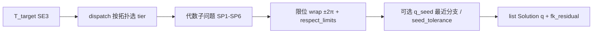

# ssik（解析逆运动学）

**ssik**（[personalrobotics/ssik](https://github.com/personalrobotics/ssik)）面向 **6R 与 7R 全转动关节机械臂**，提供 **解析逆运动学**：对每个目标位姿返回 **全部代数 IK 分支**（而非数值法常见的单解收敛），默认 **FK 闭合误差** 已低于典型工业机器人 **重复定位精度**（约 0.1 mm 量级），并可收紧到机器精度。设计借鉴 IKFast 的 **构建期 codegen、部署期纯数值** 思路，但把覆盖范围扩展到 **非 Pieper 6R**（如 Kinova JACO2、xArm6、AgileX PiPER）与 **非 SRS 7R**（如 Franka Panda、Flexiv Rizon）——这正是 [EAIK](https://github.com/OstermD/EAIK) 等库常直接拒绝的几何族。

## 英文缩写速查

| 缩写 | 英文全称 | 简要说明 |
|------|----------|----------|
| IK | Inverse Kinematics | 由末端位姿求关节角的逆运动学 |
| FK | Forward Kinematics | 由关节角求末端位姿的正运动学 |
| 6R / 7R | Six / Seven Revolute | 六轴 / 七轴全转动关节臂 |
| SRS | Spherical-Rotational-Spherical | 球肩 + 肘转 + 球腕的 7R 冗余臂典型结构 |
| Pieper | Pieper criterion | 末三轴交于一点时 6R 可解析解的经典条件 |
| URDF | Unified Robot Description Format | 统一机器人描述格式 |
| LM | Levenberg–Marquardt | 可选数值抛光，收紧近奇异处的 FK 残差 |

## 为什么重要

- **分支枚举 vs 单解数值 IK：** 运动规划、可操作性分析、穿越奇异点的轨迹延续，常需要 **在同一姿态下比较多个 IK 分支**（肩/肘/腕构型）；TracIK、MINK 等 **每种子一个解**，不保证穷尽代数分支。
- **填补 EAIK 空白：** 官方 benchmark 显示 EAIK 在 Pieper 类 UR 臂上极快，但对 **JACO2、xArm6、PiPER** 报 `6R-Unknown Kinematic Class`，对 **全部 7R** 报 `only 1-6R`；ssik 在这些几何上仍可返回 2–128 个分支（视冗余离散化而定）。
- **可部署 artifact：** 与 OpenRAVE IKFast 类似，**`ssik build`** 针对自家 URDF 生成 **单文件 `*_ik.py`**，运行时 **不依赖 urchin/sympy**，适合嵌入遥操作闭环、仿真步进或离线规划预处理。

## 核心原理

### 1. Per-arm artifact 模型

| 路径 | 适用场景 | 运行时依赖 |
|------|----------|------------|
| **`ssik.prebuilt.*_ik`** | 厂商标称 URDF、法兰无额外工具 | 仅 `numpy` + 预编译轮子 |
| **`ssik build arm.urdf`** | 自定义工具链、标定后链长、非预置机型 | 构建时需 `ssik[urdf]`；产物与 prebuilt API 相同 |
| **`ssik.Manipulator.from_urdf`** | 实验、选型前探测几何分类 | 运行时 URDF 解析 + sympy（**不推荐生产**） |

每个 artifact 模块内嵌 **KinBody 常数、dispatch 求解器、已烘焙符号预处理**；`solve(T_target)` 输入 4×4 齐次目标位姿（`BASE_LINK` → `EE_LINK`），输出 `list[Solution]`。

### 2. 求解与后处理管线

- **6R：** 最多 **16** 个解析分支（Pieper 类常见 8：4 肩 × 2 肘）。
- **7R：** 冗余为 **1 参数族**；ssik 按 **swivel 采样** 离散为 32–256 分支（如 iiwa14 常见 128）。
- **默认 `respect_limits=True`：** 先尝试 `q ± 2π` 拉回限位内，再丢弃超限分支；7R 上配合 `max_solutions=1` + `q_seed` 可走 **lock-outward 快路径**（文档称相对全扫约 20× 加速）。

### 3. 与相邻 IK 栈的分工

| 库 | 类型 | 分支 | 典型强项 | 典型弱项 |
|----|------|------|----------|----------|
| **ssik** | 解析 | 全部（离散化后） | 非 Pieper 6R、7R、可部署 artifact | Pieper 6R 上慢于 EAIK ~100× |
| **EAIK** | 解析 | 全部（支持族内） | UR/Pieper 6R 微秒级 | 拒绝多数 7R 与非 Pieper 6R |
| **IKFast** | 解析 codegen | 全部（成功生成时） | 经典 Pieper / 球腕 7R lock | 现代 sympy 下非 Pieper 易失败 |
| **MINK / TracIK** | 数值 | 单解/种子 | 任意 URDF 几何 | 无分支枚举；FK 精度依赖迭代容差 |
| **cuRobo** | GPU 数值 IK + 规划 | 并行多解探索 | 无碰撞 IK + 轨迹优化 | 非「全部分支」语义；偏规划栈 |

## 工程实践

| 步骤 | 建议 |
|------|------|
| 快速验证 | `pip install ssik` → `from ssik.prebuilt import franka_panda_ik` → `solve(T)` |
| 可视化 | `pip install 'ssik[demo]'` → `examples/05_viser_interactive_ik.py` 浏览器拖拽看全部分支 |
| 遥操作 / 跟踪 | 每控制周期 `solve(T, max_solutions=1, q_seed=q_current, seed_tolerance=deg2rad(6))`；空列表 ⇒ 需重规划或接受构型跳变 |
| 自定义工具 | `ssik build my.urdf --base base_link --ee tool0`；夹具改链后 **必须重建** artifact |
| 收紧精度 | 自定义 `TolerancePolicy(subproblem_numerical=1e-9)` + `allow_refinement=True`（LM 抛光） |
| 与 MoveIt / ROS | ssik **不替代** Planning Scene / 碰撞检测；可作为 **IK 服务后端** 或规划前 **分支枚举** 模块 |

**开源状态（截至 2026-07-21）：** **已开源** — [GitHub](https://github.com/personalrobotics/ssik)、[PyPI](https://pypi.org/project/ssik/)、[文档站](https://personalrobotics.github.io/ssik/)；BSD-3-Clause；无权重/数据集依赖。

## 局限与风险

- **速度：** 在 UR/Pieper 6R 上 **慢于 EAIK 两个数量级**；若几何在 EAIK 支持范围内且只需分支枚举，应优先 benchmark EAIK。
- **几何锁定：** prebuilt 针对 **标称厂商 URDF + 裸法兰**；标定偏差、额外 TCP 或链名不一致会导致 FK 与真机不符——须 `ssik build` 或核对 `BASE_LINK`/`EE_LINK` 与 `test_prebuilt_fixture_parity` 来源表。
- **7R 离散化：** 返回的是 **采样后的分支集合**，非连续冗余流形；高 DoF 臂 `solve` 可达 **十余毫秒** 量级，硬实时需 profiling。
- **范围外：** **无碰撞过滤**（需 FCL 等应用层）、**无连续轨迹平滑保证**（`seed_tolerance` 空结果即 discontinuity 信号）、**非 6R/7R 或含 prismatic 的链** 不在目标范围。

## 关联页面

- [Manipulation（操作任务）](../tasks/manipulation.md) — 笛卡尔目标、抓取与臂部执行上下文
- [Teleoperation（遥操作）](../tasks/teleoperation.md) — VR/手柄位姿跟踪时的 **逐 tick IK**
- [MoveIt 2](./moveit2.md) — ROS 2 规划宿主；ssik 可作 IK 插件或外部求解器对照
- [cuRobo](./curobo.md) — GPU 并行 **无碰撞 IK + 轨迹优化**；解析分支枚举与数值规划可分层组合
- [Pinocchio 快速上手](../queries/pinocchio-quick-start.md) — 动力学/WBC 栈中的 **数值 IK** 示例；与 ssik **解析臂 IK** 互补
- [Trajectory Optimization](../methods/trajectory-optimization.md) — 多 IK 种子服务非凸轨迹优化

## 参考来源

- [ssik 仓库归档](../../sources/repos/ssik.md)
- Srinivasa, S., *ssik: analytical inverse kinematics for 6R and 7R revolute arms*（[GitHub](https://github.com/personalrobotics/ssik)、[Zenodo DOI 10.5281/zenodo.20278005](https://doi.org/10.5281/zenodo.20278005)）

## 推荐继续阅读

- [ssik 官方文档 Quickstart](https://personalrobotics.github.io/ssik/quickstart/)
- [ssik Arm coverage（每臂速度与 FK 下限）](https://personalrobotics.github.io/ssik/arm_coverage/)
- [EAIK（Ostermeier 2024）](https://github.com/OstermD/EAIK) — Pieper 6R 微秒级解析 IK 对照基线
- [IK-Geo（Elias–Wen）](https://github.com/rpiRobotics/ik-geo) — 子问题分解参考 C++/Rust 实现
