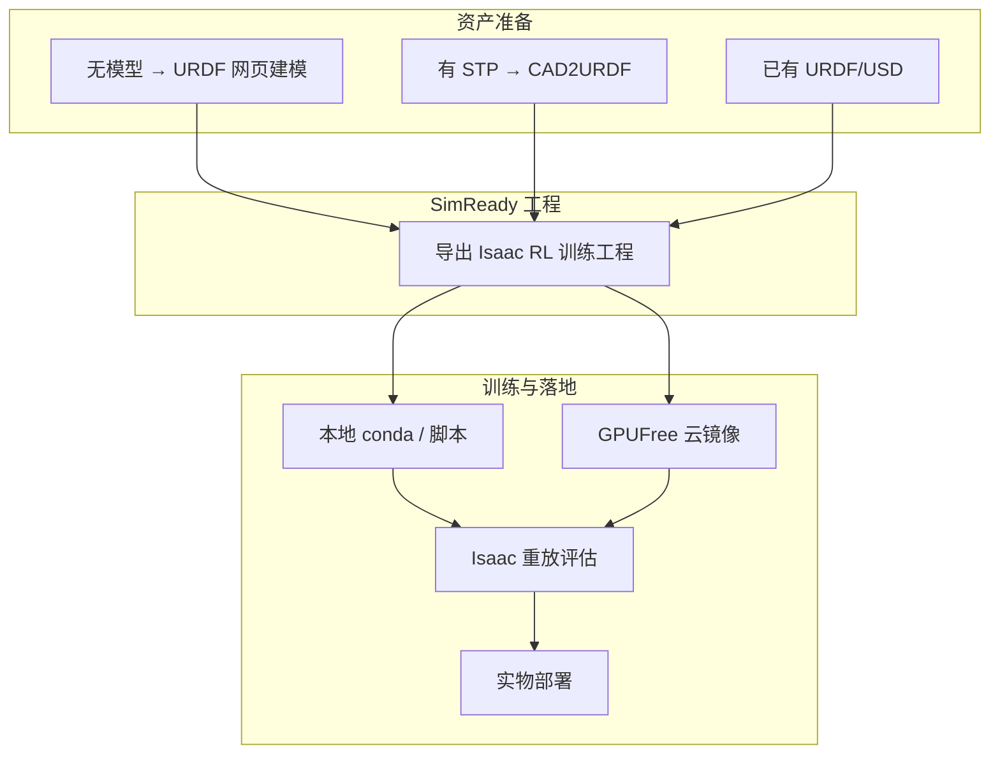

# StackForce

**StackForce**（[stackforce.cc](https://stackforce.cc/)）是面向教育与小整机开发的 **轻量级模块化机器人平台**（堆叠式主控 + 电机/舵机/传感器模块），并扩展出 **Web 工具链**：[`workbench.stackforce.cc`](https://workbench.stackforce.cc/) 按资产状态引导 **建模 → URDF → SimReady Isaac 工程 → 训练/评估 → 实物部署**；[`cad2urdf.stackforce.cc`](https://cad2urdf.stackforce.cc/upload) 提供浏览器端 **STEP/STP→URDF**（本地解析几何 + 人工配置连杆关节）。

## 英文缩写速查

| 缩写 | 英文全称 | 简要说明 |
|------|----------|----------|
| CAD | Computer-Aided Design | 机械结构三维设计，常见输出 STEP/STP |
| URDF | Unified Robot Description Format | ROS/Isaac 生态统一的连杆–关节描述格式 |
| STEP | Standard for the Exchange of Product model data | 工业 B-rep 零件/装配交换格式 |
| RL | Reinforcement Learning | 通过与仿真环境交互学习控制策略 |
| USD | Universal Scene Description | Omniverse/Isaac Sim 场景与机器人资产格式 |
| SimReady | Simulation-Ready Asset | StackForce 侧对「可导入 Isaac 训练管线」工程/资产的命名 |
| FOC | Field-Oriented Control | 磁场定向控制，StackForce 电机驱动模块常用技术 |

## 为什么重要

- **降低「我有 CAD，但不知道从哪开始训 RL」的摩擦：** [工作台](https://workbench.stackforce.cc/) 用 **三步状态分岔**（无模型 / 有 STP / 已有 URDF·USD）把读者放进正确入口，而不是要求先读完 Isaac Lab 全文档。
- **补齐国内教育向硬件 + 云工具闭环：** 主站硬件（ESP32 主控、FOC 电机板、舵机板等）与 Seeed [小轮足开源教程](https://wiki.seeedstudio.com/cn/stackforce_mini_wheeled_legged_robot/) 形成 **桌面级整机**；Web 侧再接到 **Isaac 训练工程**，适合课程、毕设与自研小整机。同属 Seeed 开源硬件线的桌面六轴臂见 [reBot-DevArm](./rebot-devarm.md)。
- **CAD→仿真资产有明确分工：** [CAD2URDF](https://cad2urdf.stackforce.cc/upload) 强调 **STEP 本地解析、原始 CAD 不上传**，但 **Link/Joint 需人工配置**——与全自动几何推断的 [step2urdf](./step2urdf.md) 形成对照，读者可按模型复杂度选型。
- **训练入口不只本地：** 工作台第三步显式列出 **本地 conda/脚本** 与 **[GPUFree](./gpufree.md) 云镜像**，与 [Isaac Lab](./isaac-lab.md) 对 RT 核心与桌面仿真的要求对齐。

## 核心结构

### 1. 硬件平台（stackforce.cc）

- **堆叠式模块：** 主控板 + 执行器（无刷 FOC、舵机）+ 传感器（IMU、测距等）+ 通信（CAN、RS485、人机交互）
- **开发面：** Arduino IDE、PlatformIO、**Simulink 无线实时**、**Python 库** 与 **ROS** 接入；配套 **StackForce Studio** 上位机调试
- **代表整机：** Seeed [Stackforce_Mini_Wheeled_Legged_Robot](https://github.com/Seeed-Projects/Stackforce_Mini_Wheeled_Legged_Robot)（轮足、B 站系列教程）

### 2. 强化学习工作台（workbench.stackforce.cc）

| 读者状态 | 引导动作 |
|----------|----------|
| 无 3D 模型 | StackForce **URDF 网页版**直接建模 |
| 有 \*.stp | 跳转 **CAD2URDF** |
| 有 URDF/USD | **直接输入** → 转 Isaac RL 工程 |

后续步骤：**SimReady 导出训练工程** → 本地或 **GPUFree** 开训 → Isaac **重放评估** → **实物部署**。

### 3. CAD2URDF（cad2urdf.stackforce.cc）

- **三步：** 导入 CAD → 配置 Link/关节 → 测试导出
- **上限：** 单文件 **300MB** STEP/STP
- **缓存：** 浏览器本地 job；可导入/导出 StackForce cad2urdf **工程文件**
- **局限：** 几何来自 STEP，**关节拓扑与惯量仍需人工**——导出后应用 [robot-viewer](./robot-viewer.md) 或 Isaac 导入器做 sanity check

## 流程总览

## 与相近工具的对照

| 工具 | 起点 | 强项 | 局限 |
|------|------|------|------|
| **StackForce CAD2URDF** | STEP/STP | 国内访问、本地解析 CAD、与工作台/SimReady **一条龙** | Link/Joint **人工配置**为主；非开源仓可查 |
| [step2urdf](./step2urdf.md) | STEP | OpenCascade.js **几何驱动关节推断**、MIT 开源 | 关节类型偏 revolute/prismatic；与工作台/Isaac 工程导出无内置绑定 |
| [URDF-Studio](./urdf-studio.md) | 设计阶段 / 已有 URDF | Skeleton/Detail/Hardware、MJCF/USD/BOM、AI 辅助 | 非 STEP 专用；与 StackForce **URDF 网页版**功能重叠需按 UI 偏好选型 |
| [FreeCAD](./freecad.md) | 参数化 CAD | 制造级 B-rep、Robot 工作台与 ROS 插件 | 需桌面安装；导出 STEP 后可进 CAD2URDF 或 step2urdf |

**推荐衔接：** FreeCAD/厂商 STEP → **CAD2URDF 或 step2urdf** → URDF → **工作台 SimReady** → [Isaac Lab](./isaac-lab.md) 训练 → Sim2Real（见 [Sim2Real](../concepts/sim2real.md)）。

## 常见误区

- **「STEP 转完就能训」：** CAD2URDF 只保证几何导入；**关节轴、限位、惯量、碰撞** 不检查清楚会在 Isaac 里表现为爆炸或学不动。
- **「工作台 = 又一个仿真器」：** StackForce Web 侧核心是 **向导 + 工程导出**；物理仿真与 RL 算法仍在 **Isaac** 生态完成。
- **「云训练随便选卡」：** 工作台推荐 GPUFree 时，仍须遵守 **RT 核心 + Vulkan 桌面镜像**（见 [GPUFree](./gpufree.md)），否则图形仿真无法实时显示。

## 关联页面

- [step2urdf](./step2urdf.md) — 浏览器 STEP→URDF，几何关节推断
- [URDF-Studio](./urdf-studio.md) — Web URDF/MJCF 设计与 BOM
- [Isaac Lab](./isaac-lab.md) — SimReady 导出目标的官方 RL 框架
- [GPUFree](./gpufree.md) — 工作台列出的云训练入口之一
- [URDF（统一机器人描述格式）](../concepts/urdf-robot-description.md) — 描述格式背景
- [强化学习](../methods/reinforcement-learning.md) — 训练范式
- [FreeCAD](./freecad.md) — STEP 上游 CAD
- [reBot-DevArm](./rebot-devarm.md) — Seeed 全栈开源桌面六轴臂（B601）

## 推荐继续阅读

- [Isaac Lab — Importing a New Asset](https://isaac-sim.github.io/IsaacLab/main/source/how-to/import_new_asset.html) — URDF→USD 与训练资产注册
- [Seeed StackForce 小轮足 Wiki](https://wiki.seeedstudio.com/cn/stackforce_mini_wheeled_legged_robot/) — 硬件组装与 URDF/STL 资源包

## 参考来源

- [StackForce 工作台站点归档](../../sources/sites/stackforce-workbench.md)
- [StackForce CAD2URDF 站点归档](../../sources/sites/stackforce-cad2urdf.md)
- [StackForce 主站](https://stackforce.cc/)
- [工作台](https://workbench.stackforce.cc/) / [CAD2URDF](https://cad2urdf.stackforce.cc/upload)
