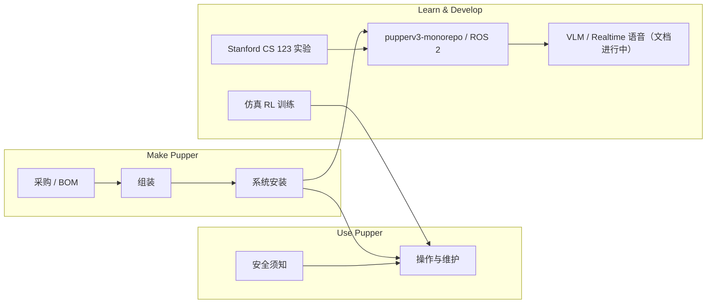

# Stanford Doggo / Pupper（开源四足）

## 一句话定义

**Stanford Doggo** 与 **Stanford Pupper** 同属斯坦福学生机器人俱乐部叙事下的 **开源四足**：**Doggo** 强调 **高动态跳跃**（转载中约 **5 kg**、**MIT** 许可）；**Pupper** 历经多代，当前 **Pupper v3** 在 [官方文档站](https://pupper-v3-documentation.readthedocs.io/en/latest/index.html) 中定位为 **教学 + 陪伴** 平台（自组约 **$2000**、**12 DoF / ~3 kg**、**Raspberry Pi 5**、仿真 **RL** 越障、**VLM / OpenAI Realtime** 语音交互）。早期 **Pupper v2** 仍以树莓派 + 舵机、数小时组装窗口为主，软件 lineage 见 [easy_quadruped](./easy-quadruped.md)。

## 英文缩写速查

| 缩写 | 英文全称 | 简要说明 |
|------|----------|----------|
| RL | Reinforcement Learning | 通过与环境交互最大化长期回报来学习策略的范式 |
| VLM | Vision-Language Model | 视觉-语言多模态理解模型，VLA 的上游 |
| ROS 2 | Robot Operating System 2 | 机器人系统集成与通信的常用中间件 |
| DoF | Degrees of Freedom | 自由度，人形通常 20–50+ 关节 |
| Sim2Real | Simulation to Real | 把仿真中学到的策略迁移落地真机的工程主线 |
| AI | Artificial Intelligence | 人工智能 |
| API | Application Programming Interface | 应用程序编程接口 |
| MuJoCo | Multi-Joint dynamics with Contact | 接触丰富的刚体物理仿真引擎 |
| IMU | Inertial Measurement Unit | 惯性测量单元，提供加速度与角速度 |
| CAD | Computer-Aided Design | 计算机辅助设计，硬件结构建模 |
| BOM | Bill of Materials | 物料清单，硬件零部件列表 |
| Locomotion | Robot Locomotion | 足式/人形等无轮移动能力的总称 |
| VLA | Vision-Language-Action | 视觉-语言-动作多模态基础策略方向 |

## 为什么重要

- **预算与能力双谱系：** 同一「斯坦福四足」品牌覆盖 **极限动态（Doggo）** 与 **可自组教学/伴侣（Pupper v3）**；便于与 [四足机器人](./quadruped-robot.md)、[步态生成](../concepts/gait-generation.md) 等页对照。
- **从模型控制到 RL + 多模态：** v3 文档明确 **并行仿真 RL** 训练越障，并接入 **视觉–语言–动作** 式交互（相机、麦克风、屏幕与耳朵表达），是低成本四足接触 **Sim2Real + 具身 AI** 的完整样板。
- **课程与工程闭环：** [Stanford CS 123](https://cs123-stanford.readthedocs.io/en/latest/) 与建造/运维文档并列，适合「硬件 + 实验课」一体化学习路径。

## Pupper v3 与早期 Pupper 对照

| 维度 | Pupper v3（当前文档主线） | 早期 Pupper / easy_quadruped lineage |
|------|---------------------------|--------------------------------------|
| 定位 | 伴侣 + 教学；强调人机安全 | 低成本四足控制入门 |
| 执行器 | Steadywin **GIM4305** 无刷关节模组 | 常见为 **舵机** + 模型步态 |
| 算力 | **Pi 5 8GB**，M.2 可扩 AI 加速 | 树莓派 + 较轻量控制栈 |
| 软件 | **[pupperv3-monorepo](https://github.com/Nate711/pupperv3-monorepo)** + **ROS 2** | [StanfordQuadruped](https://github.com/stanfordroboticsclub/StanfordQuadruped) / [easy_quadruped](./easy-quadruped.md) |
| 交互 | LCD 表情、扬声器、鱼眼相机、**VLM / Realtime API** | 以运动控制为主 |
| 训练叙事 | 仿真 **RL**，文档称并行世界大幅压缩墙钟时间 | MuJoCo **模型式 Trot**（easy_quadruped） |

## Pupper v3 技术要点

| 类别 | 规格（摘自官方 tech specs） |
|------|----------------------------|
| 机构 | 12 DoF（每腿 3）；蹲姿约 25×20×22 cm；约 **3 kg** |
| 执行器 | GIM4305：峰值 ~3.5 N·m，风冷连续 ~1.0 N·m，~30 rad/s；耳朵 9g 舵机 |
| 传感 | BNO086 IMU；IMX296 鼻端鱼眼；麦克风；关节状态 + 电池 ADC |
| 安全 | 罩壳防夹点、电池外壳、力矩限制与柔顺关节、背部 **E-STOP**、小轻量机体 |

## 流程总览（建造 → 使用 → 开发）

## 开源与文档入口

| 类型 | 链接 |
|------|------|
| **Pupper v3 文档（主索引）** | https://pupper-v3-documentation.readthedocs.io/en/latest/index.html |
| **机载软件 monorepo** | https://github.com/Nate711/pupperv3-monorepo |
| **CS 123 课程** | https://cs123-stanford.readthedocs.io/en/latest/ |
| **社区** | [Hands-On Robotics Discord](https://discord.gg/qbmaU8NmP2) |
| 早期聚合 / CAD（微信策展） | [Nate711](https://github.com/Nate711)、[StanfordPupper](https://github.com/stanfordroboticsclub/StanfordPupper) — 链路易变，以 v3 文档为准 |
| Doggo 高动态参考 | 俱乐部历史仓库与文献；见 [四足](./quadruped-robot.md) 页 RL 举例 |

## 常见误区

1. **把 v3 与 easy_quadruped 当成同一套栈** — easy_quadruped 承接 **StanfordQuadruped 模型控制 + MuJoCo**；v3 走 **GIM4305 + ROS 2 monorepo + RL/VLM**，勿混用 BOM 与代码路径。
2. **忽略安全章节** — v3 面向人旁使用（含儿童），须读文档 [Safety](https://pupper-v3-documentation.readthedocs.io/en/latest/using_pupper/safety.html)（E-STOP、勿抓线缆抬机、电机高温等）。
3. **仅记「12 DoF 树莓派 Pupper」** — 那是早期叙事；v3 为 **Pi 5 + 无刷关节模组 + ~$2000** 级自组成本。

## 关联页面

- [四足机器人](./quadruped-robot.md)
- [easy_quadruped（v2  lineage 控制 + MuJoCo）](./easy-quadruped.md)
- [Locomotion](../tasks/locomotion.md)
- [强化学习](../methods/reinforcement-learning.md)
- [VLA](../methods/vla.md)
- [机器人开源宝库（微信策展第02期）](../overview/robot-open-source-wechat-issue02-curator.md)

## 推荐继续阅读

- 官方建造向导：[Get Started Building](https://pupper-v3-documentation.readthedocs.io/en/latest/index.html#get-started-building)
- 修改机载代码：[Modifying Pupper code](https://pupper-v3-documentation.readthedocs.io/en/latest/development/modifying_code.html)
- Hands-On Robotics：https://www.handsonrobotics.org

## 参考来源

- [pupper-v3-documentation-readthedocs.md](../../sources/sites/pupper-v3-documentation-readthedocs.md)
- [pupperv3_monorepo.md](../../sources/repos/pupperv3_monorepo.md)
- [stanford_cs123_robotics_ai.md](../../sources/courses/stanford_cs123_robotics_ai.md)
- [wechat_jixie_robot_open_source_treasury_issue02_10_robots.md](../../sources/blogs/wechat_jixie_robot_open_source_treasury_issue02_10_robots.md)
