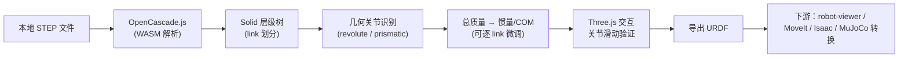

# step2urdf

**step2urdf**（原 URDFlyS2U）是 [Democratizing-Dexterous/step2urdf](https://github.com/Democratizing-Dexterous/step2urdf) 开源的 **Web STEP→URDF** 工具；官方在线版为 [step2urdf.top](https://step2urdf.top/)。它在浏览器内用 **OpenCascade.js** 解析机械 CAD，自动从几何特征推断关节，并支持导出前交互验证——适合「已有 STEP 装配体、需要尽快得到可仿真 URDF」的硬件链路。

## 英文缩写速查

| 缩写 | 英文全称 | 简要说明 |
|------|----------|----------|
| STEP | Standard for the Exchange of Product model data | 工业 B-rep 零件/装配交换格式 |
| URDF | Unified Robot Description Format | ROS 生态统一的机器人连杆/关节描述格式 |
| COM | Center of Mass | 质心，动力学与平衡分析的关键参数 |
| CAD | Computer-Aided Design | 计算机辅助设计，硬件结构建模 |
| ROS | Robot Operating System | 机器人中间件与工具链（含 ROS2） |
| WASM | WebAssembly | 浏览器内运行原生级代码的虚拟机格式 |

## 为什么重要

- **缩短 CAD→仿真 gap：** 许多开源整机与夹具以 **STEP** 分发，而 RL/MPC/WBC 栈通常需要 **URDF/MJCF**。step2urdf 把「手工写 link/joint/inertial」压缩为 **几何导入 + 少量人工确认**。
- **本地隐私友好：** 官方强调 STEP **仅在用户本机**处理（OpenCascade.js + Worker），不上传服务器——对未公开机械设计更友好；敏感项目仍建议 **自托管 Release** 而非公共在线实例。
- **生态入口：** [BotWorld](./botworld.md) 插件中心将 step2urdf 列为推荐工具，便于 **CAD→URDF→广场发布** 的上下游衔接。
- **与桌面 CAD 衔接：** [FreeCAD](./freecad.md) 等 OpenCASCADE 系工具导出的 **STEP** 是 step2urdf 的典型输入——在桌面 CAD 完成装配与公差后再做浏览器端 URDF 推断。
- **几何优先的关节推断：** 从 STEP 中识别 **圆弧/直线段** 以定义 **revolute/prismatic**，比纯手动点选轴心更贴近 CAD 语义，但仍需导出前 **交互滑动关节** 做 sanity check。

## 核心能力

| 模块 | 作用 |
|------|------|
| **STEP 导入与 solid 树** | 层级浏览、隐藏/选择组件，组织 link 划分 |
| **关节识别** | 几何特征 → revolute / prismatic；支持 XYZ **轴偏移微调** |
| **惯量与质心** | 输入整机总质量，自动分配各 link 惯量/COM，可逐 link 改 |
| **交互可视化** | Three.js 场景内测试关节角/位移，导出前验证 |
| **URDF 导出** | 生成 ROS/ROS2 可用的机器人描述包 |

技术栈：**Vue 3 + Vite + Three.js + opencascade.js（WASM）+ Comlink Worker**；MIT 许可，pnpm 构建。

## 流程总览

## 与相近工具的对照

| 工具 | 起点 | 强项 | 局限 |
|------|------|------|------|
| **step2urdf** | 已有 **STEP** | 浏览器即用、几何驱动关节、本地处理 | 关节类型限于 revolute/prismatic；复杂闭链/柔性体需人工后处理 |
| [StackForce CAD2URDF](./stackforce.md) | STEP/STP | 国内访问、本地解析、与工作台 **SimReady→Isaac** 一条龙 | Link/Joint **人工配置**为主；非开源 |
| [URDF-Studio](./urdf-studio.md) | 设计阶段 / 已有 URDF | Skeleton/Detail/Hardware 全流程、MJCF/USD/BOM、AI 辅助 | 不是 STEP 专用转换器；CAD 导入能力与本工具互补 |
| [CAD Skills](./cad-skills.md) | 自然语言 → **build123d** | Agent CLI、`gen_urdf()` 与制造链 skill | 依赖 Python/OCP 环境，非「拖 STEP 即转」 |
| [robot-viewer](./robot-viewer.md) | 已有 URDF/MJCF | 多格式预览、MuJoCo WASM 轻仿真 | 不负责从 STEP 生成模型 |

**推荐衔接：** STEP → **step2urdf** → URDF → [robot-viewer](./robot-viewer.md) / [MoveIt2](./moveit2.md) / 仿真引擎（必要时再转 MJCF）。

## 常见误区

- **「在线版 = 文件上传云端」：** 项目 README 声明本地处理；仍建议 F12 看 Network，或 **自托管** 满足合规。
- **「自动关节 = 无需人工」：** 复杂装配、轴系不一致或 CAD 简化不当时，必须 **交互验证 + 轴向微调**。
- **「URDF 可直接上真机」：** 惯量/COM 来自估算或总质量分配，Sim2Real 前应对照实测或系统辨识（参见 [Sim2Real](../concepts/sim2real.md)）。

## 关联页面

- [URDF-Studio](./urdf-studio.md) — Web 端 URDF/MJCF 设计与 BOM 工作站
- [CAD Skills](./cad-skills.md) — build123d/STEP/URDF Agent Skills CLI 路线
- [robot-viewer](./robot-viewer.md) — URDF 预览与 MuJoCo WASM
- [robot-explorer](./robot-explorer.md) — 运动学/可操作度分析
- [MoveIt2](./moveit2.md) — URDF/SRDF 下游运动规划
- [文字生成 CAD（Text-to-CAD）](../concepts/text-to-cad.md) — STEP 上游生成路线
- [BotWorld](./botworld.md) — 插件中心外链入口与资产发布广场
- [StackForce](./stackforce.md) — 工作台向导 + CAD2URDF，可导出 Isaac RL 工程

## 推荐继续阅读

- [OCP / OpenCascade 生态](https://dev.opencascade.org/) — STEP/B-rep 内核背景
- [step2urdf Bilibili 教程](https://www.bilibili.com/video/BV168PjzrErB) — 官方视频 walkthrough

## 参考来源

- [step2urdf 源码归档](../../sources/repos/step2urdf.md)
- [step2urdf.top 站点归档](../../sources/sites/step2urdf-top.md)
- [step2urdf GitHub](https://github.com/Democratizing-Dexterous/step2urdf)
