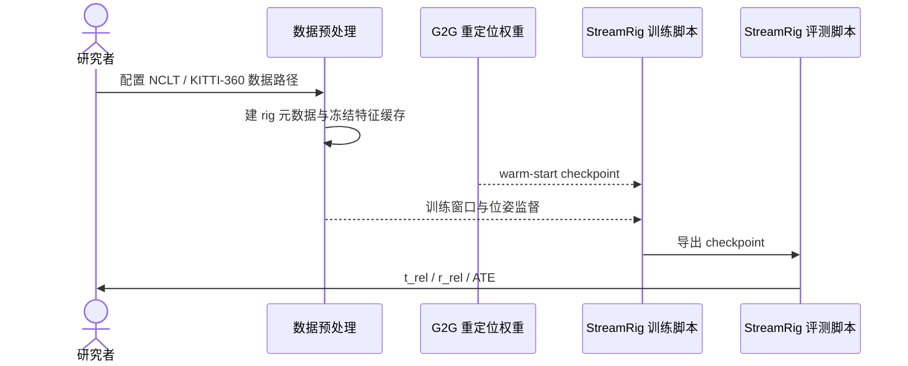

# StreamRig 项目：多相机流式视觉里程计

**StreamRig**（*Exploiting Intra-Rig Geometry for Streaming Multi-Camera Odometry*，[arXiv:2609.40244](https://arxiv.org/abs/2609.40244)）由浙江大学、华南理工大学团队提出。作者包括一作魏雨飞（Yufei Wei，浙江大学博士研究生）及通讯作者王越（Yue Wang）。论文与代码、项目页、权重在本页合并收录。它利用冻结的多视图 3D 基础模型和因果时序模块，从同步标定的多相机图像流估计 rig 位姿；**输出是视觉里程计，不是机器人控制动作**。

## 英文缩写速查

| 缩写 | 英文全称 | 本文含义 |
|---|---|---|
| VO | Visual Odometry | 项目输出的多相机视觉里程计 |
| KV cache | Key-Value cache | CausalBridge 维护的因果历史缓存 |
| ATE | Absolute Trajectory Error | 完整序列 SE(3) 对齐后的绝对轨迹误差 |
| SE(3) | Special Euclidean group in 3D | 三维刚体位姿（旋转 + 平移） |
| G2G | Group-to-Group | 跨相机组重定位模型，提供训练 warm-start 权重 |
| IMU | Inertial Measurement Unit | 惯性测量单元；仓库不提供 IMU 融合 |
| CC BY-NC | Creative Commons Attribution-NonCommercial | 主仓库采用的 4.0 非商业许可 |

## 作者与论文信息

| 字段 | 信息 |
|---|---|
| 英文标题 | *StreamRig: Exploiting Intra-Rig Geometry for Streaming Multi-Camera Odometry* |
| 作者 | Yufei Wei（魏雨飞，一作）、Shuhao Ye、Qi Wang、Xin Zheng、Qing Huang、Rong Xiong、Yue Wang（通讯作者） |
| 单位 | 浙江大学、华南理工大学（作者单位按论文标注） |
| 版本 | arXiv v1，2026-09-30；作者主页标注 ICRA 2027 under review，尚非录用论文 |
| 核心结论 | 74.6M 可训练参数，以相对位姿监督在 NCLT、TartanGround、KITTI-360 与自采 ZJH 人形机器人数据集上评估；ZJH 使用仿真训练权重做真机零样本测试 |

## 项目资源

| 资源 | 入口 | 当前核实内容 |
|---|---|---|
| 项目主页 | [weiyufei0217.github.io/StreamRig](https://weiyufei0217.github.io/StreamRig/) | 方法图、视频、交互轨迹与结果 |
| 代码 | [WeiYuFei0217/StreamRig](https://github.com/WeiYuFei0217/StreamRig) | train / eval scripts、NCLT 和 KITTI-360 配置 |
| 论文 | [arXiv:2609.40244](https://arxiv.org/abs/2609.40244) | 2026-09-30 v1 |
| 发布权重 | [Hugging Face: feixue22/StreamRig](https://huggingface.co/feixue22/StreamRig) | NCLT、KITTI-360 checkpoint；README 也提供百度网盘入口 |
| 代码许可 | [CC BY-NC 4.0](https://github.com/WeiYuFei0217/StreamRig/blob/main/LICENSE) | 非商业许可；另含 MapAnything 代码，其 Apache 2.0 许可继续适用 |

## 方法：从 rig 图像到连续位姿

1. **联合编码相机组：** 冻结的 MapAnything 多视图 3D 前端以同步图像及相机 rig 几何作为输入，避免将每台相机当作互不相关的单目视频。
2. **压缩 rig 特征：** Rig-Resampler 将各相机视觉特征压缩成紧凑 tokens；项目页报告每台相机使用 16 个 tokens。
3. **因果建模：** CausalBridge 通过 causal attention 与 KV cache 读取历史相机组状态，位姿头回归相对 rig 位姿。
4. **周期重锚：** 定期把当前 rig 设为新的参考锚点，组合连续相对位姿，限制长序列状态和漂移累积。
5. **两阶段训练：** 先做 group relocalization 预训练，再做 causal rig odometry。论文报告可训练部分合计 74.6M 参数，训练监督只用相对位姿；移除重定位预训练会明显降低性能。

它依赖**已同步且已标定的相机组**，不是单目方法；方法本身也不做 IMU、轮速或接触融合。

### 训练到评测的数据流

## 复现路径

仓库 README 的基本流程为：

1. 建立 Python 3.12 环境，安装 CUDA 12.8 对应的 PyTorch 2.9.1、项目依赖和 vendored MapAnything。
2. 获取 MapAnything 使用的 DINOv2-Large 主干权重。
3. 预处理相机组元数据，并缓存冻结前端特征。
4. 使用 G2G relocalization checkpoint 初始化，按 NCLT 或 KITTI-360 配置训练。
5. 用相应 eval 脚本加载发布权重或自训 checkpoint，按 README 指标协议计算结果。

README 命令示例使用 4 张 GPU。大数据缓存和 GPU 要求意味着复现成本不低，开始前应先核对磁盘、主机内存和权重下载情况。

## 数据集与评测

| 数据集 | 相机与场景 | 训练/测试边界 |
|---|---|---|
| NCLT | 5 相机，真实室外、跨季节 | 官方 README 提供训练/评测入口与权重 |
| TartanGround | 4 相机，仿真校园场景 | 项目页与论文列为评测集 |
| KITTI-360 | 4 相机（立体 + 两个鱼眼） | 官方 README 提供训练/评测入口与权重 |
| ZJH | 4 相机，自采人形机器人 | 仿真训练后进行真实世界零样本评测；自采数据不等于公开数据集 |

论文摘要报告：在这四组数据集上，相较被测的非 oracle 单目流式方法与 rig-aware 离线方法，StreamRig 的平移和旋转漂移更低。该结论限于论文比较对象和评测协议。

## 已公开的基准结果

| 数据集 | 序列 | t_rel ↓ | r_rel ↓ | ATE ↓ |
|---|---|---:|---:|---:|
| NCLT | 2012-02-19、2012-08-20 | 2.77% | 1.39°/100 m | 28.4 m |
| KITTI-360 | 0009、0010 | 2.59% | 0.98°/100 m | 63.7 m |

按仓库说明，t_rel / r_rel 使用 KITTI odometry 的 100–800 m 分段协议（stride 3）；ATE 对完整序列做 SE(3) 对齐。录制中断时，README 描述用真值相对位姿拼接前后片段再计算，因此不同论文或不同处理协议的数值不能直接比较。

项目页还列出 TartanGround 与 ZJH 人形机器人数据集；README 当前公开的训练 / 评测脚本与权重表重点列出 NCLT、KITTI-360。ZJH 结果为仿真训练权重在真机上的零样本评测，不表示代码仓已提供该私有 / 自采数据。

## 资源成本与部署边界

- **特征缓存：** NCLT 约 470 GiB；KITTI-360 约 104 GiB。
- **评测内存：** NCLT 评测约需 35 GB 主机内存。
- **计算：** 项目页报告 5 相机输入每次 26.2 ms、2.6 GiB；作者主页另报四相机设置 50 Hz。硬件和配置口径不同。
- **坐标与时钟：** 需要同步图像及 calibrated camera rig；部署前要核实外参、时间戳、相机到机体坐标系变换与重锚位置跳变。
- **控制集成：** 该仓库提供里程计模型，不提供完整的 IMU / 关节 / 接触融合器，也不保证满足人形控制闭环的实时性要求。

## 许可和复用

StreamRig 主仓库以 **CC BY-NC 4.0** 发布。商用前需取得许可；仓库 vendored MapAnything 保留 Apache 2.0，许可边界按文件分别遵守。发布权重应按 README 的 SHA256SUMS 校验。

## 与相邻方法的区别

| 方法 | 与 StreamRig 的关系 | 主要区别 |
|---|---|---|
| [G2G](./paper-g2g.md) | 上游重定位模型；StreamRig 训练用其 checkpoint warm-start | G2G 估计两组图像间相对位姿；StreamRig 增加因果历史与周期重锚，面向在线 rig 里程计 |
| [ORB-SLAM3](./orb-slam3.md) | 经典视觉 SLAM/里程计参照 | ORB-SLAM3 是特征点几何 SLAM，含 IMU、回环及多地图能力；StreamRig 是依赖冻结多视图模型的学习式视觉里程计，不提供这些完整系统能力 |
| 单目流式 3D 模型 | 论文比较的一类基线 | StreamRig 每个时刻联合编码标定相机组，显式使用 rig 内几何 |

**适用边界：** StreamRig 可作为多相机视觉位姿前端研究候选；漂移指标不等于闭环行走稳定性。人形机器人部署仍需和 IMU/关节状态融合，并验证坐标变换、时间同步、重锚连续性、延迟与失效恢复。

## 结论

StreamRig 把冻结多视图 3D 基础模型、rig 特征压缩、因果缓存和周期重锚组合成流式多相机里程计，展示了利用相机组内几何的价值。复现门槛不低：官方数据缓存约 470 GiB（NCLT）和 104 GiB（KITTI-360），示例使用 4 张 GPU；代码许可证为 CC BY-NC 4.0。它值得作为状态估计视觉前端研究，但不能被当作完整 VIO/SLAM 或安全控制状态估计器。

## 关联页面

- [G2G](./paper-g2g.md) — 官方 StreamRig 训练以其重定位权重 warm-start
- [状态估计知识链](../overview/hub-state-estimation.md)
- [导航 / SLAM / 自主系统栈](../overview/navigation-slam-autonomy-stack.md)
- [State Estimation](../concepts/state-estimation.md)

## 参考来源

- [官方代码仓库归档](../../sources/repos/streamrig.md)
- [官方项目页归档](../../sources/sites/streamrig-weiyufei0217-github-io.md)
- [论文题录来源](../../sources/papers/streamrig_arxiv_2609_40244.md)
