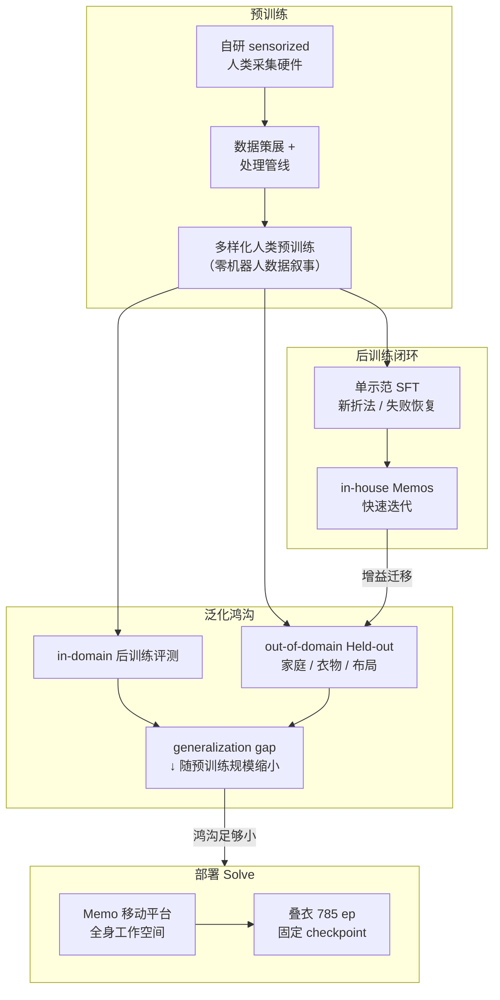

# ACT-2（Sunday Robotics · Generalizing Reliability）

**ACT-2** 是 **Sunday Robotics**（2026-07 博客预览）在自研移动平台 **Memo** 上部署的 **第二代家用机器人基础模型**：在 **ACT-1**（2025-11，长时程移动操作与零机器人数据预训练叙事）之上，核心主张从「能演示」推进到 **「可靠性可 hill-climb 且增益可泛化到未见真实家庭」**。

| 机构 | 周日机器人（Sunday Robotics） |
|------|--------------------------------|
| 平台 | **Memo**（移动全身家用机器人） |
| 首发任务 Solve | **叠衣（laundry folding）** |
| 报告成功率 | **99.1% ±0.3%**（785 次自主尝试，固定 checkpoint） |
| 部署适配成本 | **零**（无 per-home 数据 / 示范 / 后训练） |

## 一句话定义

**用规模化人类 sensorized 预训练把 in-house 后训练增益变成可跨家庭迁移的可靠性，并以声明 Scope 与零 Adaptation cost 的叠衣 Solve 验证端到端部署主张。**

## 英文缩写速查

| 缩写 | 英文全称 | 简要说明 |
|------|----------|----------|
| ACT | Autonomous Capability Transformer（Sunday 产品名） | Sunday 机器人基础模型系列（ACT-1 / ACT-2） |
| SFT | Supervised Fine-Tuning | 监督微调；博客用单示范教新折法 |
| SR | Success Rate | 任务成功率 |
| OOD | Out-of-Domain | 后训练分布外环境（未见家庭/衣物/布局） |
| Solve | （Sunday 术语）可靠能力声明 | Performance + Scope + Adaptation cost 三元组 |
| VLA | Vision-Language-Action | 与 π₀、GEN 等路线的对照语境（博客脚注） |

## 为什么重要

- **把「泛化鸿沟」量化成可缩放对象：** Sunday 定义 **generalization gap = in-domain SR − out-of-domain SR**，并报告预训练规模从 0%→100% 时 gap 从 **82%→0%**——为「实验室 hill-climb 能否预测野外表现」提供可检验曲线（仍待独立复现）。
- **单示范后训练叙事：** 四个独立 checkpoint 各用 **一条** 不同折法示范 SFT，均在 held-out 衣物上成功——博客称 robotics 首次端到端模型 **单示范 + 跨环境泛化**（对照 GPT-3 / π₀ / GEN-1 缩放叙事）。
- **Solve 框架解构 demo：** 同 **99.1%** 在「单房间单衣物」与「9 类衣物 × 未见家庭 × 零适配」下含义完全不同；见 [Robotics Solve 标准](../concepts/robotics-solve-standard.md)。
- **与 2026 家用/移动操作路线并列：** [TidyBot2](./tidybot2.md) 走 **开源 household 平台**；[Curr-0](./current-robotics-curr0.md) 走 **人形 loco-dex + HumanEx**；Sunday 走 **专有 Memo + 人类数据预训练 + 机队闭环**——代表 **闭源垂直整合 + 可靠性营销** 样本。

## 流程总览

## 核心结构

### ACT-2 Recipe（三洞察）

| 洞察 | 内容 |
|------|------|
| **缩放预训练** | 更强 base → 同量 in-house 后训练 **更可迁移**；表 1：100% 预训练时 in/out **均 100%** |
| **单示范可教新行为** | 四条不同折法各 **1 demo** SFT → 均在未见衣物上成功 |
| **失败驱动 hill-climb** | 真机长尾失败经同一高效机制 post-training；作者称端到端拥有机器人/模型/机队可 **快速闭环** |

**数据质量（同算力）：** 高质量子采样 flagship **99.1%** vs 均匀 50% 仅 **64.1%**；val loss 与 SR 线性相关（作者报告 $R^2>0.9$）。

### 叠衣 Solve 边界（摘要）

完整三元组定义见 [Solve 概念页](../concepts/robotics-solve-standard.md)。

| 组件 | ACT-2 声明 |
|------|------------|
| **Scope · 衣物** | 9 类常见可叠衣物（T 恤、长短袖、polo、无袖、衬衫、裤、打底裤、短裤；XXS–8XL） |
| **Scope · 场景** | 未见房间、床/台面、光照、机器人站位 |
| **Scope · 初始态** | 篮中/床上堆/地面；自然褶皱与朝向 |
| **Adaptation** | **零** per-home；评估 homes **未用于** task-specific post-training（作者脚注） |
| **Performance** | SR **99.1%**；质量 **4.72/5**；median 时间 **2:13** |

**分项成功率（n）：** 短裤/厚长袖/薄长袖/polo/无袖 **100%**；T 恤 **99.0%**（312）；裤 **98.8%**；打底裤 **96.3%**；衬衫 **94.7%**（19）。

### 涌现行为（定性）

- **边缘恢复：** 地面捡衣、遮挡重定向、折痕微调。
- **扰动鲁棒：** 儿童互动、对抗扰动、明暗变化下重规划。
- **全身工作空间：** 相对固定桌面臂，Memo **移动/调姿** 覆盖 8XL 衬衫、婴儿服、大毛巾等尺度跨度。

### 在训但未 Solve 的能力

吸尘、玩具整理、拉拉链、裤子翻面、咖啡等——博客仅视频演示，**未声明完整 Scope / Adaptation / 定量 Performance**。

## 工程实践

- **评测协议可借鉴：** 固定 **5 星折痕 rubric**（过折/错位/未折元素/堆叠错误各扣 1 星；2 inch 阈值）；**双轮 annotator + review lead**；rubric **评测前锁定**。
- **机队飞轮：** 同一 base 多任务共训；博客主张每完成一个 Solve，共享行为（抓取、整理、全身协调）反哺下一任务。
- **选型对照：** 需要 **可复现开源栈** 时优先 [TidyBot2](./tidybot2.md)、[LeRobot](./lerobot.md)（含 `folding_latest` 示范）；评估 **闭源家用可靠性主张** 时必读 **Solve 边界** 而非 headline SR。

## 局限与风险

- **非 peer-reviewed：** 2026-07 为预览博文；post-training 与架构细节 **另文待发**。
- **未开源（2026-07-17）：** [sunday.ai](https://www.sunday.ai/) **无** GitHub / 权重 / 数据集；复现与第三方审计不可行。见 [sources/sites/sunday-robotics.md](../../sources/sites/sunday-robotics.md)。
- **自评 bias：** 成功率与折痕质量由 **内部标注团队** 评定；虽称双审，仍非独立 benchmark。
- **衬衫样本偏少：** 最低分项衬衫 **n=19**，置信区间宽（**89.6–99.9%**）。
- **与 ACT-1 数据隔离：** 「零机器人数据预训练」与具体数据混合比例、Memo 机队采集占比 **未公开**。

## 关联页面

- [Robotics Solve 标准](../concepts/robotics-solve-standard.md) — Performance / Scope / Adaptation cost 评测框架
- [Manipulation](../tasks/manipulation.md) — 可变形物体与家用操作任务语境
- [VLA](../methods/vla.md) — 与 π₀、GEN 等「缩放降低适配数据」叙事对照
- [TidyBot2](./tidybot2.md) — 开源 household 移动操作平台对照
- [Curr-0](./current-robotics-curr0.md) — 另一全栈「人类数据→基础模型」产业路线
- [LeRobot](./lerobot.md) — 开源叠衣 checkpoint 生态（`folding_latest`）
- [Learning to Fold（LeHome 2026）](./paper-lehome-learning-to-fold.md) — 开源竞赛全链路叠衣（SO-ARM101；仿真 1st / 真机 2nd）
- [Humanoid Hardware 101 · 末端](../overview/humanoid-hardware-101-sensing-end-effectors.md) — Sunday 三指夹爪案例

## 推荐继续阅读

- Sunday 官方预览：<https://www.sunday.ai/blog/act-2-preview>
- ACT-1 引用：*ACT-1: A Robot Foundation Model Trained on Zero Robot Data*（2025，Sunday 博客脚注）
- Wired 报道（ACT-1 时代）：[This Home Robot Clears Tables and Loads the Dishwasher](https://www.wired.com/)（博客 Recent entries 链接）

## 参考来源

- [sunday_act2_preview.md](../../sources/blogs/sunday_act2_preview.md)
- [sunday-robotics.md](../../sources/sites/sunday-robotics.md)
