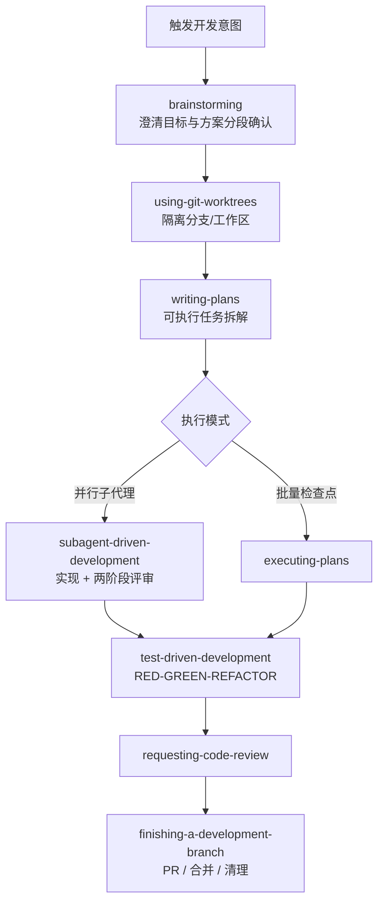

# Superpowers（obra）

**Superpowers** 是 [obra/superpowers](https://github.com/obra/superpowers) 仓库及其插件分发形态的总称：把作者团队在实践中沉淀的 **编码代理软件工程流程** 拆成一组可检索、可版本化的 **skills**（通常以 `SKILL.md` 等为载体），并通过各 **harness**（Claude Code、Codex、Cursor、Gemini CLI、OpenCode 等）的安装入口，在会话启动或任务匹配时 **强制走既定工作流**，而不是默认「直接改代码」。

## 一句话定义

用 **可组合技能库 + 启动时行为契约**，把 **头脑风暴→设计确认→细粒度实施计划→（子）代理实现与评审→TDD→分支收尾** 固化成代理的默认软件工程管线。

## 为什么重要（对本知识库读者）

- **与「LLM 维护 wiki」同构的另一条轴：** [Karpathy LLM Wiki](../references/llm-wiki-karpathy.md) 强调 **持久 wiki 与 cross-reference**；Superpowers 强调 **持久技能与可验证工程习惯**（TDD、评审、worktree）。两者都试图把 **人类策展 + 机器执行** 写成 **可重复、可审计** 的文件结构。
- **对机器人代码与仿真栈开发的迁移价值：** 本仓库读者常在 **Isaac Lab / MuJoCo / ROS2** 等多仓库、长链路场景下并行实验；`using-git-worktrees`、分任务子代理与 **RED/GREEN** 节奏，有助于降低「单会话上下文里乱改多模块」的风险（仍以团队自己的 CI 与规约为准）。
- **生态位清晰：** 上游 README 明确技能集合与 **多 harness 安装差异**；贡献边界保守（不随意合并新技能），适合作为 **方法论参考** 而非未经验证的插件大杂烩。

## 核心结构

| 层次 | 内容 |
|------|------|
| **分发** | 主仓库 + [superpowers-marketplace](https://github.com/obra/superpowers-marketplace)；各环境命令见主仓库 README（Cursor：`/add-plugin superpowers` 等）。 |
| **启动契约** | 会话开始即引导阅读 **getting-started** 类技能，并声明 **「有 skill 则必须按 skill 执行」**（见发布文归纳）。 |
| **主干工作流（README「Basic Workflow」）** | `brainstorming` → `using-git-worktrees`（设计批准后）→ `writing-plans` → `subagent-driven-development` / `executing-plans` → `test-driven-development` → `requesting-code-review` → `finishing-a-development-branch`。 |
| **技能域** | **Testing**、**Debugging**、**Collaboration**、**Meta**（含 `writing-skills`）等；README 强调代理在任务前应 **检索相关技能**。 |
| **工程哲学** | TDD；系统化调试与验证；证据优先于口头完成声明；复杂度控制（YAGNI 等 README 表述）。 |

### 流程总览（概念级）

## 常见误区或局限

- **误区：装插件等于自动变好。** 实质收益来自 **团队是否采纳同一套分支、测试与评审契约**；插件只降低「忘记流程」的概率。
- **误区：与本仓库 `AGENTS.md` / `schema` 等价替换。** 本仓库规约面向 **机器人知识 wiki**（ingest/query/lint、派生文件同步）；Superpowers 面向 **通用编码交付**；可对照借鉴，但 **目标与检查项不同**，不宜混为一谈。
- **局限：** 上游说明 **一般不随意接受新技能**；跨 harness 一致性维护成本高；具体技能正文以仓库内版本为准，本页不做逐 skill 摘录。

## 关联页面

- [LLM Wiki（Karpathy 模式）](../references/llm-wiki-karpathy.md) — **持久结构化知识** 与 **人类策展** 的范式说明
- [Ingest Workflow](../../schema/ingest-workflow.md) — 本仓库 **ingest / query / lint** 操作规范
- [Articraft](./articraft.md) — 另一类 **agent + 规约文件 + harness** 的闭环（面向 3D 资产生成，与编码技能栈问题域不同但可类比）

## 参考来源

- [Superpowers 仓库源归档（本站）](../../sources/repos/obra-superpowers.md)
- [Superpowers 发布文归纳（本站）](../../sources/blogs/fsck_superpowers_announcement_2025-10-09.md)
- [obra/superpowers（GitHub）](https://github.com/obra/superpowers)
- [obra/superpowers-marketplace（GitHub）](https://github.com/obra/superpowers-marketplace)

## 推荐继续阅读

- Jesse Vincent, *Superpowers*, [blog.fsck.com（2025-10-09）](https://blog.fsck.com/2025/10/09/superpowers/) — 设计背景、子代理压力测试与技能元叙事
- [Prime Radiant / Superpowers 通知页](https://primeradiant.com/superpowers/) — 版本与社区更新（官方入口，以站点为准）
