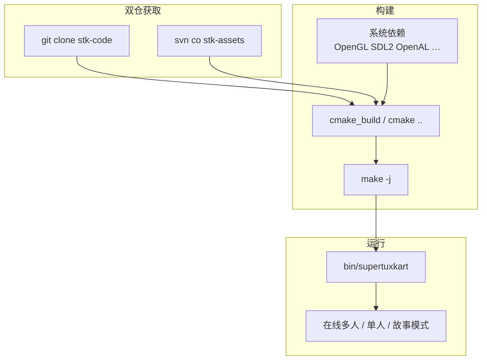
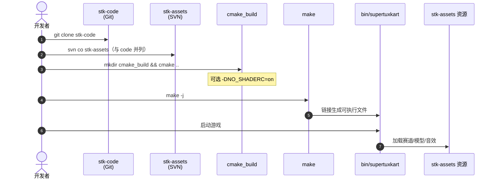

# SuperTuxKart

**SuperTuxKart**（[项目主页](https://supertuxkart.net/)，[代码](https://github.com/supertuxkart/stk-code)，[Releases](https://github.com/supertuxkart/stk-code/releases)）是 **GPL** 授权的 **免费卡丁车竞速游戏**：强调 **趣味与道具赛**，README 明确 **不追求真实卡丁物理**。引擎与逻辑在 **Git `stk-code`**，运行时资源在 **SVN `stk-assets`**；支持 **Linux / Windows / macOS / Android / Nintendo Switch**，含 **在线多人** 与持续社区开发（SuperTuxKart Evolution 路线，2025–2026 博客/论坛活跃）。

## 一句话定义

> **双仓（Git 代码 + SVN 资产）开源卡丁车游戏**：CMake 本地可构建，预编译包或 GitHub Releases 可即玩，适合作为 **可读 C++ 游戏引擎/赛道内容管线** 样本，而非 RL 训练 Gym。

## 英文缩写速查

| 缩写 | 英文全称 | 简要说明 |
|------|----------|----------|
| STK | SuperTuxKart | 项目简称 |
| GPL | GNU General Public License | 软件许可（见仓内 `COPYING`） |
| SVN | Subversion | `stk-assets` 与可选 `media` 仓 VCS |
| OpenGL | Open Graphics Library | 桌面渲染 API（≥ 3.3） |
| GLES | OpenGL ES | 移动/嵌入式渲染（≥ 3.0） |
| CMake | Cross Platform Make | 跨平台构建系统 |
| CI | Continuous Integration | GitHub Actions 多平台构建徽章 |

## 为什么重要

- **完整开源游戏栈：** 非 Demo 片段——含 **多人网络、赛道编辑器生态、长期版本发布**（稳定 **1.5**，2025-10-20）。
- **双仓分工清晰：** **代码与资产分离**（Git + SVN）是 mod/研究 fork 时的常见门槛；[`Source_control`](https://supertuxkart.net/Source_control) 官方文档化。
- **与科研赛车栈正交：** 相对 [CARLA](./carla.md) / [f1tenth-gym](./f1tenth-gym.md) 的 **真实/可训物理**，STK 自定位为 **街机 fun physics**——选型时不要误当 Sim2Real 后端。
- **多平台 CI 可借鉴：** 仓内 Linux/Apple/Windows/Switch workflow，对 **跨平台图形/输入** 工程有参考价值。
- **世界模型/游戏引擎文献对照：** Awesome WM 等分组中的 **Interactive World Models & Game Engines** 常引用可交互 3D 环境；STK 是 **可玩、可改、GPL** 的完整实例。

## 核心信息

| 项 | 内容 |
|----|------|
| **类型** | 开源卡丁车竞速游戏（非 AD/机器人仿真器） |
| **许可** | **GPL**（`stk-code/COPYING`） |
| **最新稳定版** | **1.5**（GitHub Release，2025-10-20） |
| **平台** | Linux、Windows、macOS、Android、Switch |
| **开源** | **已开源** — 代码 + 资产 SVN + 预编译 Releases |

## 开源状态

核查日：**2026-09-18**（[supertuxkart.net](https://supertuxkart.net/)、[stk-code](https://github.com/supertuxkart/stk-code)、[Source_control](https://supertuxkart.net/Source_control)）。

| 产物 | 状态 |
|------|------|
| `stk-code`（C++ 引擎/逻辑） | **已开源** GitHub |
| `stk-assets`（运行时资源） | **已开源** SVN SourceForge |
| 预编译二进制 | **Releases / Download 页** |
| `stk-media-repo`（Blender 源文件等） | **可选** SVN ~3.2GB，**非游玩必需** |
| 构建文档 | **INSTALL.md** + **ANDROID.md** |

## 流程总览

## 核心原理

### 代码 vs 资产

| 仓 | 内容 | 获取 |
|----|------|------|
| **stk-code** | 渲染、物理、网络、UI、赛道逻辑 | `git clone https://github.com/supertuxkart/stk-code` |
| **stk-assets** | 模型、纹理、赛道、音效 | `svn co https://svn.code.sf.net/p/supertuxkart/code/stk-assets` |

两目录须 **同级并列**；仅 clone 代码 **无法** 直接运行完整游戏。

### 物理与渲染定位

- README：**focuses on fun and not on realistic kart physics** — 与 [drive-game](./drive-game.md) 的 Pacejka 240 Hz **仿真向**、或 CARLA **AD 向** 物理不同。
- 渲染：OpenGL 3.3+ / GLES 3.0+；可选 Vulkan 路径（Shaderc，见 INSTALL）。

### 坐标系

- **STK 运行时：** X 右、Y 上、Z 前（地面 **XZ**）。
- **Blender 创作：** X 右、Y 前、Z 上；导出工具负责变换。

## 源码运行时序图

官方仓提供 **从源码到可执行文件** 的标准路径（归档见 [`sources/repos/supertuxkart-stk-code.md`](../../sources/repos/supertuxkart-stk-code.md)）：

- **最短即玩：** [Releases](https://github.com/supertuxkart/stk-code/releases/latest) 下载对应平台二进制，**无需编译**。
- **最短源码：** 双仓 + `INSTALL.md` 依赖 + `cmake && make` → `./bin/supertuxkart`。

## 工程实践

| 项 | 建议 |
|----|------|
| 首次体验 | 直接 **Download / Releases**，避免漏拉 `stk-assets` |
| 编译 | 严格遵循 [`INSTALL.md`](https://github.com/supertuxkart/stk-code/blob/master/INSTALL.md) 发行版包列表 |
| Shaderc | Linux 无 Shaderc 时用 `-DNO_SHADERC=on` 关闭 Vulkan 路径 |
| 路径 | 编辑 `env_paths` 类配置前确认 **assets 相对路径** 与双仓布局 |
| 贡献 | 读 [How to contribute code](https://supertuxkart.net/How_to_contribute_code) |
| 机器人/RL | **默认无 Gym API**；若做 RL 需自行包装或 fork，勿与 f1tenth/CARLA 混读指标 |
| 许可 | **GPL** — 衍生分发需遵守 copyleft |

## 局限与风险

- **非仿真器：** 物理为街机向，**不能**替代 CARLA/Isaac 做 AD 或足式 Sim2Real。
- **双仓门槛：** 仅 star `stk-code` 不足以运行；CI/文档均假设 **assets 已 checkout**。
- **GPL copyleft：** 与 MIT 栈（如部分 RL 框架）组合分发时需法律审查。
- **资产 SVN：** SourceForge SVN 在网络受限环境可能不稳定；需 mirror 或缓存 assets。
- **科研基准：** 无标准 RL leaderboard；与 [starter-kit-racing](./starter-kit-racing.md) 类似属 **引擎/体验** 参考。

## 结论

SuperTuxKart 是 **成熟、GPL、双仓架构** 的开源卡丁车游戏：**Git 代码 + SVN 资产 + CMake 全平台** 链路完整，Releases 与社区（论坛/博客）持续维护。

- **真价值：** 可 fork 的 **完整 3D 竞速游戏**（多人、关卡、道具），以及 **代码/资产分离** 的开源工程范式。
- **勿误用：** 不是 **真实车辆物理** 或 **RL 训练环境**；科研漂移/AD 请回到 [赛车漂移 RL 开源景观](../overview/racing-drift-rl-open-source-landscape.md)。
- **上手路径：** 玩家用 **Releases**；开发者 **双仓 + INSTALL.md**；艺术家可选 **media SVN**。
- **版本：** 入库日最新稳定 **1.5**（2025-10-20）；预览版见 Releases preview 通道。

## 关联页面

- [drive-game](./drive-game.md) — 浏览器纽北 **仿真向** 物理对照
- [starter-kit-racing](./starter-kit-racing.md) — 浏览器 **街机** Three.js 样板
- [CARLA](./carla.md) — **AD 科研** 仿真基础设施
- [赛车漂移 RL 开源景观](../overview/racing-drift-rl-open-source-landscape.md) — 科研训练栈 vs 可玩游戏分栏

## 参考来源

- [SuperTuxKart 项目主页归档](../../sources/sites/supertuxkart-net.md)
- [stk-code 仓库归档](../../sources/repos/supertuxkart-stk-code.md)

## 推荐继续阅读

- [SuperTuxKart 官网](https://supertuxkart.net/)
- [Source control（双仓说明）](https://supertuxkart.net/Source_control)
- [INSTALL.md](https://github.com/supertuxkart/stk-code/blob/master/INSTALL.md)
- [stk-code Releases](https://github.com/supertuxkart/stk-code/releases)
