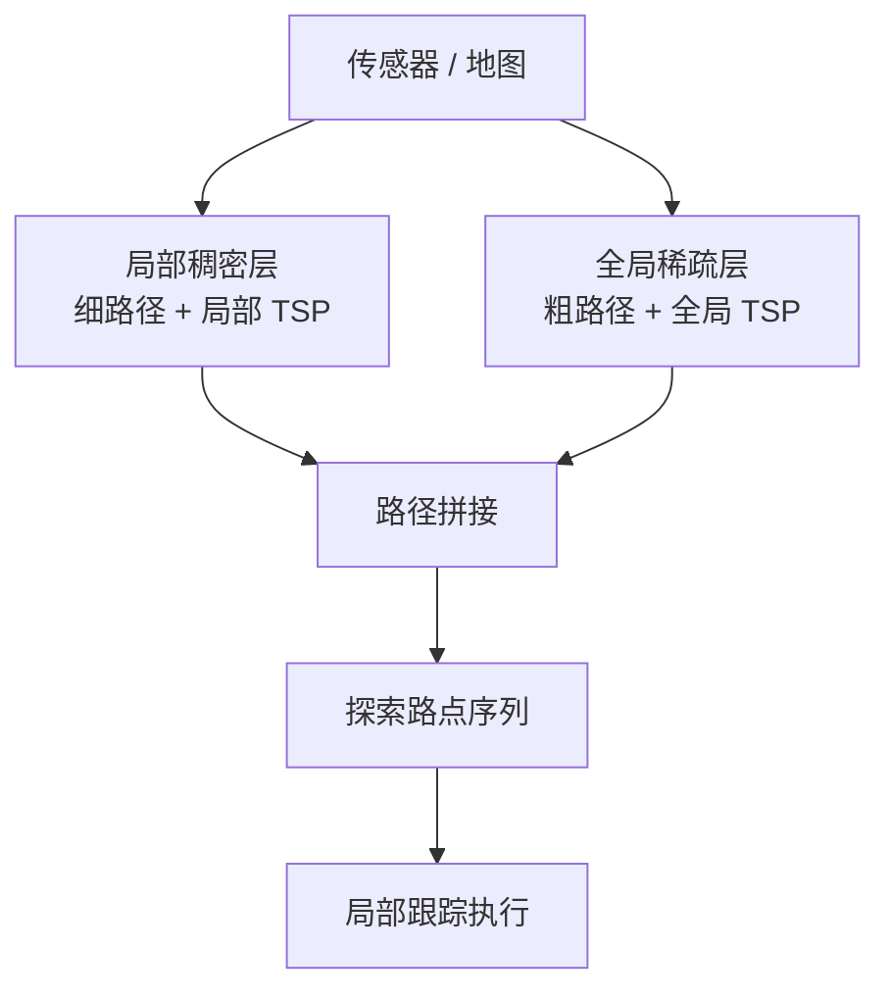
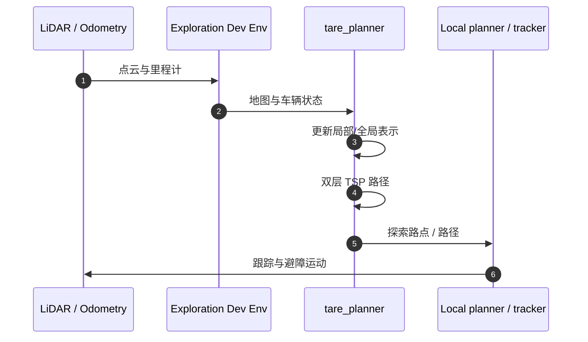

# TARE Planner

## 一句话定义

**TARE Planner**（Technologies for Autonomous Robot Exploration）是 CMU 提出的 **分层自主探索规划器**：近场用稠密表示计算细路径，远场用稀疏表示维持全局覆盖顺序，两层路径拼接并在各层以 TSP 近似优化访问顺序——课程第 5.2 节。

## 英文缩写速查

| 缩写 | 英文全称 | 简要说明 |
|------|----------|----------|
| TARE | Technologies for Autonomous Robot Exploration | 方法与项目名来源 |
| TSP | Traveling Salesman Problem | 路点访问顺序 |
| RSS | Robotics: Science and Systems | 2021 发表并获最佳论文 |
| SubT | DARPA Subterranean Challenge | 地下挑战赛实战 |
| NBV | Next-Best-View | 对照基线族 |
| ROS | Robot Operating System | 官方实现主线 ROS1 |

## 为什么重要

- 把「算力花在车附近」形式化：大场景不必对整张稠密地图做全局细规划。
- 相对贪心 NBV，双层 TSP 减少无效重访；RSS 2021 Best Paper / Best System Paper，SubT 实战背书。
- 与 [FAR](./far-planner.md) 组成课程 Ch5 教学栈：TARE 定「探索去哪」，FAR 定「怎么赶到」。

## 核心原理

### 分层表示

| 层 | 数据密度 | 规划内容 |
|----|----------|----------|
| 局部 | 高 | 细路径、局部 TSP |
| 全局 | 低 | 粗路径、全局覆盖顺序 |
| 拼接 | — | 形成完整探索轨迹 |

洞察：**细节在近场最值钱**；远场只需足够引导「下一片该去哪」。

### 开源状态

**已开源** — [`caochao39/tare_planner`](https://github.com/caochao39/tare_planner)（Melodic/Noetic 分支）。项目页：<https://www.cmu-exploration.com/tare-planner>。

代表文献：

- Cao et al., *TARE: A Hierarchical Framework…*, RSS 2021
- Cao et al., *Representation Granularity…*, Science Robotics 2023

## 源码运行时序图

复现以仓库 README 与 [CMU Exploration](https://www.cmu-exploration.com/tare-planner) 为准；依赖开发环境中的地形分析、状态估计与局部规划模块。

## 工程实践

### 接入步骤（教学）

1. 按官方文档克隆 `tare_planner` 与开发环境。
2. 启动仿真世界与传感器回放/模拟。
3. 确认定位稳定后再开 TARE（定位漂 → 探索废）。
4. RViz 观察局部/全局路径与已覆盖区域。
5. 记录覆盖–时间曲线，对照贪心 frontier 基线（若有）。

### 调参与观测

| 关注点 | 说明 |
|--------|------|
| 局部地平线尺寸 | 过大则失去「近密」优势 |
| 重规划频率 | 与计算负载权衡 |
| 传感器 FOV | 影响信息增益估计 |
| 与 FAR 交接 | 路点间距、到达阈值 |

### 迁到人形

- 将「地面车可通行」换成足式可通行层。
- 速度指令桥到 [G1 软件栈](./unitree-g1-software-stack.md)。
- 重新标定传感器高度与倾角。

## 局限与风险

- 官方主线 ROS1 + 地面车；ROS 2 / 人形需自建桥。
- 严重依赖上游定位与局部避障质量。
- **误区**：把 TARE 当全局几何最短路径器——它优化的是 **探索覆盖**，不是点到点最短。

## 关联页面

- [自主探索](../tasks/autonomous-exploration.md)
- [FAR Planner](./far-planner.md)
- [A\*](../methods/a-star.md)
- [导航·SLAM 栈总览](../overview/navigation-slam-autonomy-stack.md)
- [人形系统课程策展](./humanoid-system-curriculum.md)

## 参考来源

- [tare_planner 仓库归档](../../sources/repos/tare_planner.md)
- [CMU Exploration 站点](../../sources/sites/cmu-exploration.md)
- [深蓝学院人形系统课程大纲](../../sources/courses/shenlan_humanoid_system_theory_practice.md)

## 推荐继续阅读

- 项目页论文 PDF 与 SubT 结果视频：<https://www.cmu-exploration.com/tare-planner>
