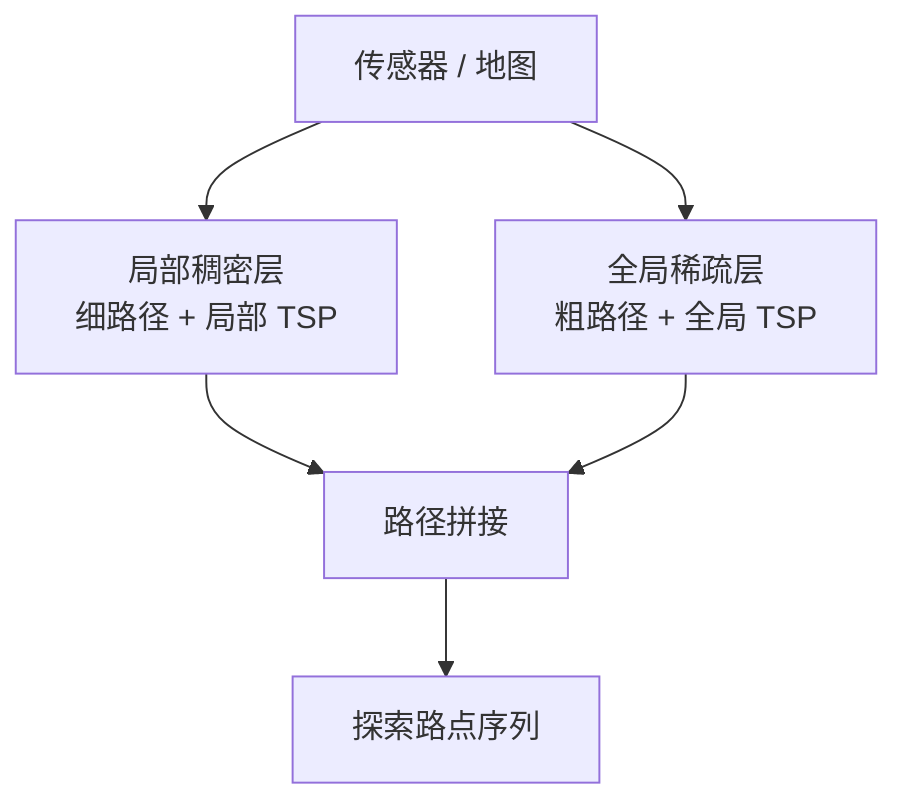
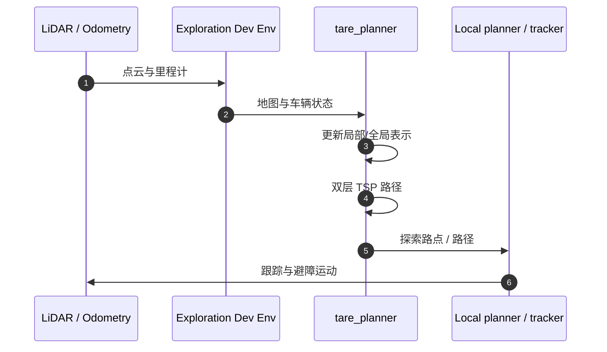

# TARE Planner

## 一句话定义

**TARE Planner** 是 CMU 提出的 **分层自主探索规划器**：近场用稠密表示算细路径，远场用稀疏表示保持全局覆盖顺序，两层路径拼接并在各层求解 TSP 近似——课程第 5.2 节。

## 英文缩写速查

| 缩写 | 英文全称 | 简要说明 |
|------|----------|----------|
| TARE | Technologies for Autonomous Robot Exploration | 本方法与项目名来源 |
| TSP | Traveling Salesman Problem | 路点访问顺序优化 |
| RSS | Robotics: Science and Systems | 2021 发表并获奖会议 |
| SubT | DARPA Subterranean Challenge | 地下挑战赛实战验证 |
| ROS | Robot Operating System | 官方实现基于 ROS1 |

## 为什么重要

- 把「算力花在车附近」形式化，大规模场景比纯贪心 NBV 更少无效重访。
- 与 [FAR](./far-planner.md) 组成 CMU 探索教学栈，直接对应深蓝课程 Ch5。

## 核心原理

开源状态：**已开源** — [`caochao39/tare_planner`](https://github.com/caochao39/tare_planner)。

## 源码运行时序图

复现入口以仓库 README 与 [CMU Exploration](https://www.cmu-exploration.com/tare-planner) 为准（Melodic/Noetic 分支）。

## 工程实践

- 先在官方开发环境仿真跑通，再考虑接到 G1/其他平台的速度接口。
- 评价：覆盖效率、路径长度、CPU 占用；对照 NBVP 等基线（论文表格）。

## 局限与风险

- 官方主线是地面车 ROS1；迁移 ROS 2 / 人形需自行桥接。
- 依赖上游定位质量，定位漂了探索会漏扫或反复绕路。

## 关联页面

- [自主探索](../tasks/autonomous-exploration.md)
- [FAR Planner](./far-planner.md)
- [人形系统课程策展](./humanoid-system-curriculum.md)

## 参考来源

- [tare_planner 仓库归档](../../sources/repos/tare_planner.md)
- [CMU Exploration 站点](../../sources/sites/cmu-exploration.md)
- [深蓝学院人形系统课程大纲](../../sources/courses/shenlan_humanoid_system_theory_practice.md)

## 推荐继续阅读

- Cao et al., RSS 2021 TARE 论文 PDF（项目页链接）
