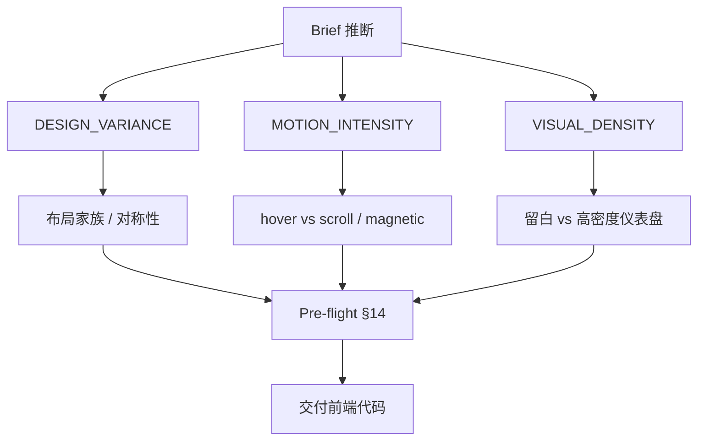

# Taste Skill

**Taste Skill**（[Leonxlnx/taste-skill](https://github.com/Leonxlnx/taste-skill)，[tasteskill.dev](https://tasteskill.dev)）是开源 **Agent Skill 包**，目标是在 Cursor、Claude Code、Codex 等工具生成前端时 **压低「AI 模板味」**：先读 brief 推断设计方向，再用 **三旋钮** 与 **硬规则** 约束布局、动效与密度，最后通过 **pre-flight** 才允许交付代码。

## 一句话定义

在 **SKILL.md 层** 用 **方差 / 动效 / 密度** 三个可调 dial + **禁令清单 + 起飞前检查**，把 agent 从默认 SaaS 审美拉向 **brief 对齐的、非对称也可的高完成度 UI**。

## 英文缩写速查

| 缩写 | 英文全称 | 简要说明 |
|------|----------|----------|
| UI | User Interface | 技能主要约束 React/HTML/CSS 产出 |
| GSAP | GreenSock Animation Platform | v2 提供 canonical 动效 skeleton，与 MOTION 旋钮联动 |
| MIT | Massachusetts Institute of Technology License | 仓库协议 |
| LLM | Large Language Model | 执行 SKILL 的 coding agent |
| UX | User Experience | brief 推断含受众、行业、情绪与布局家族 |

## 为什么重要（对本知识库读者）

- **本站静态站：** agent 改 `docs/` 时易产出统一圆角卡片与 cream 配色；Taste Skill 与 [frontend-design](anthropic-frontend-design-skill.md) 同属 **审美约束**，但更强调 **旋钮化** 与 **redesign audit-first**（改现有页时先审计再动刀）。
- **与 GSAP skill：** [GSAP AI Skills](gsap-skills.md) 教 **API**；Taste Skill 管 **动多少、何时 scroll/magnetic**（`MOTION_INTENSITY`）。
- **与 Impeccable：** Taste 偏 **生成前/生成中 SKILL 规约**；Impeccable 偏 **命令动词 + 61 条 detector 闭环** — 可叠加（见 [对比](../comparisons/skillry-taste-skill-impeccable.md)）。

## 核心结构

| 层次 | 内容 |
|------|------|
| **默认安装** | `npx skills add https://github.com/Leonxlnx/taste-skill --skill "design-taste-frontend"` |
| **v2（默认）** | experimental；安装名稳定，规则迭代 toward v2.0.0 stable |
| **三旋钮** | `DESIGN_VARIANCE` · `MOTION_INTENSITY` · `VISUAL_DENSITY` |
| **协议块** | brief inference；design-system map；dark mode；redesign protocol；block library schema；§14 pre-flight |
| **硬禁令示例** | em-dash ban；反 boilerplate 布局/字体默认值 |
| **变体 skill** | v1 兼容、`gpt-taste`、minimalist、brutalist、`output-skill`（防半成品） |
| **协议** | MIT |

### 三旋钮（治理「AI 味」的主控）

## 常见误区或局限

- **误区：装一次就永久去 slop。** v2 仍 **experimental**；规则措辞可能变，重大改版应 pin v1（`design-taste-frontend-v1`）。
- **误区：替代设计系统仓库。** 它约束 **生成**；长期产品仍需要 token 与组件库文档（可与 Impeccable `DESIGN.md` 并用）。
- **局限：** 技能正文偏 **Web 前端**；机器人栈 UI（RViz、自定义 teleop）需自行改写 brief 与 design-system map。
- **局限：** 高 star 不等于安全审计 — 仍应读 SKILL 变更日志再升级。

## 关联页面

- [Impeccable](impeccable.md) — 命令 + detector
- [Skillry](skillry.md) — 商业交付物市场
- [frontend-design（Anthropic）](anthropic-frontend-design-skill.md) — 官方基线
- [GSAP AI Skills](gsap-skills.md) — 动效实现
- [find-skills](find-skills-skill.md) — CLI 发现其它 skill
- [选型对比](../comparisons/skillry-taste-skill-impeccable.md)

## 参考来源

- [taste-skill 仓库归档（本站）](../../sources/repos/leonxlnx-taste-skill.md)
- [tasteskill.dev 核查](../../sources/sites/tasteskill-dev.md)
- [SKILL 仓库（GitHub）](https://github.com/Leonxlnx/taste-skill)

## 推荐继续阅读

- [Taste Skill Changelog](https://www.tasteskill.dev/changelog) — v2 规则演进
- [Impeccable README](https://github.com/pbakaus/impeccable) — detector 与命令面对照
