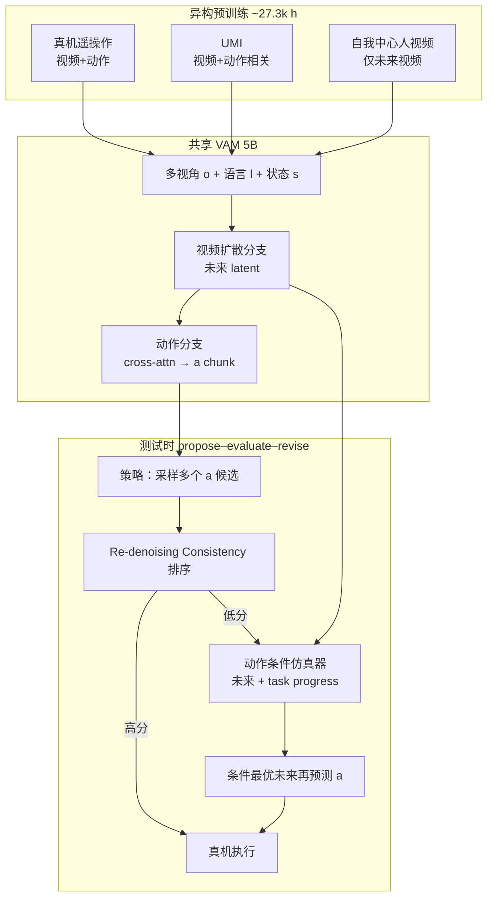

# τ₀-World Model（τ0-WM）

**τ₀-World Model（τ0-WM）**（2026-05-31，[AGIBOT Finch 研究页](https://finch.agibot.com/research/tau0-wm)，[代码](https://github.com/sii-research/tau-0-wm)，[权重](https://huggingface.co/sii-research/tau-0-wm)）是面向 **双臂操纵** 的 **统一视频–动作世界模型**：在共享的 **Video-Action Model（VAM）** 表征上，同时承担 **动作生成**、**多视角未来预测** 与 **动作条件后果评估**，并在测试时用额外算力做 **propose → evaluate → revise**，把「先想象再动手」落到执行前决策，而非仅靠单次前馈策略。

## 一句话定义

**一个 5B Joint WAM：用同一视频扩散骨干学「世界怎么变」与「手该怎么动」，再用动作条件 rollout 与一致性分数在真机执行前筛选、修正 action chunk。**

## 英文缩写速查

| 缩写 | 英文全称 | 简要说明 |
|------|----------|----------|
| WM | World Model | 学习环境动态以供想象/规划的世界模型 |
| VAM | Video-Action Model | 从视频学习并预测动作的模型 |
| WAM | World Action Model | 联合世界模型与动作预测的架构 |
| VLA | Vision-Language-Action | 视觉-语言-动作多模态基础策略方向 |
| Manipulation | Robot Manipulation | 抓取、移动、操作物体的任务总称 |

## 为什么重要

- **监督错位是常态：** 机器人数据有 **动作** 但场景窄；人视频有 **交互动力学** 但没有机器人控制空间。τ₀-WM 用 **模态掩码** 让每条样本只贡献其合法信号，避免假装「每条轨迹都有 action label」。
- **世界模型不止于预览：** 动作条件分支输出 **任务进度轨迹**（子任务标签 + 失败轨迹），使仿真器成为 **action consequence evaluator**，而不只是「好看的下一帧」。
- **测试时算力换成功率：** 多候选 action + **Re-denoising Consistency Score** + 必要时 **仿真选优再预测**，把瓶颈从「单次采样」移到 **执行前推理**——与 [VLA](../methods/vla.md) 反应式前馈形成对照。
- **Agibot 视频 WM 谱系延伸：** 与 [GE-Sim 2.0](./ge-sim-2.md)（闭环模拟器 + World Judge + 本体专家）同生态；τ₀-WM 更强调 **策略与世界预测共享 5B 表征** 及 **操纵策略侧的测试时搜索**。

## 核心结构

| 模块 | 作用 |
|------|------|
| **VAM 骨干** | 基于 **Wan-2.2 TI2V-5B** 级 **视频扩散**；条件：**多视角观测 + 语言 + 机器人状态**。 |
| **视频分支** | 预测 **未来视觉 latent**（时序场景动力学）。 |
| **动作分支** | **逐层 cross-attention** 读取视频中间表征 → **连续 action chunk**（控制相关表征）。 |
| **异构预训练** | 约 **27.3k 小时**：真机遥操作 **17.8k h**、UMI **6.5k h**、自我中心人交互 **3k h**；**模态特定监督掩码**。 |
| **动作条件仿真器** | 输入候选 action → **多视角未来 + 稠密 task-progress**；评估 **视觉合理性** 与 **任务推进**。 |
| **测试时闭环** | 多候选采样 → **Re-denoising Consistency Score** 排序 → 必要时 **仿真 → 选优 rollout → 二次动作预测**。 |

### 流程总览（训练 + 推理）

## 与相邻路线的分界

| 对比轴 | τ₀-WM | [mimic-video](../methods/mimic-video.md) | [GE-Sim 2.0](./ge-sim-2.md) |
|--------|--------|----------------------------------------|------------------------------|
| **骨干耦合** | 视频与动作 **联合训练**、共享中间表征 | 常 **冻结** 互联网视频骨干 + **流匹配动作头** | **视觉专家** 为主，另加 **状态专家 / World Judge** |
| **数据** | 机器人 + UMI + 人视频 **掩码混训** | 强调 **互联网视频先验** + 机器人逆动力学 | **千万级真机 episode** 闭环模拟 |
| **推理** | **内置** 动作条件仿真 + 一致性分数 + 修订环 | 默认 **潜计划 + 动作解码**，论文侧重部分去噪 | **闭环 rollout** 供策略 / 评测 / 奖励 |
| **参数规模** | **5B**（公开 VAM 权重） | 论文实现约 **2B** 级 Cosmos 系 | 公开榜强调 **2B** 视觉专家 |

## 部署与开源（截至 2026-05-31）

- **已发布：** VAM **Hugging Face 权重**（Apache-2.0）、**策略推理 server**（WebSocket，借鉴 [openpi](https://github.com/Physical-Intelligence/openpi)）；需自备 **Wan2.2-TI2V-5B** 与配置文件路径。
- **动作空间（部署）：** 双臂 **绝对 EEF** 位姿 + 夹爪；与预训练 **相对位姿 + 6D 旋转** 自动互转（见 [官方 README](https://github.com/sii-research/tau-0-wm)）。
- **待发布：** **Simulator 权重**、完整 **测试时计算** 代码（README 口径）。

## 常见误区

- **误区 1：有视频生成就等于 WAM。** 若推理从不依赖 **未来预测或仿真评分**，更接近带辅助头的 VLA；τ₀-WM 的测试时环 **显式** 使用世界模型选动作。
- **误区 2：人视频监督等于有机器人动作。** 人视频样本 **只训未来视频**，不伪造 robot action；混训靠 **掩码** 而非标签填充。
- **误区 3：与 GE-Sim 2.0 重复。** GE-Sim 2.0 偏 **可扩展闭环模拟平台 + 独立 Judge**；τ₀-WM 偏 **单栈 5B 策略–仿真一体 + 操纵测试时搜索**——可互补而非互替。

## 与其他页面的关系

- [World Action Models（WAM）](../concepts/world-action-models.md) — Joint 族谱与 Cascaded 对照
- [Generative World Models](../methods/generative-world-models.md) — 像素/ latent 视频世界模型工具箱
- [机器人世界模型训练闭环 taxonomy](../overview/robot-world-models-training-loop-taxonomy.md) — 策略内预测 × 可控视频生成
- [Manipulation](../tasks/manipulation.md) — 精细操作与接触丰富任务语境
- [mimic-video（VAM）](../methods/mimic-video.md) — 另一条 VAM 工程路线
- [GE-Sim 2.0](./ge-sim-2.md) — Agibot 闭环视频世界模拟器
- [EWMBench](./ewmbench.md) — 操纵视频生成质量评测（与内置 task-progress 评估互补）

## 参考来源

- [τ₀-WM 技术报告](../../sources/papers/tau0_wm_tech_report.md)
- [AGIBOT Finch 项目页](../../sources/sites/tau0-wm-agibot-finch.md)
- [sii-research/tau-0-wm 仓库](../../sources/repos/sii_research_tau_0_wm.md)

## 关联页面

- [World Action Models（WAM）](../concepts/world-action-models.md)
- [Generative World Models](../methods/generative-world-models.md)
- [mimic-video](../methods/mimic-video.md)
- [GE-Sim 2.0](./ge-sim-2.md)
- [Manipulation](../tasks/manipulation.md)

## 推荐继续阅读

- 技术报告 PDF：<https://finch-static.agibot.com/VAM/blog/tau_0_wm.pdf>
- 项目页：<https://finch.agibot.com/research/tau0-wm>
- Hugging Face 权重：<https://huggingface.co/sii-research/tau-0-wm>
