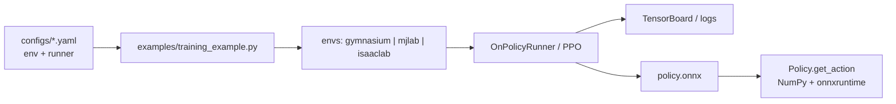
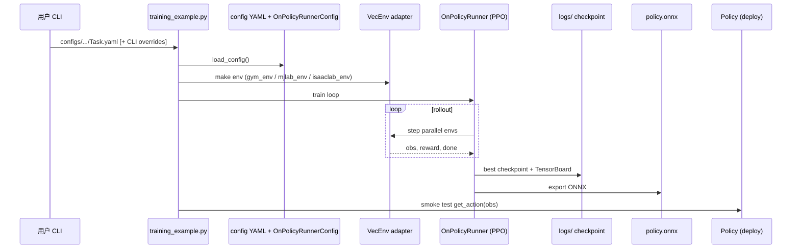

# Telekinesis RLbotics

**Telekinesis RLbotics**（[`telekinesis-ai/telekinesis-rlbotics`](https://github.com/telekinesis-ai/telekinesis-rlbotics)，Apache-2.0，PyPI `telekinesis-rlbotics`）是 **Telekinesis GmbH** 在 Agentic Skill Library 中发布的 **跨仿真后端 RL 训练与 ONNX 部署框架**：用 **一份 YAML** 描述 `env`（framework / task / 并行数 / device）与 `runner`（PPO、网络、日志、checkpoint），同一 `training_example.py` 覆盖 **Gymnasium、mjlab、Isaac Lab** 三条线。

## 英文缩写速查

| 缩写 | 英文全称 | 简要说明 |
|------|----------|----------|
| RL | Reinforcement Learning | 通过与环境交互最大化长期回报来学习策略的范式 |
| PPO | Proximal Policy Optimization | 本库默认 on-policy 算法 |
| ONNX | Open Neural Network Exchange | 训练导出的跨运行时策略格式 |
| Sim2Real | Simulation to Real | 仿真策略迁移真机的工程主线 |
| Sim2Sim | Simulation to Simulation | 同一策略在不同仿真器间迁移验证 |
| GPU | Graphics Processing Unit | mjlab / Isaac Lab 大规模并行训练算力基础 |

## 为什么重要

- **后端选型解耦：** 不必为 Gymnasium 经典控制、mjlab 轻量 GPU 仿真、Isaac Lab 高保真场景各维护一套训练脚本；换任务主要换 `configs/<framework>/` 下的 YAML。
- **部署链路短：** 训练结束自动导出 **自包含 `policy.onnx`**，`Policy(path).get_action(obs)` 仅需 **NumPy + onnxruntime**，适合嵌入 Physical AI 栈或真机侧轻量推理环。
- **与厂商/社区训练仓互补：** 不替代 [unitree_rl_mjlab](./unitree-rl-mjlab.md)、[robot_lab](./robot-lab.md) 的任务与资产注册，而是提供 **统一 PPO runner + 导出约定**；适合快速试算法或在多后端间做 **Sim2Sim** 对照。

## 流程总览

## 源码运行时序图

复现最短路径：安装对应 extra（`[gym]` / `[mjlab]` / `[isaaclab]`）→ `python examples/training_example.py configs/gymnasium/Pendulum-v1.yaml` → `tensorboard --logdir logs` → 用 `telekinesis.rlbotics.policy.Policy` 加载 `policy.onnx`。

## 核心机制

| 模块 | 路径 / 职责 |
|------|-------------|
| 环境适配 | `src/telekinesis/rlbotics/envs/{gym,mjlab,isaaclab}_env.py` |
| 训练循环 | `runner.py` + `rollout.py` + `algorithms.py`（PPO） |
| 配置 | `config.py`；YAML 的 `runner` 映射 `OnPolicyRunnerConfig` |
| 导出与推理 | `checkpoint.py` → `policy.onnx`；`policy.py` 封装 ONNXRuntime |
| 预置任务 | `configs/gymnasium/*`、`configs/mjlab/*`（含 Unitree G1/Go1）、`configs/isaaclab/*`（Anymal、Franka 等） |

## 工程实践

| 维度 | 记录 |
|------|------|
| 安装 | `pip install "telekinesis-rlbotics[gym]"` 等；PyTorch 可按 CUDA 版本预装 |
| Python | 3.10–3.12；Isaac Lab extra 建议 **3.11** |
| 训练 CLI | `-n/--num-envs`、`-d/--device`、`--resume [last\|best\|path]`、`--log-dir` |
| 监控 | TensorBoard；日志目录含 checkpoint 与可选视频 |
| 开源状态 | **已开源**（GitHub + PyPI + 官方文档互链）；截至 2026-09 约 33★，生态仍早期 |

## 局限与风险

- **任务覆盖依赖各后端：** Isaac / mjlab 任务 ID 须在本机已安装对应栈；本库不提供独立仿真资产仓。
- **算法面较窄：** 文档与代码以 **PPO** 为主，不等同于 RSL-RL / SKRL 等多算法生态。
- **与厂商官方链路的边界：** Unitree 真机 DDS / C++ 部署仍以 [unitree_rl_mjlab](./unitree-rl-mjlab.md) 文档为准；此处 ONNX 是 **通用推理接口**，真机集成需自行对接控制环。
- **项目年轻：** 2026-08 开源，API 与 config  schema 可能迭代；跟进 [官方文档](https://docs.telekinesis.ai/skills/rlbotics/overview.html) 与 release。

## 与相邻框架对比

| 维度 | Telekinesis RLbotics | unitree_rl_mjlab | robot_lab |
|------|---------------------|------------------|-----------|
| 维护方 | Telekinesis GmbH | Unitree 官方 | 社区（fan-ziqi） |
| 仿真 | Gymnasium + mjlab + Isaac Lab | mjlab | Isaac Lab |
| 配置 | 单 YAML 跨后端 | 任务仓内 Python 配置 | Isaac 扩展注册 |
| 部署 | ONNX + NumPy 推理 API | ONNX → 官方 C++ | 多路径（如 rl_sar） |
| 定位 | 跨后端 RL 技能 / 快速实验 | 厂商机型 + Sim2Real | 多机型 Isaac 任务集 |

## 结论

**Telekinesis RLbotics 的价值在于「一条 YAML + 一条训练脚本」横跨三类仿真后端，并把 ONNX 部署压到 NumPy 级依赖，适合做多后端对照与 Agentic OS 内的 RL 技能封装，而不是替代各仿真器官方任务仓。**

- 选型时先定 **仿真后端**，再选 `configs/<framework>/` 下 YAML；Gymnasium 适合算法烟测，机器人场景走 mjlab 或 Isaac Lab extra。
- 部署以 **`policy.onnx` + `Policy.get_action`** 为锚点，真机前仍须核对观测归一化与控制接口。
- 生态处于早期（~33★），生产选型建议与 [unitree_rl_mjlab](./unitree-rl-mjlab.md)、[robot_lab](./robot-lab.md) 等成熟仓并列评估。

## 关联页面

- [mjlab](./mjlab.md) · [Isaac Gym / Isaac Lab](./isaac-gym-isaac-lab.md)
- [unitree_rl_mjlab](./unitree-rl-mjlab.md) · [robot_lab](./robot-lab.md)
- [强化学习 (Reinforcement Learning)](../methods/reinforcement-learning.md)
- [Sim2Real](../concepts/sim2real.md)

## 参考来源

- [telekinesis-rlbotics.md](../../sources/repos/telekinesis-rlbotics.md)
- [telekinesis-docs-rlbotics.md](../../sources/sites/telekinesis-docs-rlbotics.md)
- 仓库：<https://github.com/telekinesis-ai/telekinesis-rlbotics>

## 推荐继续阅读

- [Telekinesis RLbotics 官方文档](https://docs.telekinesis.ai/skills/rlbotics/overview.html) — 分后端教程与 Agentic OS 上下文
- [mjlab 官方文档](https://mujocolab.github.io/mjlab) — mjlab 后端任务与依赖说明
