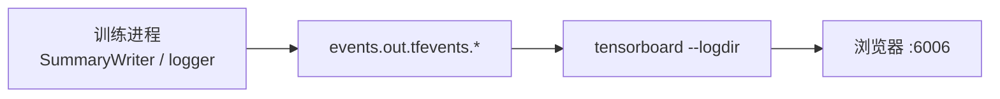

# TensorBoard

**TensorBoard**（[tensorflow/tensorboard](https://github.com/tensorflow/tensorboard)）是一套 **Web 端实验检查工具**，从训练进程写入的 **event 文件** 读取数据并在浏览器中绘图。虽起源于 TensorFlow 生态，现已成为 **PyTorch + rsl_rl** 机器人 RL 训练的 **事实标准本地仪表盘**。

## 一句话定义

在训练机或登录节点上执行 `tensorboard --logdir <logs>`，用浏览器查看 **标量曲线、直方图、计算图与 profiler**——无需云端账号，适合单机 debug 与内网集群。

## 英文缩写速查

| 缩写 | 英文全称 | 简要说明 |
|------|----------|----------|
| TB | TensorBoard | 本页所述可视化工具（口语缩写） |
| RL | Reinforcement Learning | 策略训练中最常见的使用场景 |
| PPO | Proximal Policy Optimization | rsl_rl 默认 on-policy 算法，loss 写入 `Loss/` |
| AMP | Adversarial Motion Prior | 判别器 loss 与 pred 曲线用于判断风格奖励平衡 |
| GPU | Graphics Processing Unit | 训练算力；TB 本身多在 CPU 侧读日志 |
| TF | TensorFlow | TensorBoard 最初配套的深度学习框架 |
| API | Application Programming Interface | `tf.summary` / `torch.utils.tensorboard` 写 event |
| UI | User Interface | 默认 `http://localhost:6006` Web 前端 |

## 为什么重要

- **本库 RL 实体的收敛判据**：[AMP_mjlab](./amp-mjlab.md) 用 `Train/mean_reward` 阶跃、`Episode_Reward/*` 分项与 `Loss/amp_*` 作为「Recovery Jump 是否出现」的官方基准；[BeyondMimic](../methods/beyondmimic.md) 等页亦按 TB 命名空间解读曲线。
- **离线 / 内网友好**：上游 README 明确设计为 **无需互联网** 即可运行——适合保密项目、HPC 登录节点端口转发场景。
- **零协作开销**：个人或小团队快速迭代时，比配置 W&B 项目/密钥更轻；与 [Weights & Biases](./weights-and-biases.md) 可并行启用。

## 核心结构 / 机制

### 数据流



### 启动与目录

```bash
tensorboard --logdir logs/rsl_rl
# 浏览器打开 http://localhost:6006
```

- 支持 **多 run 子目录** 叠加对比（`logdir` 指向父目录即可）。
- 推荐浏览器：**Chrome / Firefox**。

### 可视化类型（官方能力摘要）

| 类型 | 典型用途 |
|------|----------|
| **Scalars** | loss、reward、episode length、学习率 |
| **Histograms** | 权重/激活分布漂移 |
| **Graph** | 网络结构（TF 或 trace） |
| **Images / Audio / Text** | 感知、语音或日志片段 |
| **Embeddings** | 表征空间投影 |
| **HPARAMS** | 多组超参结果对比 |
| **Profiler** | 算子耗时剖析 |

### 机器人 RL 常见 tag（rsl_rl + mjlab）

| 前缀 | 示例 | 解读要点 |
|------|------|----------|
| `Train/` | `mean_reward`, `mean_episode_length` | 总收敛与是否长期终止 |
| `Episode_Reward/` | `track_root_height`, `foot_slip` | 分项 reward 定位「会站不会走」等 |
| `Loss/` | `surrogate`, `amp_policy_pred` | PPO 稳定性与 AMP 判别器平衡 |

完整判据表见 [AMP_mjlab §训练监控](./amp-mjlab.md)。

### 框架写入方式

| 栈 | 写法 |
|----|------|
| PyTorch | `torch.utils.tensorboard.SummaryWriter` |
| rsl_rl | runner 内置 `SummaryWriter`，tag 见上表 |
| MimicKit | `logger_type="tb"` |
| TensorFlow | `tf.summary.scalar` + `FileWriter` |

## 常见误区或局限

- **不是团队协作中心**：event 文件在本地磁盘，跨机器对比需自行同步 `logs/` 或使用 [W&B](./weights-and-biases.md)。
- **不是真机 log 工具**：部署后 ros2 bag / 关节时序请用 [PlotJuggler](./plotjuggler.md)。
- **tag 命名无统一标准**：mjlab `Episode_Reward/` 与 vanilla rsl_rl `Episode/rew_*` **前缀不同**——读曲线前应对照具体仓库 runner 源码（AMP_mjlab 页已列表）。
- **大日志体积**：高频 scalar + 长训练会生成 GB 级 events；定期归档或降低 log 频率。

## 与其他页面的关系

- [Weights & Biases](./weights-and-biases.md) — 云端协作与 Artifacts；训练期可并存
- [W&B vs TensorBoard](../comparisons/wandb-vs-tensorboard.md) — 选型对比
- [AMP_mjlab](./amp-mjlab.md) — TB 曲线作为训练成功基准
- [robot_lab](./robot-lab.md) — Isaac Lab 训练 + TB 工作流
- [PlotJuggler](./plotjuggler.md) — 训练标量 vs 真机时序的分工
- [RL 策略真机调试 Playbook](../queries/robot-policy-debug-playbook.md) — 工具链位置
- [强化学习](../methods/reinforcement-learning.md) — 实验可观测性

## 推荐继续阅读

- [TensorFlow — TensorBoard 官方介绍](https://www.tensorflow.org/tensorboard)
- [TensorBoard GitHub](https://github.com/tensorflow/tensorboard)
- [PyTorch SummaryWriter 文档](https://pytorch.org/docs/stable/tensorboard.html)

## 参考来源

- [sources/repos/tensorboard.md](../../sources/repos/tensorboard.md)
- [tensorflow/tensorboard](https://github.com/tensorflow/tensorboard)
- [TensorFlow TensorBoard 文档](https://www.tensorflow.org/tensorboard)
