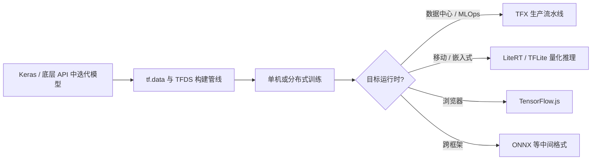

# TensorFlow

**TensorFlow** 是由 **Google Brain** 团队最初开发、现由全球社区维护的 **端到端开源机器学习平台**。它以 **`tf.keras`** 高层 API 降低建模门槛，并通过 **TFX**、**LiteRT**（原 TensorFlow Lite 品牌演进）、**TensorFlow.js** 等子项目延伸到 **生产 MLOps、移动/边端与浏览器** 运行时。在机器人研究与工程中，TensorFlow 更多出现在 **边端策略量化部署**（如 TFLite）与部分 **感知/RL 遗留代码栈**，训练侧常与 [PyTorch](./pytorch.md) 形成对照选型。

## 一句话定义

面向研究与生产的 **全栈 ML 平台**：Python/C++ 核心运行时 + Keras 建模 + 数据/训练/可视化/部署子生态，强调「同一平台内从实验到上线」。

## 英文缩写速查

| 缩写 | 英文全称 | 简要说明 |
|------|----------|----------|
| API | Application Programming Interface | 应用程序编程接口 |
| CPU | Central Processing Unit | 中央处理器 |
| GPU | Graphics Processing Unit | 图形处理器，CUDA 路径加速训练与推理 |
| CUDA | Compute Unified Device Architecture | NVIDIA GPU 通用并行计算平台 |
| RL | Reinforcement Learning | 通过与环境交互最大化长期回报来学习策略的范式 |
| MLOps | Machine Learning Operations | 机器学习生产化运维与流水线实践 |
| GNN | Graph Neural Network | 图神经网络，处理关系/拓扑数据 |
| TFLite | TensorFlow Lite | TensorFlow 边端推理运行时（现官网品牌向 LiteRT 演进） |
| ONNX | Open Neural Network Exchange | 跨框架神经网络模型交换格式 |

## 为什么重要？

- **端到端叙事完整**：官网将 **教程、数据集、建模 API、可视化（TensorBoard）、生产流水线（TFX）、边端（LiteRT）、Web（TF.js）** 串成一条学习—部署路径，适合需要「平台化」交付的团队。
- **边端部署成熟**：**LiteRT / TFLite** 在 Android、iOS、Raspberry Pi、Edge TPU 等受限设备上有长期积累；机器人 onboard 推理（ARM、Jetson/Orin 等）常经 **量化导出** 接入。
- **高层 API 友好**：`tf.keras` 与 Sequential/Functional API 降低入门成本，教学与快速原型仍广泛采用。
- **子生态覆盖 RL 与图学习**：**TensorFlow Agents** 支持强化学习实验；**TensorFlow GNN** 面向关系数据，与交通预测、发现类任务相关。

## 核心结构（官网与 README 归纳）

1. **核心运行时**：`tensorflow` PyPI 包提供张量运算、自动求导与设备放置；稳定 **Python / C++** API，其他语言 API 不保证向后兼容。
2. **建模层**：**`tf.keras`** 为官方推荐的高层 API；教程常以 MNIST + `Sequential` 展示 `compile` / `fit` / `evaluate` 闭环。
3. **数据与实验**：**tf.data** 构建输入管线；**TensorFlow Datasets** 提供标准数据集；**TensorBoard** 跟踪训练曲线与图结构。
4. **生产与边端**：
   - **TFX**：生产 ML 流水线与 MLOps 最佳实践
   - **LiteRT**：移动与边端推理（量化、delegate、设备插件）
   - **TensorFlow.js**：浏览器或 Node.js 端训练与推理
5. **安装矩阵**：`pip install tensorflow`（含 CUDA GPU，Ubuntu/Windows）；`tensorflow-cpu` 为更小 CPU 包；`tf-nightly` 供测试；macOS Metal、DirectX 等经 **Device Plugins** 扩展。

## 与机器人研究与工程的关系

- **训练侧对照**：人形 RL、模仿学习、VLA 等 **新工作更常默认 PyTorch**；TensorFlow 在 **历史代码复现、Keras 教学栈、TF Agents 实验** 场景仍常见。
- **部署侧衔接**：[htwk-gym](../methods/htwk-gym.md) 等栈将 PyTorch 训练策略经 **TFLite 量化** 部署到 Booster 机器人 **ARM/NVIDIA Orin**；体现「训练框架 ≠  onboard 运行时」的分工。
- **Web / 遥操作 Demo**：**TensorFlow.js** 可在无后端环境下跑轻量模型，适合浏览器侧原型（能力与延迟需按任务评估）。
- **感知遗留栈**：部分抓取、检测旧实现仍绑定 TensorFlow 1.x/2.x 图模式；新项目应优先核对维护状态与 CUDA 兼容性。

## 常见误区或局限

- **LiteRT / TFLite 品牌演进**：文档与包名可能并存；集成时以 [LiteRT 安装页](https://www.tensorflow.org/lite) 与目标设备 delegate 文档为准。
- **训练生态份额**：机器人学习社区新论文代码 **PyTorch 占比更高**；选 TensorFlow 训练前应确认 **复现栈、checkpoint 格式、分布式与仿真接口** 是否匹配。
- **Nightly 与 Stable**：`tf-nightly` 未完全测试；复现应锁定 Stable 版本并记录 `tensorflow.__version__`。
- **算子与量化限制**：并非所有训练图算子都能无损转 TFLite；部署前需在目标 delegate 上做 **代表性输入 benchmark**。

## 流程总览（实验 → 生产 → 边端）

## 关联页面

- [PyTorch](./pytorch.md)
- [深度学习基础](../concepts/deep-learning-foundations.md)
- [强化学习](../methods/reinforcement-learning.md)
- [htwk-gym（TFLite 部署示例）](../methods/htwk-gym.md)
- [反向传播算法](../concepts/backpropagation.md)
- [ONNX](./onnx.md)
- [MNN](./mnn.md)

## 参考来源

- [TensorFlow 官方站点与文档索引](../../sources/repos/tensorflow-official.md)

## 推荐继续阅读

- [TensorFlow Tutorials](https://www.tensorflow.org/tutorials/)
- [Install TensorFlow](https://www.tensorflow.org/install)
- [LiteRT for mobile & edge](https://www.tensorflow.org/lite)
- [TFX: Production ML pipelines](https://www.tensorflow.org/tfx)
- [tensorflow/tensorflow（GitHub）](https://github.com/tensorflow/tensorflow)
