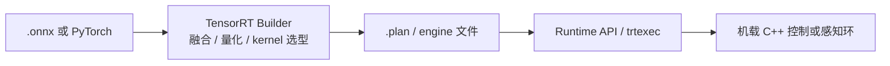

# TensorRT

**NVIDIA TensorRT** 是 NVIDIA 的 **深度学习推理加速 SDK 生态**：在 **build 阶段**将训练好的网络（常见入口为 [ONNX](./onnx.md) 或 PyTorch）编译为针对目标 GPU 优化的 **serialized engine（plan）**；在 **runtime 阶段**由应用加载 engine 执行前向。它基于 **CUDA**，支持 **FP32/FP16/BF16/FP8/INT8** 等精度，覆盖 **数据中心 GPU、GeForce RTX、Jetson、DRIVE** 等平台。在机器人研究与工程中，TensorRT 是 **NVIDIA 机载算力**（Orin、Thor、4090 等）上把感知网络与 tracker 策略压到 **毫秒级** 的首选 runtime。

## 一句话定义

**NVIDIA GPU 上的推理编译器 + runtime**：把通用 ONNX 图变成 **目标 GPU 专属高速 engine**，以延迟与吞吐换取平台绑定。

## 英文缩写速查

| 缩写 | 英文全称 | 简要说明 |
|------|----------|----------|
| TRT | TensorRT | NVIDIA 推理优化 SDK |
| ONNX | Open Neural Network Exchange | 最常见上游交换格式 |
| ORT | ONNX Runtime | 可通过 TensorRT EP 调用 TRT |
| FP16 | 16-bit Floating Point | 半精度推理，Jetson 常用 |
| INT8 | 8-bit Integer Quantization | 整数量化，需校准数据 |
| Jetson | NVIDIA 嵌入式 AI 平台 | Orin/Thor 等人形机载板卡 |
| CUDA | Compute Unified Device Architecture | TRT 依赖的 GPU 并行平台 |
| LLM | Large Language Model | TensorRT-LLM 子生态覆盖 |

## 为什么重要？

- **机载延迟标杆**：本库 [Humanoid-GPT](./paper-humanoid-gpt.md) 报告 **ONNX + TensorRT <1.5 ms**（4090）；[RF-DETR](./rf-detr.md) 在 T4/Jetson 上以 **TensorRT FP16** 达实时检测。
- **Jetson 生态默认优化路径**：感知、VLA、扩散去噪等 GPU 密集型 onboard 模块在 Orin 上文献普遍写 **TRT** 或 **ORT+TensorRT EP**。
- **与 ONNX 分工清晰**：训练侧导出 `.onnx`；部署侧 `trtexec` 或 Builder API 生成 **engine**——engine **绑定 GPU 架构**，换卡常需重编。
- **工具链完整**：**Model Optimizer**（量化/剪枝）、**TensorRT-LLM**、**Triton** serving backend，覆盖从单进程 C++ 到服务化部署。

## 核心结构（官方两阶段模型）

1. **Build Phase**
   - 输入：ONNX / PyTorch（Torch-TensorRT）等
   - Builder 为每层选择最快 **CUDA kernel**，做 **层融合、精度校准**
   - 输出：**engine 二进制**（plan）
2. **Runtime Phase**
   - `ICudaEngine` + `IExecutionContext` 执行推理
   - 须遵守 **对象生命周期**（factory 对象须覆盖其创建对象存活期）
3. **CLI 入口**：`trtexec --onnx=model.onnx` 生成 engine 并 benchmark
4. **版本注意**（11.x）：**强类型网络**为默认；旧版弱类型与隐式 INT8 calibrator API 已移除，升级须读 Migration Guide

## 与机器人研究与工程的关系

- **全身控制**：[Whole-Body Tracking Pipeline](../concepts/whole-body-tracking-pipeline.md) 真机层与 [ONNX Runtime](./onnxruntime.md) 并列；**极致延迟**场景优先 TRT（[Booster RoboCup demo](./booster-robocup-demo.md)：仿真 ORT / 真机 TRT）。
- **扩散/生成中间件**：[ETH G1 扩散 locomotion](./paper-hrl-stack-27-learning_whole_body_humanoid_locomot.md) 等用 **TensorRT ~20 ms** 两步去噪。
- **感知**：[RF-DETR](./rf-detr.md)、[object-detection 选型](../queries/object-detection-model-selection.md) — Jetson 上 TRT 为默认 benchmark 后端。
- **非 NVIDIA 硬件**：**不适用**；应选 [ONNX Runtime](./onnxruntime.md)、[MNN](./mnn.md)、[OpenVINO](./openvino.md) 等。

## 常见误区或局限

- **「ONNX 文件 = 已优化部署」**：TRT 还需 **build engine**；且 engine 与 **GPU SM 版本** 绑定。
- **ORT TensorRT EP ≠ 独立 engine**：API 与调试体验不同；极致性能常直接链 TRT runtime API。
- **动态 shape 与固定控制环**：locomotion 策略应 **固定输入 shape** 再 build，避免 runtime 重编译抖动。
- **量化回归**：INT8 须代表性校准集；闭环行走须在吊架复测（与 MNN/TFLite 同理）。

## 流程总览（ONNX → Engine → 机载）

## 关联页面

- [ONNX](./onnx.md)
- [ONNX Runtime](./onnxruntime.md)
- [MNN](./mnn.md)
- [OpenVINO](./openvino.md)
- [RF-DETR](./rf-detr.md)
- [Humanoid-GPT](./paper-humanoid-gpt.md)
- [ONNX Runtime vs MNN vs TensorRT](../comparisons/onnxruntime-vs-mnn-vs-tensorrt.md)

## 参考来源

- [NVIDIA TensorRT 官方站点与文档索引](../../sources/repos/tensorrt-official.md)

## 推荐继续阅读

- [TensorRT 文档](https://docs.nvidia.com/deeplearning/tensorrt/latest/)
- [Quick Start Guide](https://docs.nvidia.com/deeplearning/tensorrt/latest/getting-started/quick-start-guide.html)
- [How TensorRT Works](https://docs.nvidia.com/deeplearning/tensorrt/latest/architecture/how-trt-works.html)
- [NVIDIA/TensorRT（GitHub）](https://github.com/NVIDIA/TensorRT)
