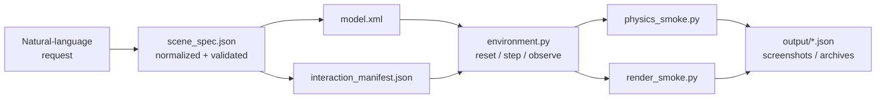
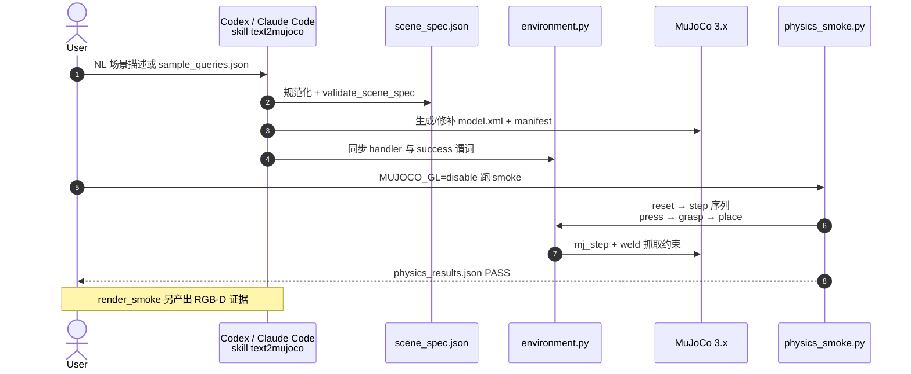

# Text2MuJoCo

**Text2MuJoCo**（[ShawnJoeng/Text2Mujoco](https://github.com/ShawnJoeng/Text2Mujoco)，MIT）是运行在 **现有编码代理**（Codex、Claude Code 等）内的 **Agent Skill 包**：把一条自然语言场景/任务描述，编译为 **可 `mj_loadXML`、可逐步交互、可机器审计** 的 MuJoCo 3 环境包，而不是只吐一段 MJCF 草稿。

## 一句话定义

> **NL → verified MuJoCo package**：`scene_spec.json` 为 canonical 输入，同步生成 `model.xml`、`environment.py`、`interaction_manifest.json` 与 `physics_smoke.py` / `render_smoke.py`，并用 JSON 数值报告 + committed RGB-D 截图证明「能跑、能交互、能成功」。

## 英文缩写速查

| 缩写 | 英文全称 | 简要说明 |
|------|----------|----------|
| MuJoCo | Multi-Joint dynamics with Contact | 底层物理引擎；本 skill 目标为 MuJoCo 3.x |
| MJCF | MuJoCo XML Format | `model.xml` 场景与刚体/关节/执行器描述 |
| NL | Natural Language | 用户或 sample query 的自然语言场景请求 |
| RGB-D | RGB + Depth | `render_smoke.py` 输出的彩色与深度证据 |
| API | Application Programming Interface | 统一 `reset/step/observe/is_success` 环境面 |
| SKILL.md | Agent Skill Manifest | `text2mujoco_codex` / `_claude` 内的技能契约与流程 |

## 为什么重要

- **补 MuJoCo 生态的「场景 authoring 摩擦」**：[MuJoCo Playground](./mujoco-playground.md) / [MuJoCo Menagerie](https://github.com/google-deepmind/mujoco_menagerie) 提供 **现成任务与资产**；Text2MuJoCo 面向 **「我脑子里有一个 manipulation / 导航 micro-scene，还没 MJCF」** 的快速原型 — 与 [仿真器选型](../queries/simulator-selection-guide.md) 中「先 MuJoCo 验证物理与交互契约」路径互补。
- **Agent Skill 范式落地**：与 [Archify](./archify.md) 类似，代理负责语义与补丁，**确定性脚本**负责 validate/deliver；差异是交付物为 **可仿真环境** 而非静态图。
- **可审计 > 可渲染**：条件字符串 **不会** 自行执行 — handler 代码、dependency order、success predicate 变更后必须重跑受影响 validation layer；静态 pose overlap 阈值 **0.1 mm**，序列接触 **1.0 mm**（solver softness 文档化）。

## 核心信息

| 项 | 内容 |
|----|------|
| **维护** | [ShawnJoeng](https://github.com/ShawnJoeng)（GitHub 个人仓） |
| **许可证** | MIT |
| **适配器** | `text2mujoco_codex`、`text2mujoco_claude`（校验脚本 CI diff，防漂移） |
| **Showcase** | 8 个 committed 场景（见 [showcase/](https://github.com/ShawnJoeng/Text2Mujoco/tree/main/showcase)） |
| **开源** | **已开源**（截至 **2026-09-19**） |

## 流程总览

## 源码运行时序图

主仓 **已开源**。下列时序对齐 README「How it works」与 showcase **01-button-cube-box** 交互链。

**Showcase 01（Button / Cube / Box）**：`press_start_button` → `grasp_red_cube` → `place_cube_in_box` → `inspect_rgbd` — [TEST_REPORT.md](https://github.com/ShawnJoeng/Text2Mujoco/blob/main/showcase/01-button-cube-box/TEST_REPORT.md) 记录 MuJoCo **3.2.7** 下 physics + RGB-D 全 PASS。

**Showcase 04（Lever / Ball / Ramp）**：`pull_blue_lever` → `check_release_zone` → `confirm_target_tray` → `inspect_with_camera` — 杠杆开闸、球沿坡道滚入目标托盘（[04-lever-ball-ramp](https://github.com/ShawnJoeng/Text2Mujoco/tree/main/showcase/04-lever-ball-ramp)）。

## 工程实践

| 项 | 说明 |
|----|------|
| **安装（Codex）** | `install-skill-from-github.py --repo ShawnJoeng/Text2Mujoco --path text2mujoco_codex --name text2mujoco` |
| **安装（Claude）** | 对称使用 `text2mujoco_claude` 路径 |
| **调用** | 直接描述场景，或 `$text2mujoco` 显式 invoke |
| **本地复现 01** | 进入 `showcase/01-button-cube-box/`，按 TEST_REPORT 跑 validator + smoke |
| **依赖** | MuJoCo 3.x Python binding；headless physics 用 `MUJOCO_GL=disable` |
| **与 RL 关系** | 产出 **Gym-like 交互面包**，可再接 [RL 训练](../methods/reinforcement-learning.md)；非 Playground 级批量 MJX 环境 |
| **开源状态** | **已开源** — 见 [sources/repos/text2mujoco.md](../../sources/repos/text2mujoco.md) |

## 局限与风险

- **代理质量依赖**：skill 约束流程，但 **首次生成** 仍可能多轮 patch；validation 阈值故意严格（overlap、marker 离地、grasp weld 诚实性）。
- **非通用场景编辑器**：面向 **agent 编译 + 验证** 闭环，不是 Unity/Blender 式人工摆场景。
- **Showcase 覆盖**：八场景偏 manipulation / 导航 micro-task；**不** 替代 [MuJoCo Menagerie](https://github.com/google-deepmind/mujoco_menagerie) 机器人 URDF/MJCF 资产库。
- **04 等场景** 未必各有独立 `TEST_REPORT.md`；以各目录 `output/*.json` 与 showcase 汇总 [model_audit_report.json](https://github.com/ShawnJoeng/Text2Mujoco/blob/main/showcase/output/model_audit_report.json) 为准。

## 关联页面

- [MuJoCo](./mujoco.md) — 底层引擎与 MJCF 文化
- [MuJoCo Playground](./mujoco-playground.md) — 现成 RL 任务入口（对比「从零 NL 造场景」）
- [MuJoCo Menagerie（GitHub）](https://github.com/google-deepmind/mujoco_menagerie) — 官方机器人 MJCF 资产
- [仿真器选型指南](../queries/simulator-selection-guide.md)
- [Archify](./archify.md) — 同类 Agent Skill + 确定性 validate 交付范式
- [Agent Skills（Addy Osmani）](./agent-skills-addyosmani.md) — 技能生态索引

## 参考来源

- [text2mujoco.md](../../sources/repos/text2mujoco.md)
- [Text2MuJoCo GitHub](https://github.com/ShawnJoeng/Text2Mujoco)
- [01-button-cube-box TEST_REPORT](https://github.com/ShawnJoeng/Text2Mujoco/blob/main/showcase/01-button-cube-box/TEST_REPORT.md)

## 推荐继续阅读

- [Showcase 索引](https://github.com/ShawnJoeng/Text2Mujoco/tree/main/showcase)
- [sample_queries.json](https://github.com/ShawnJoeng/Text2Mujoco/blob/main/showcase/sample_queries.json)
