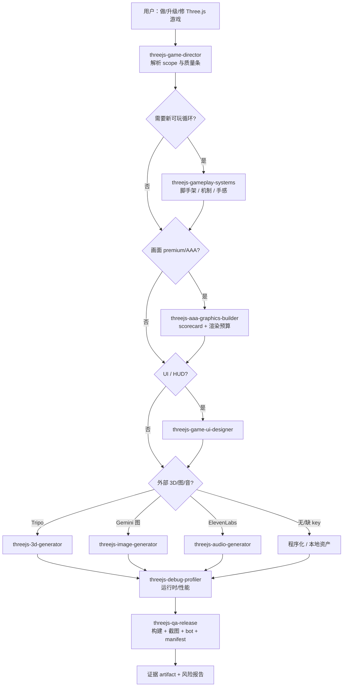
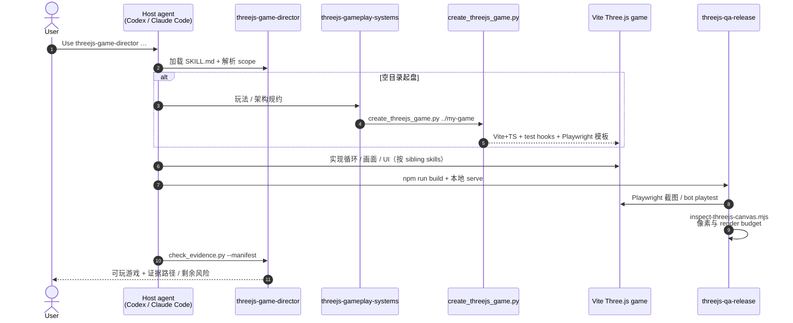

# Three.js Game Skills

**Three.js Game Skills** 是 [majidmanzarpour/threejs-game-skills](https://github.com/majidmanzarpour/threejs-game-skills)（MIT，~1.8k stars）分发的 **Agent Skills 游戏生产包**：九项自包含 `SKILL.md` 覆盖 **可玩循环 → 画面/UI 抛光 → 可选 Tripo/Gemini/ElevenLabs 资产 → 调试/性能 → 发布级 QA**。用户只需调用 **`threejs-game-director`**，导演技能按 scope 自动加载 sibling 专家，并在 **premium/AAA/release-ready** 请求下要求 **构建、浏览器证据、canvas 像素、viewport、bot playtest、visual scorecard** 等可审计 artifact。

## 一句话定义

用 **导演技能 + 九垂直 `SKILL.md` + 打包 Vite/TypeScript 脚手架与 QA 脚本**，把 **「做一个能玩的浏览器 Three.js 游戏」** 固化为代理可执行规约；核心 Three.js 路径 **无需付费 API**，外部 3D/图像/音频生成 **可选**。

## 英文缩写速查

| 缩写 | 英文全称 | 简要说明 |
|------|----------|----------|
| Three.js | — | 浏览器 WebGL 3D 库；本技能包的运行时目标 |
| QA | Quality Assurance | 质量保障；本仓含 Playwright 截图、bot playtest、证据 manifest |
| GLB | GL Transmission Format Binary | Tripo 等 3D 生成常用网格容器 |
| VFX | Visual Effects | 视觉特效；`threejs-aaa-graphics-builder` 负责粒子/后处理等 |
| HUD | Heads-Up Display | 抬头显示/UI 叠层；`threejs-game-ui-designer` 专长 |
| API | Application Programming Interface | Tripo / Gemini / ElevenLabs 等可选生成服务接口 |
| TS | TypeScript | 脚手架与游戏代码默认语言（Vite 模板） |

## 为什么重要

- **Agent Skills 的「完整垂直交付」样本：** 与 [img2threejs](./img2threejs.md)（**单图→程序化模型**）、[GSAP Skills](./gsap-skills.md)（**DOM 动效**）、[image-blaster](./image-blaster.md)（**单图→splat 世界包**）并列，本仓把 **玩法、画面、UI、资产生成、调试、发布** 写成 **可安装技能簇**，并由导演统一路由——代表 **游戏级 scope 的 skill 编排**，而非单点 API 备忘。
- **证据契约降低「声称完成」风险：** README 的 **Expected Evidence** 按改动缩放（小 HUD 修不必跑全量发布审计）；`check_evidence.py --manifest` 与 `inspect-threejs-canvas.mjs` 把 **premium/AAA** 声明绑定到 **截图、像素指标、run ID**，对本站维护者理解「代理自验」有直接参照。
- **对本站 `docs/` 的弱交叉价值：** [前端体验优化清单](../../docs/checklists/frontend-optimization-v1.md) 规划 richer 交互；若需要 **WebGL 小游戏 demo 或 Three.js 交互 sandbox**，本仓 **Vite 脚手架 + `__THREE_GAME_TEST_HOOKS__`** 是可复用起点（非必须引入全九技能）。
- **与机器人栈的边界清晰：** 产物是 **浏览器可发布游戏**，不是 URDF/MJCF 仿真资产或真机部署链；需要制造/仿真几何时看 [CAD Skills](./cad-skills.md) / [img2threejs](./img2threejs.md) 的 **程序化 WebGL** 或 **STEP/URDF** 路线。

## 核心结构

| 层次 | 内容 |
|------|------|
| **分发** | `npx skills add majidmanzarpour/threejs-game-skills --skill '*' -a codex|claude-code -g -y`；或 clone 后 `./install.sh --codex|--claude|--all`。 |
| **入口** | `threejs-game-director` — scope 解析、sibling 路由、可选委托、连续性笔记、资产 job 恢复、证据汇总。 |
| **玩法层** | `threejs-gameplay-systems` — 核心循环、实体/输入/相机、物理选型、打击感；含 `create_threejs_game.py` 脚手架生成器。 |
| **画面/UI** | `threejs-aaa-graphics-builder`（scorecard + 技术美术预算）、`threejs-game-ui-designer`（HUD/触控/安全区）。 |
| **质量层** | `threejs-debug-profiler`、`threejs-qa-release`（Playwright、canvas 像素、bot playtest、生产构建）。 |
| **可选资产** | `threejs-3d-generator`（Tripo）、`threejs-image-generator`（Gemini）、`threejs-audio-generator`（ElevenLabs）；缺 key 时程序化 fallback + `probe_asset_credentials.sh`。 |
| **脚手架** | `skills/threejs-gameplay-systems/assets/threejs-vite-game/` — Vite+TS+Playwright，确定性 RNG 与测试钩子。 |

### 导演路由（流程总览）

### 源码运行时序图

主仓 **已开源**（MIT）。下列时序对齐 README 与 `create_threejs_game.py` / QA 脚本：用户通过代理 prompt 驱动，脚本负责脚手架与验证机械步骤。

关键复现路径：安装技能 → 在空目录 prompt 导演 →（可选）`create_threejs_game.py` 落盘脚手架 → 开发后 `npm run build` + QA 脚本收集证据。

## 工程实践

| 项 | 要点 |
|----|------|
| **安装（Codex）** | `npx skills add majidmanzarpour/threejs-game-skills --skill '*' -a codex -g -y` |
| **安装（Claude Code）** | 同上，`-a claude-code`；或 `/threejs-game-director` |
| **本地开发** | clone 后 `./install.sh --codex` / `--claude` / `--all`；`--force` 覆盖同名技能 |
| **推荐 prompt** | 点名 `threejs-game-director`，说明游戏类型与质量条（premium/AAA/release-ready 会拉高证据要求） |
| **凭证探测** | `bash …/threejs-game-director/scripts/probe_asset_credentials.sh` → `TRIPO/GEMINI/ELEVENLABS=SET|MISSING` |
| **维护者自检** | 仓库根 `npm install && npm run check:scripts && npm run validate:skills && npm run test:helpers` |
| **开源状态** | **已开源**（截至 2026-09-07）：MIT 主仓；Tripo/Gemini/ElevenLabs 为 **可选闭源 API**。 |

## 局限与风险

- **误区：浏览器游戏技能 = 机器人仿真。** 本包产出 **Web 可发布游戏**；物理、碰撞、资产语义面向 **玩法与画面**，**不等于** MuJoCo/Isaac 操作资产或 [CAD Skills](./cad-skills.md) 制造链。
- **误区：装了技能就保证 AAA 画面。** premium 声明依赖 **scorecard + 实测截图**；缺 Tripo/Gemini 时英雄模型可能仍是程序化几何——导演应报告 credential probe 与 fallback，而非静默宣称完成。
- **误区：与 img2threejs 重复。** [img2threejs](./img2threejs.md) 做 **单图→可 diff TS 工厂**；本仓做 **完整游戏循环 + UI + QA + 可选 API 资产**，目标产物不同。
- **局限：** 强依赖宿主 **浏览器/Playwright** 工具链；外部资产生成有 **费用与配额**；演示游戏托管在 Netlify，非本仓库子模块。

## 关联页面

- [img2threejs](./img2threejs.md) — **单图→程序化 Three.js 工厂**（无外部 3D API）
- [image-blaster](./image-blaster.md) — **单图→Marble splat + Hunyuan 资产包**（Claude Code 编排）
- [GSAP Skills](./gsap-skills.md) — **DOM/SVG Web 动效** 官方 Agent Skills
- [CAD Skills](./cad-skills.md) — **STEP/URDF 制造** Agent Skills
- [video-shotcraft](./video-shotcraft.md) — **Remotion 产品宣传片** Agent Skill
- [Skills For Real Engineers（mattpocock）](./mattpocock-skills.md) — 通用编码工程技能对照
- [Superpowers（obra）](./superpowers-obra.md) — 重流程交付技能库
- [前端体验优化清单](../../docs/checklists/frontend-optimization-v1.md) — 本站 `docs/` 交互 roadmap
- [LLM Wiki（Karpathy 模式）](../references/llm-wiki-karpathy.md) — 知识编译 vs skill 规约编译

## 参考来源

- [majidmanzarpour/threejs-game-skills 仓库源归档（本站）](../../sources/repos/threejs-game-skills.md)
- [majidmanzarpour/threejs-game-skills（GitHub）](https://github.com/majidmanzarpour/threejs-game-skills)

## 推荐继续阅读

- [Agent Skills 规范](https://agentskills.io/) — `SKILL.md` 与安装约定
- [vercel-labs/skills CLI](https://github.com/vercel-labs/skills) — 跨 harness 安装器
- [Three.js 文档](https://threejs.org/docs/) — 运行时 API
- [Neon Ridge Drift 演示](https://ridgedrift.netlify.app/) — README 列出的可玩样例之一
- [Tripo API 快速开始](https://platform.tripo3d.ai/docs/quick-start) — 可选 3D 生成后端
