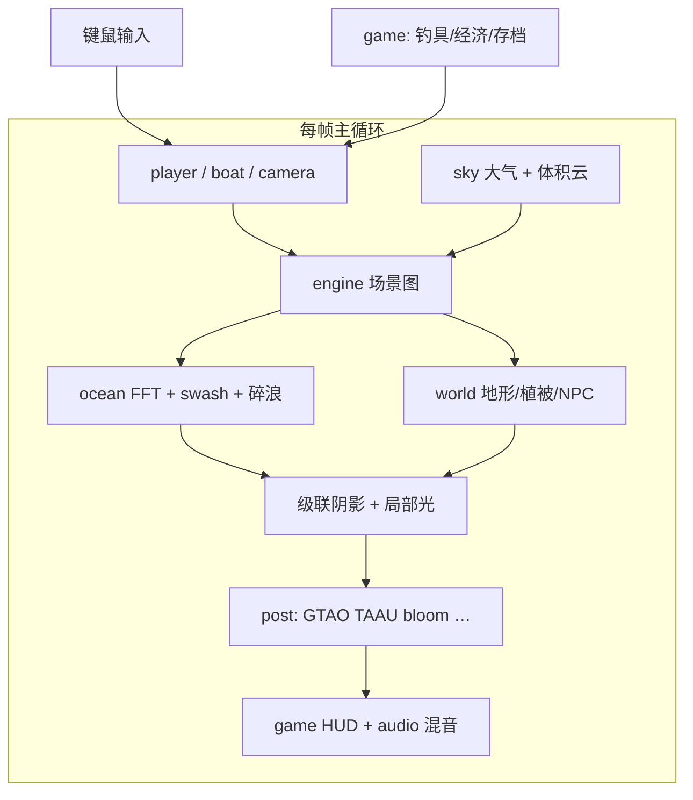
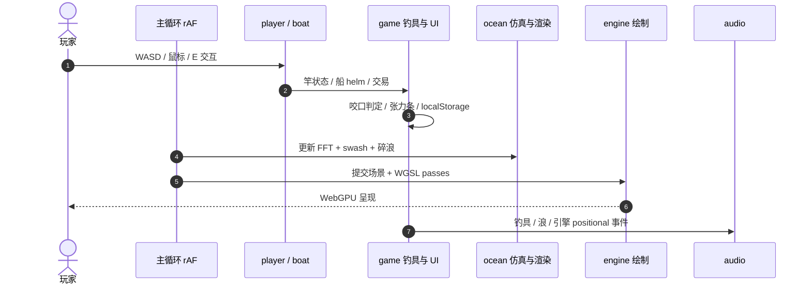

# Tidewater

**Tidewater**（[GitHub](https://github.com/dgreenheck/tidewater)，[在线游玩](https://dgreenheck.github.io/tidewater/)）是运行在 **WebGPU + WGSL** 上的浏览器 **热带岛钓鱼游戏**：自研小型渲染引擎（无商业引擎框架），把 **四级联 FFT 海洋**、**浅水 swash**、**物理大气与体积云**、级联阴影与 GTAO/TAAU 后处理、以及 **钓具张力博弈 + 船载/码头经济循环** 打包为可即时体验的 Demo；MIT 开源，`main` 自动部署 GitHub Pages。

## 一句话定义

**在浏览器里用自研 WebGPU 引擎同时跑「可玩的钓鱼闭环」与「近影视级海洋–大气–村落场景」，作为机器人栈之外的实时 GPU 交互与流体可视化参照。**

## 英文缩写速查

| 缩写 | 英文全称 | 简要说明 |
|------|----------|----------|
| WebGPU | Web Graphics Processing Unit API | 浏览器 GPU 计算与图形 API |
| WGSL | WebGPU Shading Language | WebGPU 着色器语言 |
| FFT | Fast Fourier Transform | Tessendorf 谱海洋等多 cascade 频域合成 |
| GTAO | Ground Truth Ambient Occlusion | 屏幕空间环境光遮蔽变体 |
| TAAU | Temporal Anti-Aliasing Upsampling | 时域抗锯齿 + 升采样 |
| LOD | Level of Detail | 植被 impostor 与 dither 淡出 |

## 为什么重要

- **WebGPU 工程样本：** 与 [Particles4All](./particles4all.md)（统一粒子 PBD）、[BotLab MotionCanvas](./botlab-motioncanvas.md)（ONNX + MuJoCo 编排）并列，展示 **纯前端 WGSL** 可承载的多 pass 实时管线，而非仅 WASM 推理或 WebGL2。
- **海洋/流体可视化参照：** FFT 海面 + 碎浪 + swash + 焦散 + 水线合成，对 **水域仿真教学、数字孪生可视化、sim 结果浏览器预览** 有借鉴价值（非 RL 训练后端）。
- **零安装传播：** Pages 即玩 + `npm run dev` 本地调试，适合公开课/展会 **GPU 能力演示**；首访 shader 编译成本高，需在演示前预热缓存。
- **资产与动画管线：** Poly Haven 扫描、Rocketbox 蒙皮角色、`tools/` 转换脚本 —— 与 [角色动画 vs 机器人](../concepts/character-animation-vs-robotics.md) 中的 **游戏侧资产路径** 可对照阅读。

## 核心信息

| 项 | 内容 |
|----|------|
| **维护者** | dgreenheck（GitHub 个人项目；仓库描述提及 Opus 5.5 辅助构建） |
| **许可** | MIT（第三方 CC0 音频/扫描等见 CREDITS.md） |
| **开源** | **已开源** — 完整 `src/` 与 deploy workflow |

## 核心能力

| 维度 | 要点 |
|------|------|
| **引擎** | `src/engine/` — 场景图、GPU 资源、WGSL shader 组合、材质与光照 |
| **海洋** | 四 cascade FFT（Tessendorf）、泡沫/白浪、深度碎浪、swash、尾迹、焦散、水下/水上分割 |
| **天空** | Hillaire 2020 大气、体积云/卷云、God rays、lens flare |
| **世界** | 地形、渔村/码头、 reef 鱼群、植被 LOD、鲸与鸟类行为 |
| **玩法** | 抛投/收线/张力条、18 鱼种、鱼市与 chandlery 升级、可驾驶柴油船、localStorage 存档 |
| **后处理** | GTAO、bounce light、contact shadows、TAAU、运动模糊、bloom、自动曝光 |
| **音频** | CC0 场录 positional soundscape |
| **质量** | 目标 60fps @ 2560×1267（M5 Pro）；动态分辨率缩放 |

## 流程总览

## 源码运行时序图

浏览器端无后端；典型 **游玩帧** 与 **抛竿–搏鱼** 路径（对齐 `src/player/`、`src/game/`、`src/ocean/`）：

- **最短体验路径：** 打开 [GitHub Pages](https://dgreenheck.github.io/tidewater/)（需 WebGPU 浏览器）。
- **开发路径：** clone → `npm install` → `npm run dev` → `http://127.0.0.1:5189`；`npm test` 跑 headless smoke。

## 工程实践

| 步骤 | 做法 |
|------|------|
| 在线 | https://dgreenheck.github.io/tidewater/ |
| 本地 | `npm install` && `npm run dev` |
| 调试渲染 | URL 参数：`?fly`、`noClouds`、`noCaustics`、`noSim` 等（见 README） |
| 设置 | **H** 面板可调海况、时刻、云、后处理等 |
| 对照 | 机器人训练级仿真见 [MuJoCo](./mujoco-wasm.md) / Isaac；本仓偏 **实时视觉交互** |

## 局限与风险

- **非机器人仿真后端：** 无 URDF/MJCF、无批量 RL、无可微系统辨识；物理为 **视觉与玩法优先**（见 [仿真物理保真](../queries/simulation-physics-fidelity.md)）。
- **GPU 与首载：** WebGPU 实现因平台差异大；首访 shader 编译可能 **>1 分钟**，演示需预加载。
- **范围：** 主题是休闲钓鱼与海岸场景，勿与工业海洋数字孪生或水动力 CFD 直接等同。
- **维护：** 个人项目，API 与性能目标以 README 为准。

## 关联页面

- [Particles4All](./particles4all.md) — 浏览器 WebGPU 流体/粒子对照
- [BotLab MotionCanvas](./botlab-motioncanvas.md) — 浏览器内策略–仿真编排
- [MuJoCo WASM](./mujoco-wasm.md) — 浏览器侧刚体物理另一条路径
- [仿真物理保真（Query）](../queries/simulation-physics-fidelity.md)
- [角色动画 vs 机器人](../concepts/character-animation-vs-robotics.md)

## 参考来源

- [Tidewater 仓库归档](../../sources/repos/tidewater.md)

## 推荐继续阅读

- [GitHub：dgreenheck/tidewater](https://github.com/dgreenheck/tidewater)
- [在线游玩](https://dgreenheck.github.io/tidewater/)
- [Tessendorf — Simulating Ocean Water (SIGGRAPH 2001)](https://people.cs.cmu.edu/~kmcrane/Projects/FFT/fft.pdf)
