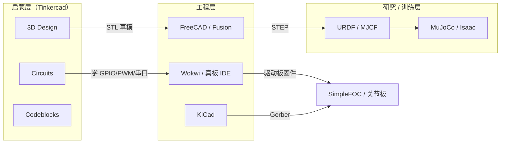

# Tinkercad

**Tinkercad**（[tinkercad.com](https://www.tinkercad.com/)）是 **Autodesk** 提供的 **免费 Web 应用**：在同一账号与课堂体系里覆盖 **3D 设计**、**电子电路仿真（Arduino Uno / BBC micro:bit 等）** 与 **Codeblocks 积木编程**。在机器人研究与工程知识库中，它定位为 **K–12 / 创客启蒙与焊板前入门层**——补齐「零门槛造型 + 入门 MCU 仿真」，**不是** [FreeCAD](./freecad.md) 级制造 CAD、[KiCad](./kicad.md) 级 PCB 真值，也 **不是** MuJoCo / Isaac 类刚体接触仿真器。

## 英文缩写速查

| 缩写 | 英文全称 | 简要说明 |
|------|----------|----------|
| CAD | Computer-Aided Design | 计算机辅助设计；本页指浏览器端积木式 3D 造型 |
| MCU | Microcontroller Unit | 微控制器；Circuits 中仿真 Arduino / micro:bit |
| STEM | Science, Technology, Engineering, Mathematics | 科学—技术—工程—数学教育框架 |
| STL | Stereolithography (file format) | 三角网格交换格式，3D 打印常用导出 |
| NGSS | Next Generation Science Standards | 美国新一代科学教育标准；课堂教案对齐目标之一 |
| COPPA | Children's Online Privacy Protection Act | 儿童在线隐私保护法；Tinkercad 宣称 KidSAFE COPPA 认证 |
| PWM | Pulse-Width Modulation | 脉宽调制；舵机/LED 调光等入门实验常用 |
| GPIO | General-Purpose Input/Output | 通用数字 IO；Arduino 入门课核心接口 |

## 为什么重要

- **机器人学习入口的「缺层」**：研究栈常从 URDF / RL / FOC 切入，但实验室新人与课程往往需要 **零安装** 的造型与电路沙箱；Tinkercad 把 **可打印草模 + Arduino 行为仿真** 放在浏览器里，降低第一周摩擦。
- **与工程工具链可衔接**：3D 侧可导出 **STL/OBJ**（并可转入 Fusion 360）；电路侧 Arduino 积木可切换到 **C++ 文本**，再迁移到 Arduino IDE / PlatformIO 与 [SimpleFOC](./simplefoc.md) 真板。
- **课堂与合规**：Ad-free、课堂管理、对齐 Common Core / NGSS——适合高校 outreach、中学机器人社与入门实训，而不是替代 [Wokwi](./wokwi.md) 的 CI / ESP32 工程仿真。
- **划清边界**：避免把「能在浏览器里转舵机」误读成 **接触丰富的机器人仿真** 或 **可打样的原理图真值**。

## 核心原理

### 三工作区 + Sim Lab

| 模块 | 输入 | 机制 | 输出 |
|------|------|------|------|
| **3D Design** | 基本体、孔/实体布尔、尺寸手柄 | 浏览器 CSG 式积木建模 | STL/OBJ/GLTF/SVG/USDZ 等；可转 Fusion |
| **Circuits** | 虚拟面包板、元件库、MCU | 电路拓扑 + 固件解释/仿真循环 | LED/舵机/串口等行为；Blocks 或 C++ |
| **Codeblocks** | Scratch 风格积木栈 | 积木驱动参数与重复构造 | 参数化 / 动画化 3D 造型 |
| **Sim Lab** | 材料、重力、电机类型 | 玩具级刚体/机构示意 | 机构直觉与课堂演示视频 |

### 在机器人工具谱系中的位置

- **Circuits vs Wokwi**：二者都做浏览器 MCU 仿真；Tinkercad 强在 **课堂一体（3D+电路）与 Arduino/micro:bit 入门路径**，弱在 **ESP32/STM32/Pico 广度、GDB、wokwi-cli CI**。
- **3D vs FreeCAD/Blender**：Tinkercad 强在 **分钟级上手**；制造公差、装配约束、FEM 走 FreeCAD；网格/动画/USD 走 [Blender](./blender.md)。
- **Circuits vs KiCad**：Tinkercad 验证 **功能行为**；KiCad 产出 **可制造 PCB**。

## 工程实践

| 场景 | 建议用法 | 下一步 |
|------|----------|--------|
| **外壳 / 支架草模** | 3D Design 快速定外形与孔位 → 导出 STL 试打 | 参数化与 STEP 真值转 [FreeCAD](./freecad.md) 或 Fusion |
| **Arduino 第一次 blink / 舵机** | Circuits 积木 → Blocks+Text 对照生成的 C++ | 真板 + PlatformIO；FOC 见 [SimpleFOC](./simplefoc.md) |
| **无硬件外设冒烟（入门）** | 超声波、光敏、按键 + 串口监视器 | 进阶 MCU / CI 仿真改用 [Wokwi](./wokwi.md) |
| **底软 bring-up 教学** | 用 Tinkercad 讲清 GPIO/PWM/UART 语义 | 总线与产测流程见 [电机底软通信总览](../overview/motor-drive-firmware-bus-protocols.md) |
| **整机电子认知** | 课堂拼「传感器 + MCU + 执行器」故事线 | 驱动/BMS/计算板真值见 [Hardware 101 · 电源与电子](../overview/humanoid-hardware-101-power-compute-electronics.md) |

**开源状态（项目页核查）：** **确认未开源** — Autodesk 闭源 SaaS；免费账号可用，无公开仿真内核或编辑器源码。设计资产可导出；不要假设可自建私有化实例或审计仿真保真度实现。

## 局限与风险

- **误区：Tinkercad = 机器人仿真器** — Sim Lab / 舵机元件是 **教学示意**，无浮基动力学、接触摩擦模型或策略训练 API。
- **误区：Circuits 原理图可直接打样** — 教学面包板拓扑 ≠ [KiCad](./kicad.md) 原理图/PCB/Gerber；功率、EMC、铜厚与隔离需另做。
- **MCU 覆盖窄** — 公开教程主推 Arduino Uno 与 micro:bit；ESP32 / STM32 工程栈优先 [Wokwi](./wokwi.md)。
- **几何与许可** — 导出多为网格；复杂参数与装配语义会在转制造 CAD 时丢失。产品闭源，机构数据与课堂内容受 Autodesk ToS / 隐私策略约束。
- **研究复现不适用** — 不提供可版本锁定的开源仿真内核，不宜作为论文实验环境依赖。

## 关联页面

- [Wokwi](./wokwi.md) — 工程向浏览器 MCU/外设仿真（ESP32/STM32/CI）
- [FreeCAD](./freecad.md) — 开源参数化机械 CAD（制造级上游）
- [KiCad](./kicad.md) — 开源原理图 / PCB / Gerber
- [Blender](./blender.md) — 开源 DCC（网格与动画层）
- [SimpleFOC](./simplefoc.md) — Arduino/ESP32/STM32 上的开源 FOC
- [电机驱动器底软通信协议总览](../overview/motor-drive-firmware-bus-protocols.md)
- [文字生成 CAD](../concepts/text-to-cad.md)
- [Humanoid Hardware 101 · 电源与电子](../overview/humanoid-hardware-101-power-compute-electronics.md)

## 参考来源

- [Tinkercad 官网归档](../../sources/sites/tinkercad-com.md)
- [Tinkercad 官网](https://www.tinkercad.com/)
- [Tinkercad Circuits Learn](https://www.tinkercad.com/learn/circuits)

## 推荐继续阅读

- [Autodesk Tinkercad Getting Started Guide (PDF)](https://damassets.autodesk.net/content/dam/autodesk/www/pdfs/tinkercad-getting-started-guide.pdf)
- [Tinkercad Learn](https://www.tinkercad.com/learn)
- [Wokwi Docs — Supported Hardware](https://docs.wokwi.com/getting-started/supported-hardware)（工程向对照）
