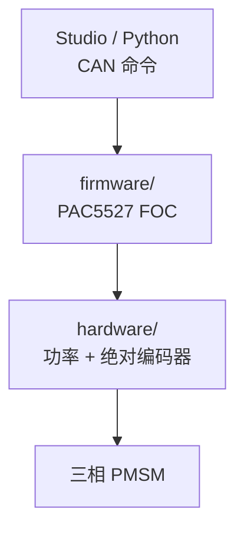

# Tinymovr（紧凑开源关节驱动）

## 一句话定义

**Tinymovr**（现属 [Motion Layer](https://motionlayer.company)，仓 [motionlayer/Tinymovr](https://github.com/motionlayer/Tinymovr)，文档 [tinymovr.readthedocs.io](https://tinymovr.readthedocs.io)）是面向三相无刷（PMSM）的紧凑电机控制器：**集成编码器**、**CAN**、FOC 固件与 Studio 上位机。

## 英文缩写速查

| 缩写 | 英文全称 | 简要说明 |
|------|----------|----------|
| FOC | Field-Oriented Control | 无刷电机的磁场定向控制 |
| CAN | Controller Area Network | 电机/关节常用的现场总线通信协议 |
| PCB | Printed Circuit Board | 印制电路板 |
| PMSM | Permanent Magnet Synchronous Motor | 永磁同步电机 |
| MCU | Microcontroller Unit | 微控制器；本项目固件面向 PAC5527 |
| API | Application Programming Interface | 上位机/脚本调用接口 |

## 为什么重要

- 相对 [moteus](./moteus.md)，板级与文档更偏「小型驱动从零看懂」：`hardware/`、`firmware/`、`studio/` 分目录清晰。
- 在开源执行器学习阶梯中，与 moteus 同属 **Stage 2：关节驱动 PCB 与固件**。
- **开源边界必须写清：** v3.0.0 公共仓仍可读；**v3.1+ 源码已私有**，仅 Releases 二进制——选型与二次开发前先确认版本策略。

## 开源状态（截至 2026-07-25 项目页/README 核查）

| 资产 | 状态 |
|------|------|
| 公共仓源码（≤ v3.0.0） | **已开源快照**：firmware/hardware/docs **MIT**；Studio / 项目整体 **GPLv3** |
| v3.1+ 固件/Studio 源码 | **未开源**（私有仓；二进制由 MotionLayer 分发） |
| 文档 | **已发布**：Read the Docs + 仓内 `docs/` |
| Releases | **已发布**：固件、Python wheel、Studio Web 等附件 |

## 核心结构/机制

| 目录 | 内容 |
|------|------|
| `firmware/` | PAC5527 固件 |
| `hardware/` | 原理图 / PCB |
| `studio/` | 上位机与客户端库 |
| `docs/` | Sphinx 文档源 |
| 根目录 | `ARCHITECTURE.md`、`SAFETY.md`、`AVLOS_GUIDE.md` 等开发者文档 |

## 工程实践

| 目标 | 做法 |
|------|------|
| 学习开源实现 | 检出 **v3.0.0** 标签，精读功率采样、编码器与 CAN 协议（Avlos） |
| 跑最新功能 | 从 Releases 下二进制；接受源码不可改的前提 |
| 对照自研板 | 与 [moteus](./moteus.md)、[SimpleFOC](./simplefoc.md) 画同一张误差预算表 |
| 合规 | Studio/项目 GPLv3；商用闭源分发前评估；v3.1+ 专有二进制另遵厂商条款 |

## 局限与风险

- **v3.1+ 源码关闭**后，不能再假设「GitHub = 可改固件」。
- 峰值电流与热设计面向紧凑应用，不宜默认外推重型人形髋膝。
- 组织从 `tinymovr` 迁至 `motionlayer`，链接与商标以当前站为准。

## 关联页面

- [moteus](./moteus.md)
- [VESC](./vesc.md)
- [SimpleFOC](./simplefoc.md)
- [开源 QDD 执行器项目对比](../comparisons/open-source-qdd-actuator-projects.md)
- [执行器驱动链选型闭环](../queries/actuator-drive-chain-selection-loop.md)

## 参考来源

- [sources/repos/tinymovr.md](../../sources/repos/tinymovr.md)
- [开源 QDD 执行器学习策展](../../sources/personal/open_source_qdd_actuator_learning_curator.md)

## 推荐继续阅读

- <https://github.com/motionlayer/Tinymovr>
- <https://tinymovr.readthedocs.io>
- <https://tinymovr.com>
