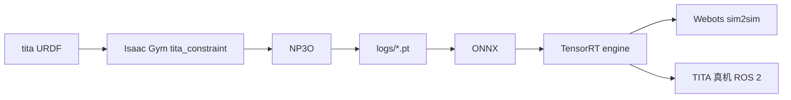

# tita_rl

**tita_rl** 是 [直驱科技（Direct Drive Tech）](https://github.com/DDTRobot) 为 **TITA 轮腿双足** 提供的官方强化学习训练仓（GitHub：[`DDTRobot/tita_rl`](https://github.com/DDTRobot/tita_rl)），建立在 **Isaac Gym** 上，算法实现来自 [LocomotionWithNP3O](https://github.com/zeonsunlightyu/LocomotionWithNP3O)。

## 一句话定义

用 **NP3O 约束 PPO** 在 Isaac Gym 里训 TITA 的 `tita_constraint` 速度跟踪策略，把 ONNX 编成 TensorRT engine，再交给配套仓做 **Webots sim2sim** 和板载推理。

## 英文缩写速查

| 缩写 | 英文全称 | 简要说明 |
|------|----------|----------|
| TITA | Direct Drive Tech TITA | 本仓的目标整机（轮腿双足） |
| NP3O | Constrained PPO（仓内 `algorithm/np3o.py`） | 带 cost value / violation loss 的 PPO 变体 |
| Isaac Gym | NVIDIA Isaac Gym | 已弃用的 GPU 并行 RL 仿真；本仓仍钉在这一代 |
| ONNX | Open Neural Network Exchange | `export_policy_as_onnx.py` / play 导出格式 |
| TensorRT | NVIDIA TensorRT | `trtexec` 把 ONNX 编成 `model_gn.engine` 供 Webots/真机 |

## 为什么重要

- **厂商官方 Gym 栈**：要复现或部署 **TITA 双轮足** 时，这是文档最完整的 Isaac Gym 入口；同组织新栈 [DDT_Lab](./ddt-lab.md) 才是 Isaac Lab。
- **训练与部署分得清楚**：本仓只负责并行训练；sim2sim/真机在 [`tita_rl_sim2sim2real`](https://github.com/DDTRobot/tita_rl_sim2sim2real)，避免把 Webots bringup 误当成 Gym 脚本。
- **约束 RL 可读**：`costs` 里显式列出位置/力矩/速度限与绊倒，适合对照「奖励塑形 vs 代价约束」怎么写进 locomotion。

## 核心原理

| 模块 | 作用 |
|------|------|
| 任务 | `tita_constraint`（`train.py` 注册 `LeggedRobot` + `TitaConstraintRoughCfg`） |
| 资产 | `resources/tita/urdf/tita_description.urdf`；8 关节，足端 `leg_4`，`base` 接触终止 |
| 观测 | 本体 33 维 + 高程扫描 187 + 10 步历史 + 特权 latent；默认 4096 env |
| NP3O | `cost_value_loss_coef` / `cost_viol_loss_coef`；6 个 cost 通道 |
| 导出 | 策略 → ONNX → `trtexec --saveEngine=model_gn.engine` |

## 工程实践

1. 对齐 README 参考环境：Python **3.8** conda、**Isaac Gym**、CUDA 12.x；先跑 Gym 自带 `1080_balls_of_solitude.py`。
2. `git clone https://github.com/DDTRobot/tita_rl.git` → `python train.py --task=tita_constraint --headless`（开 GUI 在 3060 上会明显卡）。
3. 评估：把 `logs/` 下 checkpoint 拷到仓根，`python simple_play.py --task=tita_constraint`；仓内有示例 `tita_example_10000.pt`。
4. 导出：生成 `test.onnx` 后 `/usr/src/tensorrt/bin/trtexec --onnx=test.onnx --saveEngine=model_gn.engine`。
5. 部署：clone [`tita_rl_sim2sim2real`](https://github.com/DDTRobot/tita_rl_sim2sim2real)，把 engine 路径写进 `FSMState_RL.cpp`；可用官方 Webots 2023 ROS 2 Docker。真机默认 `robot@192.168.42.1`，先停 `tita-bringup.service`。
6. **不要**把本仓和 [DDT_Lab](./ddt-lab.md) 的 checkpoint 混用；观测、历史编码与仿真后端都不同。

## 局限与风险

- **开源状态：已开源**（MIT）；训练代码与示例权重可跑。
- **Isaac Gym 已 deprecated**：新实验优先 DDT_Lab；本仓服务既有 TITA Gym 流水线与论文复现。
- **部署仓无 SPDX**：`tita_rl_sim2sim2real` 许可证未在 GitHub 标明；TensorRT 10.x 需看上游 issue。
- **姊妹仓勿混机体**：`titatit_rl` / `quadruped-wheel-titatit-rl` 是 TITATIT 四足 / 四轮足，不是 TITA 双轮足。

## 关联页面

- [轮腿双足](../concepts/wheel-legged-biped.md)
- [DDT_Lab](./ddt-lab.md) — 同厂商 Isaac Lab + NP3O（D1 / Tita）
- [Isaac Gym](./isaac-gym.md)
- [legged_gym](./legged-gym.md) — 本仓环境/配置结构的经典模板
- [Webots](./webots.md) — sim2sim 后端
- [wheel_legged_genesis](./wheel-legged-genesis.md)
- [Isaac-RL-Two-wheel-Legged-Bot](./isaac-rl-two-wheel-legged-bot.md)
- [Hybrid Locomotion](../tasks/hybrid-locomotion.md)
- [Locomotion](../tasks/locomotion.md)

## 参考来源

- [sources/repos/tita_rl.md](../../sources/repos/tita_rl.md)
- [sources/repos/tita_rl_sim2sim2real.md](../../sources/repos/tita_rl_sim2sim2real.md)
- 上游：<https://github.com/DDTRobot/tita_rl>
- 部署仓：<https://github.com/DDTRobot/tita_rl_sim2sim2real>

## 推荐继续阅读

- NP3O 上游：<https://github.com/zeonsunlightyu/LocomotionWithNP3O>
- Isaac Lab 官方继任：[DDT_Lab](https://github.com/DDTRobot/DDT_Lab)
