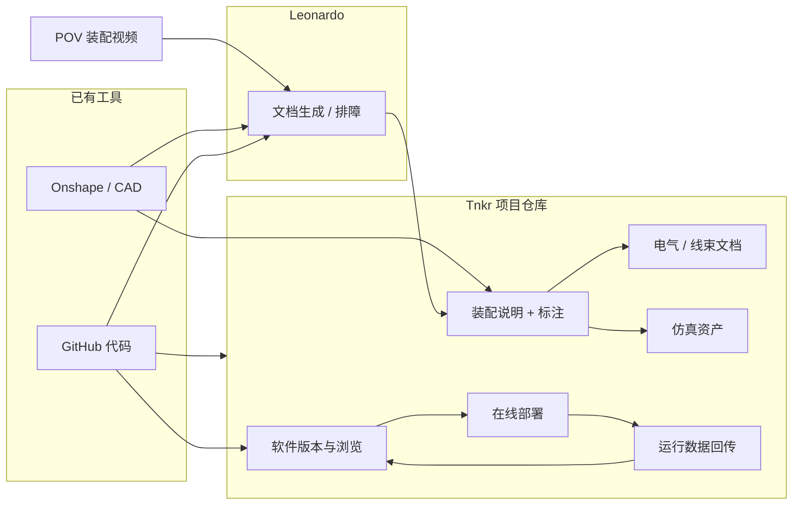

# Tnkr

**Tnkr**（[tnkr.ai](https://tnkr.ai/)）公开定位为 **「robotics 的 GitHub」**：把机器人项目里长期分散的 **机械设计、电气接线、控制软件、现场部署与运行数据** 放进**可分享、可 fork、可贡献**的单一项目空间，而不是让知识碎在 CAD 云盘、代码仓、网盘和聊天里。

## 为什么重要？

机器人研发是**跨学科流水线**，但工具链默认按学科切开：

- 机械在 **Onshape / SolidWorks**；
- 控制在 **GitHub**；
- 实验记录与 BOM 在 **Notion / 表格 / 邮件**；
- 数据集与模型又在 **独立训练栈**（如 [LeRobot](./lerobot.md) Hub）。

结果是：**复现成本高**、接线与装配细节难传承、fork 后难以把「改硬件」和「改策略」绑在同一条版本线上。Tnkr 试图用 **项目级仓库 + 贡献指南 + 数据回传** 把「造整机 → 跑起来 → 改进模型」收成闭环，服务开源人形、四足等项目的 **rebuild / remix** 社区。

## 核心机制

| 模块 | 作用 |
|------|------|
| **工具接入** | 连接既有 **GitHub**、**Onshape**（叙事亦提及 SolidWorks 等 CAD 生态） |
| **装配与电气文档** | 从 CAD 生成分步装配；在说明/模型上标注 **线束与元件** |
| **软件溯源** | 跟踪提交、在平台内浏览关联代码 |
| **仿真与部署** | 生成/关联仿真资产，连接 **在线部署** 做采集与分析（具体后端以官方为准） |
| **Leonardo** | 结合 **POV 视频、CAD、代码** 生成文档、建议改进、辅助排障 |
| **社区数据飞轮** | 发布贡献规范，允许他人重建项目并 **回传运行数据** 改进策略/模型 |

## 流程总览

以下主干对应官方 launch 叙事（[发布视频摘录](../../sources/blogs/tnkr_launch_youtube_nlv.md)），细节以产品文档为准：

## 常见误区或局限

- **不是 LeRobot 替代品：** [LeRobot](./lerobot.md) 强在 **策略库、数据集格式与 Hugging Face 生态**；Tnkr 强在 **整机项目文档与多学科版本化**。二者可并存（代码仍在 GitHub，训练数据仍可导出到常见格式）。
- **不是 URDF 专业编辑器：** [URDF-Studio](./urdf-studio.md) 面向 **URDF/MJCF/USD 编辑与 BOM**；Tnkr 更偏 **CAD 驱动的装配/协作叙事**，仿真描述文件如何导出需查官方能力。
- **公开信息仍在快速迭代：** 仿真后端、支持机种、模型部署 API 等应以 [官网](https://tnkr.ai/) 与频道更新为准；第三方科技媒体报道可能存在营销夸大，本站仅作线索。

## 与其他页面的关系

- **数据与训练栈：** [LeRobot](./lerobot.md)、[imitation-learning](../methods/imitation-learning.md)、[sim2real](../concepts/sim2real.md) — 策略与 Sim2Real 方法论；Tnkr 侧重 **项目级复现与贡献闭环**。
- **设计与分析工具：** [URDF-Studio](./urdf-studio.md)、[robot-explorer](./robot-explorer.md)、[robot-viewer](./robot-viewer.md) — 描述文件编辑与运动学分析；可与 Tnkr 的 CAD/装配流上下游配合。
- **开源整机索引：** [humanoid-robot](./humanoid-robot.md)、[机器人开源宝库（微信策展第01期）](../overview/robot-open-source-wechat-issue01-curator.md) — 发现可 fork 的开源平台后，可用 Tnkr 类工具降低「只拿到 CAD 却装不起来」的摩擦（需项目方主动发布）。

## 推荐继续阅读

- [Tnkr 官方站点](https://tnkr.ai/)
- [Launch 视频：We built the GitHub for robotics](https://www.youtube.com/watch?v=nLVeWpSb38U)（@TnkrdotAI）

## 英文缩写速查

| 缩写 | 英文全称 | 简要说明 |
|------|----------|----------|
| CAD | Computer-Aided Design | 计算机辅助设计，硬件结构建模 |
| AI | Artificial Intelligence | 人工智能 |
| Sim2Real | Simulation to Real | 把仿真中学到的策略迁移落地真机的工程主线 |
| BOM | Bill of Materials | 物料清单，硬件零部件列表 |
| URDF | Unified Robot Description Format | 统一机器人描述格式 |
| MJCF | MuJoCo XML Format | MuJoCo 的模型与场景描述格式 |
| API | Application Programming Interface | 应用程序编程接口 |

## 参考来源

- [Tnkr 平台归档](../../sources/repos/tnkr.md)
- [Tnkr 发布视频摘录](../../sources/blogs/tnkr_launch_youtube_nlv.md)
