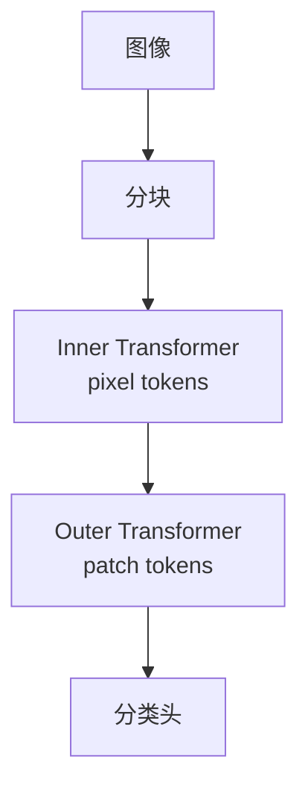

# TNT（Transformer-in-Transformer）

## 一句话定义

**TNT** 把每个图像块进一步拆成 **pixel-level token**，用内层 Transformer 建模块内结构，外层 Transformer 建模块间关系，形成「Transformer 套 Transformer」的视觉骨干。

## 英文缩写速查

| 缩写 | 英文全称 | 简要说明 |
|------|----------|----------|
| TNT | Transformer-in-Transformer | 内外双层视觉 Transformer |
| ViT | Vision Transformer | 对照基线：仅 patch 级 token |
| Pixel token | Inner-block tokens | 块内像素/子块序列 |
| Patch token | Outer tokens | 块级序列 |
| CLS | Class Token | 分类聚合 token |

## 为什么重要

- 课程 2.3.2 与作业 2 直接基于 TNT 做分类。
- 针对 ViT「块内结构被线性投影抹平」的问题，用内层注意力补局部归纳。

## 核心原理

1. 图像分 patch；每个 patch 展成更细的 pixel token 序列。  
2. **Inner Transformer** 更新块内表示并汇总。  
3. **Outer Transformer** 在 patch 序列上做全局交互并分类。

## 工程实践

| 项 | 建议 |
|----|------|
| 作业 | 固定 ImageNet/CIFAR 配置，先复现官方精度再改增强 |
| 超参 | 内外层深度与头数分开调；显存高于同规模 ViT |
| 机器人 | 作骨干需测延迟；局部增强不一定转化为闭环收益 |

## 局限与风险

计算与实现复杂度高于 ViT/CvT；社区生态小于 ViT/DINOv2。选型时与 [CvT](./cvt.md)、纯 ViT 做精度–延迟对照。

## 关联页面

- [Vision Transformer](../concepts/vision-transformer.md)
- [CvT](./cvt.md)
- [Transformer CV 课程策展](../entities/transformer-cv-curriculum.md)

## 参考来源

- [Transformer 视觉应用课程大纲](../../sources/courses/transformer_cv_applications_syllabus.md)

## 推荐继续阅读

- [TNT (NeurIPS 2021) arXiv:2103.00112](https://arxiv.org/abs/2103.00112)
