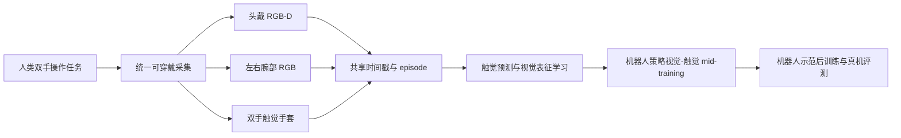

# TouchScale: 500 Hours of Human Vision and Touch for Visual-Tactile Learning

## 一句话定义

**TouchScale** 是一个把头戴 RGB-D、双腕 RGB 和双手全掌触觉数据同步记录的人类接触丰富交互数据集，用于视觉-触觉学习和机器人操作研究。

## 英文缩写速查

| 缩写 | 英文全称 | 简要说明 |
|---|---|---|
| RGB-D | Red-Green-Blue plus Depth | 彩色图像和深度图 |
| Taxel | Tactile Pixel | 触觉阵列中的单个感测单元 |
| cIoU | Contact Intersection over Union | 预测接触区域与真实接触区域的交并比 |
| CoP | Center of Pressure | 压力中心位置 |
| VTLA | Vision-Tactile-Language-Action | 视觉、触觉、语言与动作联合策略 |

## 为什么要把视觉和触觉一起采集

第一视角视频记录手如何移动，却不能直接告诉模型手指在哪里接触、压力如何变化。TouchScale 用同一可穿戴采集流程同步记录头部 RGB-D、两侧腕部 RGB 和双手触觉，提供对接触状态的直接监督。它关注的是人类交互数据如何帮助触觉预测、视觉表征学习及后续机器人操作。

## 数据采集与结构

论文描述的 full TouchScale 包含约 500 小时、约 87,000 episodes、约 2,000 个任务描述和 1,500+ 个物体。采集覆盖日常活动及结构化操作任务；每只手套有 880 个 taxels，记录手指和掌心的法向压力信号。统一的设备与时间同步流程使多个传感流能按 episode 对齐。

当前公开仓库的范围与论文全量不同：截至 2026-10-10，Hugging Face 数据卡显示已发布 100 小时、15,324 episodes、929 个任务描述、22 种场景和 905+ 个物体；全量 500 小时仍标记为计划在 2026 年 11 月前发布。下载数据文件需要同意分享联系信息。

## 从人类触觉到机器人策略

论文没有把人手动作重定向成机器人动作。TouchScale 被用于机器人策略的视觉-触觉 mid-training，之后再用机器人示范做本体相关后训练。作者在四个真实接触丰富操作任务上报告平均成功率从 22.5% 提升至 57.5%。

触觉预测结果需按比较口径读取：

- **同规模比较：** 约 16 小时 TouchScale 对 EgoTouch 的训练数据，在未见过的 EgoTactile 传感器上 contact IoU 分别为 0.181 和 0.134。
- **TouchScale 数据扩展：** 从约 10% 到完整训练集时，论文报告 cIoU 从 0.311 增至 0.383。
- **策略 mid-training：** 四个任务平均真实机器人成功率比较是 22.5% 与 57.5%，属于论文设定的 mid-training 和机器人后训练流程。

因此，摘要中“0.134 到 0.383”的简写不是同规模数据对照；做技术比较时应引用论文中匹配规模的具体实验表格。

## 数据示意

## 使用与许可边界

当前 Hugging Face 数据卡标注 CC-BY-NC-4.0，且访问文件前需要同意分享联系信息。非商业许可对商业机器人训练、产品开发或服务部署有实质影响；使用前应直接核对数据卡的完整条件。论文里的 500 小时是全量数据集规模，当前公开的 100 小时应单独标注，不能把计划发布写成已经可获取。

## 关联页面

- [触觉感知](../concepts/tactile-sensing.md)
- [视觉-触觉融合](../concepts/visuo-tactile-fusion.md)
- [接触丰富操作](../concepts/contact-rich-manipulation.md)
- [N0-VTLA](./paper-n0-vtla.md)

## 参考来源

- [TouchScale 论文归档](../../sources/papers/touchscale_arxiv_2610_10288.md)
- [TouchScale 数据集发布归档](../../sources/datasets/touchscale_huggingface.md)
- [arXiv:2610.10288 v2](https://arxiv.org/abs/2610.10288)
- [Hugging Face 数据集卡](https://huggingface.co/datasets/2077AIDataFoundation/TouchScale)
- [项目主页](https://touch-scale.github.io/)
