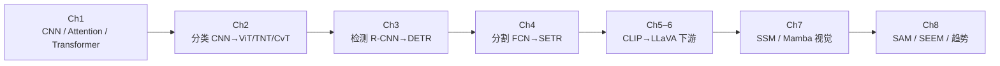

# Transformer 视觉应用课程策展

## 一句话定义

把「Transformer 在计算机视觉中的应用」八章大纲落成可交叉引用的知识图：从 **CNN/注意力基础** 走到 **分类·检测·分割·多模态·Mamba·视觉基础模型**，保证截图中每个知识点都有独立详情节点。

## 英文缩写速查

| 缩写 | 英文全称 | 简要说明 |
|------|----------|----------|
| ViT | Vision Transformer | 视觉 Transformer 分类骨干 |
| DETR | DEtection TRansformer | 集合预测目标检测 |
| VLM | Vision-Language Model | 视觉–语言模型 |
| MLLM | Multimodal Large Language Model | 多模态大语言模型 |
| SSM | State Space Model | Mamba 等状态空间模型 |
| SAM | Segment Anything | 可提示分割基础模型 |
| SEEM | Segment Everything Everywhere All at Once | 多提示统一分割 |
| mAP | mean Average Precision | 检测主指标 |

## 为什么重要

1. **补齐视觉上游课图**：本库原有骨干/检测/SAM 节点分散；本策展按课程八章把经典 CNN、DETR 族、分割 Transformer、MLLM 下游与 Mamba 视觉变体一次性挂上网。
2. **服务机器人选型**：机载检测要 YOLO/DETR，开放集核验要 SAM/VLM，长序列可看 Mamba——课程顺序即一条可读的能力升级链。
3. **验收清单**：下表每一节都指向独立 wiki 页，便于对照截图做覆盖检查。

## 核心原理

策展页本身不推导新算法，而是把课程树映射为知识图：**一节课点 → 一个（或少数）wiki 详情节点**，节点之间用标准 Markdown 链接互指。复用已有页（ViT、ResNet、YOLO、SAM、BLIP-2 等），仅对缺失叶子新建 concept/method/entity 页，避免重复造页。

## 推荐学习路径

## 章节 ↔ 本库节点完整映射

### 第 1 章 Transformer 基础知识

| 节 | 主题 | 独立节点 |
|----|------|----------|
| 1.1.1 | 经典 CNN 与卷积 | [卷积神经网络（CNN）](../concepts/convolutional-neural-network.md) |
| 1.1.2 | CNN vs Transformer | [CNN vs ViT Backbones](../comparisons/cnn-vs-vit-backbones.md) |
| 1.2.1 | SENet / SE-ResNet / DANet | [通道与空间注意力](../methods/channel-spatial-attention.md) |
| 1.2.2 | Attention / Multi-Head Attention | [多头注意力](../concepts/multi-head-attention.md) |
| 1.3.1 | Transformer 结构 | [Transformer](../concepts/transformer.md) |
| 作业 1 | 实现 MHA | 同上 |

### 第 2 章 图像分类

| 节 | 主题 | 独立节点 |
|----|------|----------|
| 2.1.1 | MNIST / CIFAR / ImageNet | [MNIST](./dataset-mnist.md)、[CIFAR](./dataset-cifar.md)、[ImageNet](./dataset-imagenet.md) |
| 2.1.2 | ImageNet-21K / JFT-300M | [ImageNet](./dataset-imagenet.md)、[JFT-300M](./dataset-jft-300m.md) |
| 2.2.1–2.2.4 | LeNet / AlexNet / VGG / ResNet | [LeNet-5](./lenet5.md)、[AlexNet](./alexnet.md)、[VGGNet](./vggnet.md)、[ResNet](./paper-resnet-deep-residual-learning.md) |
| 2.3.1–2.3.3 | ViT / TNT / CvT | [ViT](../concepts/vision-transformer.md)、[TNT](./tnt.md)、[CvT](./cvt.md) |
| 作业 2 | TNT 分类 | [TNT](./tnt.md) |

### 第 3 章 目标检测

| 节 | 主题 | 独立节点 |
|----|------|----------|
| 3.1.1 | COCO / Objects365 | [COCO](./dataset-coco.md)、[Objects365](./dataset-objects365.md) |
| 3.1.2 | 检测评价指标 | [目标检测评价指标](../concepts/object-detection-metrics.md) |
| 3.2.1 | R-CNN 族 | [R-CNN 族](../methods/rcnn-family.md) |
| 3.2.2 | YOLO / RetinaNet | [YOLO](./paper-yolo-unified-realtime-detection.md)、[RetinaNet](./retinanet.md) |
| 3.3 | DETR / Deformable DETR | [DETR](./detr.md)、[Deformable DETR](./deformable-detr.md) |
| — | 方法总览 | [Object Detection](../methods/object-detection.md) |
| 作业 3 | VisDrone + DETR | [DETR](./detr.md) |

### 第 4 章 图像分割

| 节 | 主题 | 独立节点 |
|----|------|----------|
| 4.1.1 | 语义 / 实例 / 全景 | [图像分割任务分类](../concepts/image-segmentation-taxonomy.md) |
| 4.1.2 | VOC / ADE20K / Cityscapes / Mapillary | [PASCAL VOC](./dataset-pascal-voc.md)、[ADE20K](./dataset-ade20k.md)、[Cityscapes](./dataset-cityscapes.md)、[Mapillary](./dataset-mapillary.md) |
| 4.2 | FCN / U-Net / SegNet / PSPNet / Mask R-CNN | [FCN](../methods/fcn-semantic-segmentation.md)、[U-Net](../methods/unet.md)、[SegNet](../methods/segnet.md)、[PSPNet](../methods/pspnet.md)、[Mask R-CNN](../methods/mask-rcnn.md) |
| 4.3 | SETR / SegFormer | [SETR](./setr.md)、[SegFormer](./segformer.md) |
| 作业 4 | ADE20K + SETR | [SETR](./setr.md)、[ADE20K](./dataset-ade20k.md) |

### 第 5–6 章 多模态

| 节 | 主题 | 独立节点 |
|----|------|----------|
| 5.1.1 | 多模态基础 | [多模态基础概念](../concepts/multimodality-basics.md) |
| 5.1.2 | Flickr30K Entities / VaTeX / WIT | [Flickr30K Entities](./dataset-flickr30k-entities.md)、[VaTeX](./dataset-vatex.md)、[WIT](./dataset-wit.md) |
| 5.1.3 | 多模态 LLM 路线 | [多模态 LLM 发展路线](../overview/multimodal-llm-development.md) |
| 5.2 | CLIP / BLIP / BLIP-2 | [CLIP](./clip.md)、[BLIP](./blip.md)、[BLIP-2](./paper-blip2.md) |
| 6.1 | LLaVA / MiniGPT-4 / InstructBLIP | [LLaVA](./llava.md)、[MiniGPT-4](./minigpt4.md)、[InstructBLIP](./instructblip.md) |
| 6.2 | LISA / Sa2VA / SIDA | [LISA](./lisa.md)、[Sa2VA](./sa2va.md)、[SIDA](./sida.md) |
| 作业 5 | LLaVA 指令微调 | [LLaVA](./llava.md) |

### 第 7 章 Mamba

| 节 | 主题 | 独立节点 |
|----|------|----------|
| 7.1.1 | RNN/CNN/Transformer 优劣 | [RNN vs CNN vs Transformer vs Mamba](../comparisons/rnn-cnn-transformer-mamba.md) |
| 7.1.2 | 状态空间模型 | [SSM](../concepts/state-space-model-ssm.md) |
| 7.2 | Vim / VMamba | [Vision Mamba](./vision-mamba-vim.md)、[VMamba](./vmamba.md) |
| 7.3 | MambaIR / RS-Mamba / ChangeMamba / VideoMamba / U-Mamba | [MambaIR](./mambair.md)、[RS-Mamba](./rs-mamba.md)、[ChangeMamba](./changemamba.md)、[VideoMamba](./videomamba.md)、[U-Mamba](./u-mamba.md) |
| 作业 6 | SegMamba / BraTS | [U-Mamba](./u-mamba.md)（医学分割近邻） |

### 第 8 章 视觉基础模型与趋势

| 节 | 主题 | 独立节点 |
|----|------|----------|
| 8.1.1–8.1.2 | SAM / SAM 2 | [SAM](./paper-segment-anything.md)、[SAM 2](./paper-sam2.md) |
| 8.1.3 | SEEM | [SEEM](./seem.md) |
| 8.2 | 五大趋势 | [视觉基础模型发展趋势](../concepts/visual-foundation-model-trends.md) |
| — | 生成式预训练对照 | [生成式视觉预训练](../concepts/generative-vision-pretraining.md) |
| 作业 7 | COD10K 微调 SAM | [SAM](./paper-segment-anything.md) |

## 与其它策展的关系

- **[视觉感知骨干知识链](../overview/hub-vision-backbone.md)**：偏机器人策略上游选型；本页是课程级全量节点索引。
- **[人形系统课策展](./humanoid-system-curriculum.md)**：系统工程链；本页是视觉算法课链。
- **[VLA 纵深](../../roadmap/depth-vla.md)**：多模态之后进入动作；接 Stage 0。

## 工程实践

| 项 | 建议 |
|----|------|
| 学习顺序 | 严格 Ch1→Ch4 打基础，再进 VLM；Mamba/SAM 可并行选修 |
| 作业最小集 | MHA 实现 → TNT/CIFAR → DETR 小数据 → LLaVA LoRA |
| 机器人裁剪 | 实时闭环保留 YOLO/短 ViT；开放集用 SAM+CLIP 核验 |

## 局限与风险

- 大纲截图未给出机构课号/链接时，来源以本库 `sources/courses/` 归档为准。
- 部分作业数据（VisDrone、BraTS、COD10K）未单独建页，需要时再 ingest。
- 节点为课程覆盖级编译，不等于每篇论文的深读笔记（深读见 Humanoid Paper Notebooks 分工）。

## 关联页面

- [视觉感知骨干知识链](../overview/hub-vision-backbone.md)
- [CNN vs ViT](../comparisons/cnn-vs-vit-backbones.md)
- [多模态 LLM 发展路线](../overview/multimodal-llm-development.md)
- [人形系统课策展](./humanoid-system-curriculum.md)
- [机器人视觉感知栈选型闭环知识链](../queries/robot-perception-stack-selection-loop.md) — 课程第 3–4 章的检测/分割选型，在感知栈里落到②层

## 参考来源

- [Transformer 视觉应用课程大纲](../../sources/courses/transformer_cv_applications_syllabus.md)

## 推荐继续阅读

- [Attention Is All You Need](https://arxiv.org/abs/1706.03762)
- [Vision Transformer](https://arxiv.org/abs/2010.11929)
- [Segment Anything](https://arxiv.org/abs/2304.02643)
