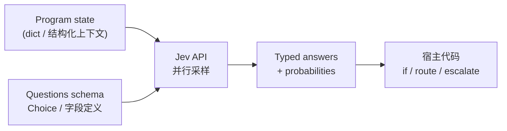
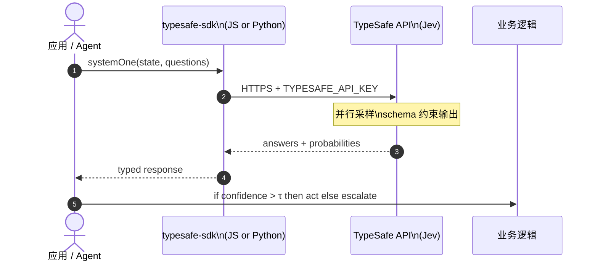

# Jev（TypeSafe AI · System One Model）

**Jev** 是 [TypeSafe AI](https://typesafe.ai/) 发布的首个 **System One Model**（2026-09-15 官宣早期访问）：面向 **软件自动化** 的「前沿智能函数调用」——**非结构化 state 进，预定义 schema 的 typed probabilistic decisions 出**。相对自回归 LLM，官方宣称在 System One 形任务上可达 **40–200× 更低延迟**、**~两个数量级** 成本优势（workflow eval 峰值 **193.6× faster / 444.6× cheaper**）。

## 一句话定义

**Jev** 不是生成字符串的聊天模型，而是在 **单次并行查询** 中返回 **类型安全、带校准概率** 的多字段决策，供普通代码当作 **smart if-statement / 路由 / 评分 / guardrail** 直接消费。

## 英文缩写速查

| 缩写 | 英文全称 | 简要说明 |
|------|----------|----------|
| S1 | System One (Model) | TypeSafe 新模型类：机器原生快速结构化决策 |
| RLCD | Reinforcement Learning for Calibrated Decisions | 校准决策强化学习；相对 RLHF/RLVR 的训练目标 |
| RLHF | Reinforcement Learning from Human Feedback | 人类偏好优化；Chat 类 LLM 主流路线 |
| API | Application Programming Interface | `systemOne` / `system_one` HTTP 调用面 |
| CFG | Classifier-Free Guidance | 推理可选 `--task.guidance-scale`（LLM 侧类比） |
| MTok | Million Tokens | 定价单位；Jev 输入约 $0.042/MTok（官方 2026-09） |

## 核心信息

| 字段 | 内容 |
|------|------|
| 机构 | TypeSafe AI（旧金山）；创始人 Diogo Almeida（前 OpenAI） |
| 类型 | System One 决策 API + 官方 SDK / Agent Skills |
| 文档 | <https://docs.typesafe.ai/> |
| 介绍 | <https://typesafe.ai/blog/introducing-system-one-models-and-jev> |
| JS SDK | <https://github.com/typesafe-ai/typesafe-sdk-js>（`@typesafe-ai/sdk`，MIT） |
| Python SDK | <https://github.com/typesafe-ai/typesafe-sdk-python>（`typesafe-sdk`，MIT） |
| Agent Skills | <https://github.com/typesafe-ai/skills>（MIT） |
| 开源结论 | **SDK/Skills 已开源**；**Jev 权重未公开**，早期访问需 `TYPESAFE_API_KEY` / waitlist |

## 为什么重要（对本知识库读者）

- **与字符串 agent 分层：** 本库已收录 [DeepSeek Harness](./deepseek-harness.md)、[Agent Lightning](./agent-lightning.md) 等 **LLM 轨迹 / RL** 栈；Jev 占 **更底层决策面** — 在 harness **之外**用 typed probability 做分类、路由、置信度门控，而不是让 LLM 每次吐 JSON 再 parse。
- **机器人编排对照：** [行为树 × VLA 编排](../concepts/behavior-tree-vla-orchestration.md) 用 BT 管「何时跑哪段技能」；Jev 适合 **毫秒级** 的 **条件分支**（是否 escalate、选哪条子流程、guardrail 分数），与 VLA chunk **异步** 并存。
- **Real-time 边界：** 官方 **70–500 ms** 端到端宣称使 **游戏/交互 demo**（Doom bot、Wikiracing）与 **在线 guardrail** 成为可能；与秒级 LLM 推理形成鲜明对照（数字以官方 workflow eval 为准）。

## 核心原理

### System One vs Chat LLM

| | Chat LLM | Jev (System One) |
|---|----------|------------------|
| **输出** | 自由字符串 | **预声明 schema** 的结构化值 |
| **类型安全** | 需 JSON mode + 校验 | **不可能** 产出 schema 外类型（官方声称） |
| **置信度** | 常过度自信 | **每条答案带校准概率** |
| **采样** | 逐 token 自回归 | **并行** 一次出齐各字段 |
| **典型用途** | 人机对话、copilot | **代码内自动化、map-reduce、实时分支** |

训练算法 **RLCD（Reinforcement Learning for Calibrated Decisions）** 优化 **校准决策** 而非人类偏好写稿或纯 verifiable string reward。

### 流程总览



### API 形态（SDK 对齐）

```typescript
// JS: @typesafe-ai/sdk
client.systemOne({
  state: { document: "..." },
  questions: {
    category: choice("What is this ticket about?", {
      billing: null, technical: null, other: null,
    }),
  },
});
```

Python 等价：`TypeSafeClient.system_one` + `Choice`（见 [`typesafe-sdk-python`](../../sources/repos/typesafe-sdk-python.md)）。

## 工程实践

| 项 | 建议 |
|----|------|
| **准入** | 官网 waitlist → `TYPESAFE_API_KEY` |
| **JS** | Node **≥20**；`npm install @typesafe-ai/sdk` |
| **Python** | `uv add typesafe-sdk`；context manager `with TypeSafeClient()` |
| **Agent 集成** | `typesafe-ai/skills` → Claude Code 插件或 `npx skills add` |
| **置信度门控** | 高置信自动执行，低置信 **human review**（官方推荐模式） |
| **Workflow 组合** | 多字段独立 question + 代码侧概率阈值 → 离散分支（见官方 workflow evals） |
| **高基数选择** | cardinality **≤255**；更高基数可用两阶段 score-then-choose |

### 源码运行时序图



节点对齐官方 SDK README 的 Quickstart；模型侧为 **托管 API**，非本地权重推理。

## 评测与官方证据（摘要）

- **Workflow evals：** 固定 Python workflow 图；参考概率为 GPT-6 Astra + Fable 5.1 平均；Jev 在 **成本–智能** Pareto 前沿（细节见官网 workflow evals 站点）。
- **Side-by-side：** 并行字段概率 vs GPT-5.6 Terra 自回归（简化 state/query 演示）。
- **类型错误率：** LLM 侧来自 OpenRouter 统计；Jev 侧 schema 匹配 **0%**（结构性保证，非经验估计）。
- **Demo：** Doom ~10 QPS；Wikiracing 多步链接选择。

## 局限与风险

- **非通用 LLM：** 放弃自由文本生成；创意写作、长链 CoT 解释、开放式 chat **不是主场景**。
- **早期访问：** 定价/可用性/区域（官方称西海岸服务）可能变化；**193.6× / 444.6×** 为 workflow 基准上界，生产增益需自测。
- **权重未开源：** 无法本地部署或微调 Jev；依赖 TypeSafe  SLA 与 API 稳定性。
- **Workflow 偏差：** 公开 workflow 由 TypeSafe 能力团队编写，可能存在选择偏差（博客自述）。
- **与具身 VLA 关系：** Jev **不输出关节/action chunk**；机器人侧仅适合 **语义路由、安全评分、任务分类** 等 **System One** 子问题。

## 关联页面

- [行为树 × VLA 编排](../concepts/behavior-tree-vla-orchestration.md) — BT 宏流程 vs Jev 毫秒级 fuzzy 分支
- [DeepSeek Harness](./deepseek-harness.md) — 字符串 agent 运行时；可与 Jev 决策层叠加
- [Agent Lightning](./agent-lightning.md) — LLM agent RL；与 Jev 决策 API 不同层
- [Matt Pocock Skills](./mattpocock-skills.md) — 同类「agent 技能包」生态参照
- [VLA 方法页](../methods/vla.md) — 连续控制 vs 离散 typed 决策分工

## 参考来源

- [Introducing System One Models & Jev（官方博客）](../../sources/blogs/typesafe_ai_introducing_system_one_models_jev.md)
- [TypeSafe AI 站点归档](../../sources/sites/typesafe-ai.md)
- [typesafe-sdk-js](../../sources/repos/typesafe-sdk-js.md)
- [typesafe-sdk-python](../../sources/repos/typesafe-sdk-python.md)
- [typesafe-ai/skills](../../sources/repos/typesafe-ai-skills.md)
- [Awesome JEV（社区）](../../sources/repos/awesome-jev.md)
- [Awesome JEV 中文（社区）](../../sources/repos/awesome-jev-zh.md)

## 推荐继续阅读

- [TypeSafe 文档](https://docs.typesafe.ai/)
- [Awesome JEV 策展站](https://omnijev.github.io/awesome-jev/)
- [官方介绍博文](https://typesafe.ai/blog/introducing-system-one-models-and-jev)
