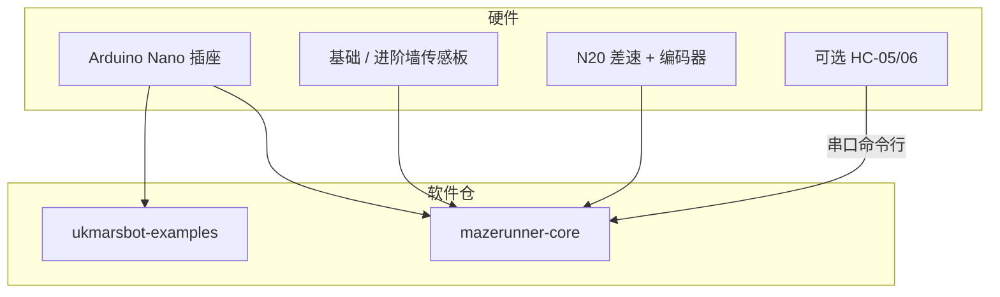

# UKMARSBOT

## 一句话定义

**UKMARSBOT** 是 [UK Micromouse and Robotics Society（UKMARS）](https://ukmars.org/) 发布的 **低成本入门多用途开源机器人平台**：默认 **Arduino Nano** 差速底盘，可参加循线、沿墙、直线加速、迷你相扑，并升级到经典 Micromouse 迷宫求解。

## 英文缩写速查

| 缩写 | 英文全称 | 简要说明 |
|------|----------|----------|
| UKMARS | UK Micromouse and Robotics Society | 英国 Micromouse 与机器人协会 |
| BOM | Bill of Materials | 物料清单；仓内按模块提供 |
| IDE | Integrated Development Environment | Arduino IDE 或 PlatformIO |
| BT | Bluetooth | HC-05/06 无线串口调试 |
| MCU | Microcontroller Unit | 默认 Nano；可换 STM32 / Pico |
| GEMINI | UKMARS GEMINI platform | 后续 Pico + MicroPython 三层板平台 |

## 为什么重要

- **Micromouse 真机主入口**：协会文档、赛事、[从零视频](https://www.youtube.com/watch?v=kLJjyr8uiFg) 与 GitHub 同一生态，比散落个人仓更易跟到底。
- **一台机多赛种**：先学会电机/编码器/传感，再上 [mazerunner-core](https://github.com/ukmars/mazerunner-core)，降低「直接做竞赛鼠」挫败。
- **与竞赛鼠对照**：相对 [WolfieMouse](./wolfiemouse.md)（STM32F4 / FreeRTOS / KiCad 一体），UKMARSBOT 优先 **可购性与教学**。

## 核心结构/机制

| 组成 | 说明 |
|------|------|
| **硬件主仓** | [ukmars/ukmarsbot](https://github.com/ukmars/ukmarsbot)（MIT）：`hardware/` Gerber·PDF·BOM，`mechanical/` STL，`docs/` |
| **示例** | [ukmarsbot-examples](https://github.com/ukmars/ukmarsbot-examples) |
| **迷宫核心** | [mazerunner-core](https://github.com/ukmars/mazerunner-core)：探索中心并返回起点；PlatformIO 优先，亦可 Arduino IDE |
| **后续** | [GEMINI](https://github.com/ukmars/gemini)：树莓派 Pico / MicroPython，保留 UKMARSBOT 设计原则 |
| **调试** | 蓝牙串口 + 命令解释器；传感器标定例程在 mazerunner-core |

## 工程实践

| 项 | 建议 |
|----|------|
| **从哪开始** | 看 [官方从零教程](https://www.youtube.com/watch?v=kLJjyr8uiFg) → 下 Gerber/BOM 打样 → examples |
| **迷宫** | 复制 `config` 模板，先校正编码器极性与轮径，再标定墙传感 |
| **工具链** | 协会推荐 VS Code + PlatformIO；Arduino IDE 可直接打开 `.ino` |
| **迷宫墙** | 参考 [maze-building](https://github.com/ukmars/maze-building) 自建练习迷宫 |
| **开源状态（2026-07-27）** | **已开源**：硬件 MIT；迷宫固件与示例公开 |

## 局限与风险

- **不是竞赛速度上限**：Arduino Nano 算力与模块化结构适合学习；冲榜需更紧凑 PCB / 更快 MCU / 更强运动学（见 WolfieMouse、半尺寸鼠）。
- **旧仓混淆**：`ukmarsbot-mazerunner` 已 **deprecated**，新工程用 `mazerunner-core`。
- **LiPo 安全**：文档倾向受保护电池包；自制 LiPo 需自行评估。
- **ECAD 历史**：早期 Eagle 7；改板时注意与现行 KiCad 流程差异。

## 关联页面

- [Micromouse](../concepts/micromouse.md) — 竞赛与算法总览
- [WolfieMouse](./wolfiemouse.md) — 竞赛级 STM32 对照
- [MuSHR](./mushr.md) — ROS 教育小车对照
- [PID Control](../methods/pid-control.md)
- [KiCad](./kicad.md) — 协会后续模块倾向的开源 EDA

## 参考来源

- [sources/repos/ukmarsbot.md](../../sources/repos/ukmarsbot.md)
- [sources/sites/ukmars-org.md](../../sources/sites/ukmars-org.md)
- [sources/courses/ukmarsbot_getting_started_youtube.md](../../sources/courses/ukmarsbot_getting_started_youtube.md)
- [ukmars/ukmarsbot](https://github.com/ukmars/ukmarsbot)
- [ukmars.org](https://ukmars.org/)

## 推荐继续阅读

- [mazerunner-core README](https://github.com/ukmars/mazerunner-core)
- [UKMARSBOT 从零视频](https://www.youtube.com/watch?v=kLJjyr8uiFg)
- [Micromouse Online](https://micromouseonline.com/)
