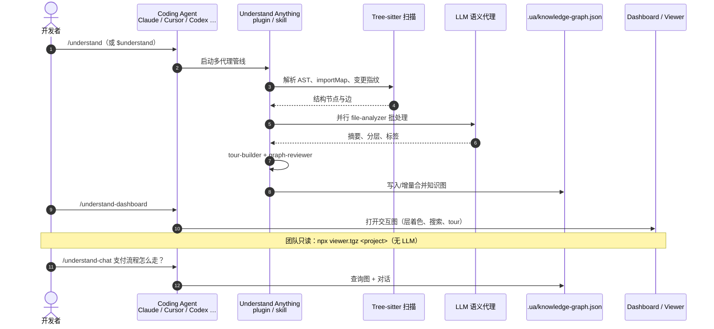

# Understand Anything（Egonex）

**Understand Anything**（[Egonex-AI/Understand-Anything](https://github.com/Egonex-AI/Understand-Anything)，MIT，[官网](https://understand-anything.com) / [Demo](https://understand-anything.com/demo/)）是 **Egonex** 开源的 **代码库 / 知识库可视化** 插件与技能集：在 Claude Code、Codex、Cursor、Copilot、Gemini CLI、OpenCode、Hermes 等宿主里运行 `/understand`，用 **Tree-sitter 确定性解析 + LLM 语义标注** 的多代理管线生成 **可探索、可搜索、可问答** 的知识图，并打开交互 dashboard——强调 **「教会你代码在做什么」**，而非只展示依赖 hairball。

## 一句话定义

**把任意代码库（或 Karpathy 式 LLM wiki）编译成带业务语义层的持久知识图，让人和 coding agent 用图遍历 + 引导 tour 理解系统，而不是盲读文件。**

## 英文缩写速查

| 缩写 | 英文全称 | 简要说明 |
|------|----------|----------|
| AST | Abstract Syntax Tree | Tree-sitter 输出的语法树；结构边来源 |
| LLM | Large Language Model | 生成摘要、分层、业务域与 tour 的语义通道 |
| CLI | Command-Line Interface | 各平台 `/understand` 或 Codex `$understand` 技能入口 |
| JSON | JavaScript Object Notation | 图落盘为 `.ua/knowledge-graph.json` |
| MCP | Model Context Protocol | 部分宿主通过 plugin/skill 暴露；本工具核心是图 + dashboard |
| REPL | Read-Eval-Print Loop | 对话式 `/understand-chat` 查询图内知识 |

## 为什么重要（对本知识库读者）

- **与本站维护模式直接相关：** 本仓库采用 [Karpathy LLM Wiki](../references/llm-wiki-karpathy.md) ingest/query/lint；Understand Anything 提供 **`/understand-knowledge`** 把同类 wiki 变成 **力导向知识图 + 社区聚类**，适合新人快速摸清 `wiki/` / `sources/` 拓扑（**不替代** `make lint` 与 `## 参考来源` 质量门）。
- **机器人 monorepo 上手：** Isaac / MuJoCo / ROS2 / 训练脚本 / 论文 PDF 混仓时，用 **结构图 + 业务域视图**（认证、数据层、仿真接口）降低 onboarding 成本；与 [graphify](./graphify.md) 同属「代理读代码前先构图」路线，但 UA 强调 **dashboard、tour、diff 影响面** 与 **多 IDE 插件分发**。
- **团队可提交图：** `.ua/` JSON 可进 git（大文件用 LFS），队友用 **viewer** 本地打开 dashboard **无需 LLM API**——适合 PR review 与文档即代码。
- **宿主生态已铺好：** 一条 `install.sh` 覆盖 Codex、OpenClaw、Hermes、Cursor 等，和 [CLI-Anything](./cli-anything.md)（生成应用 CLI）、[DeepSeek Harness](./deepseek-harness.md)（agent 运行时）互补。

## 核心信息

| 项 | 内容 |
|----|------|
| **组织** | Egonex（[Egonex-AI](https://github.com/Egonex-AI)）；原创 [Lum1104](https://github.com/Lum1104) |
| **许可** | MIT |
| **数据目录** | 默认 `.ua/`（遗留 `.understand-anything/` 仍兼容） |
| **支持平台** | Claude Code（原生 plugin）、Cursor、VS Code Copilot、Codex、OpenCode、OpenClaw、Gemini CLI、Hermes、Kiro 等（见 README 兼容表） |
| **开源** | **已开源** — 插件、管线、dashboard、viewer 安装脚本；初始全量分析耗 token，可接 Ollama |

## 核心原理

| 层次 | 内容 |
|------|------|
| **结构通道** | Tree-sitter：import/export、调用、继承；`importMap` 预解析；指纹增量检测 |
| **语义通道** | LLM：英文/多语言摘要、架构层、业务域、语言概念注解、tour |
| **多代理** | scanner → file-analyzer（并行）→ architecture / tour / reviewer；domain 与 knowledge 另起 analyzer |
| **视图** | 结构图 + **业务域水平图**（domains / flows / steps） |
| **协作** | 提交 `.ua/*.json`；`--auto-update` post-commit；`npx …viewer.tgz` 只读本地浏览 |

### 流程总览

```mermaid
flowchart TB
  subgraph input [输入]
    CODE[代码库 / monorepo 子目录]
    WIKI[Karpathy LLM wiki]
  end
  subgraph pipe [多代理管线]
    SCAN[project-scanner]
    FILE[file-analyzer × N]
    ARCH[architecture-analyzer]
    TOUR[tour-builder]
    REV[graph-reviewer]
    DOM[domain-analyzer]
    ART[article-analyzer]
  end
  subgraph out [产出]
    JSON[".ua/knowledge-graph.json"]
    DASH[understand-dashboard / viewer]
    CHAT[/understand-chat / diff / explain]
  end
  CODE --> SCAN --> FILE --> ARCH --> TOUR --> REV --> JSON
  CODE --> DOM
  WIKI --> ART --> JSON
  JSON --> DASH
  JSON --> CHAT
```

## 源码运行时序图

节点对齐 [`sources/repos/understand-anything.md`](../../sources/repos/understand-anything.md) 与 README Quick Start。



- **最短路径（Claude Code）：** marketplace 安装 → `/understand` → `/understand-dashboard`。
- **无宿主看图：** 提交 `.ua/` 后 `npx …/understand-anything-viewer.tgz .`。
- **本仓库 wiki：** `/understand-knowledge` 指向仓库根或 `wiki/` 目录，对照 [ingest-workflow](../../schema/ingest-workflow.md) 人工策展链。

## 工程实践

| 场景 | 做法 |
|------|------|
| **首次分析大仓** | 用订阅/本地模型跑全量 `/understand`；超大 monorepo 先 `/understand src/…` 分子目录 |
| **中文团队** | `/understand --language zh` 或首次对话语言检测写入 `.ua/config.json` |
| **保持图新鲜** | `/understand --auto-update` 或发布前手动增量 `/understand` |
| **PR 影响面** | `/understand-diff` 看改动涟漪；与 graphify `prs` 类似定位 |
| **与 graphify 选型** | graphify 偏 **混合语料 + MCP 查询 + token 节省叙事**；UA 偏 **IDE 插件 + 业务域 + tour + 团队 viewer**（可并用） |
| **与本站 CI** | 自动图 **不替代** `make ci-preflight`；wiki 真理源仍是 git + lint |

## 局限与风险

- **Token 成本：** 初次全库分析在大型项目上显著；依赖增量与本地模型缓解。
- **语义层非形式验证：** LLM 生成的业务域/摘要可能漂移，需人工 spot-check 关键路径。
- **非机器人专用：** 不解析 USD/URDF 语义或仿真时钟；工程价值在 **研发 harness 与代码库认知**。
- **与 Karpathy wiki 分工：** `/understand-knowledge` 是 **探索视图**；本库 ingest 仍要求人工写回 `wiki/` 与 `sources/`。

## 与其他工具对比

| 对照 | 差异读法 |
|------|----------|
| [graphify](./graphify.md) | 更广语料（PDF/音视频）；`graphify query`/MCP；UA 更强 **dashboard + 业务域 + 多 IDE 插件** |
| [CLI-Anything](./cli-anything.md) | 生成 **应用 CLI harness**；UA 分析 **已有代码结构** |
| 本站 `make graph` | 统计 **wiki markdown 链接图**；UA 覆盖 **源码与未升格 sources** |
| [DeepSeek Harness](./deepseek-harness.md) | Agent **运行时**；UA 是 **代码理解插件** |

## 关联页面

- [graphify](./graphify.md) — 另一套「文件夹 → 知识图」技能
- [LLM Wiki（Karpathy）](../references/llm-wiki-karpathy.md) — `/understand-knowledge` 目标形态
- [CLI-Anything](./cli-anything.md) — agent-native 软件操控
- [Hermes Agent](./hermes-agent.md) / [OpenClaw](./openclaw.md) — `install.sh` 支持的宿主
- [Ingest Workflow](../../schema/ingest-workflow.md) — 本库人工 ingest 规范

## 参考来源

- [understand-anything.md](../../sources/repos/understand-anything.md) — 仓库与管线
- [understand-anything 站点](../../sources/sites/understand-anything.md) — 官网与 Demo 核查

## 推荐继续阅读

- 仓库 — <https://github.com/Egonex-AI/Understand-Anything>
- 在线 Demo — <https://understand-anything.com/demo/>
- Karpathy LLM Wiki Gist — <https://gist.github.com/karpathy/442a6bf555914893e9891c11519de94f>
