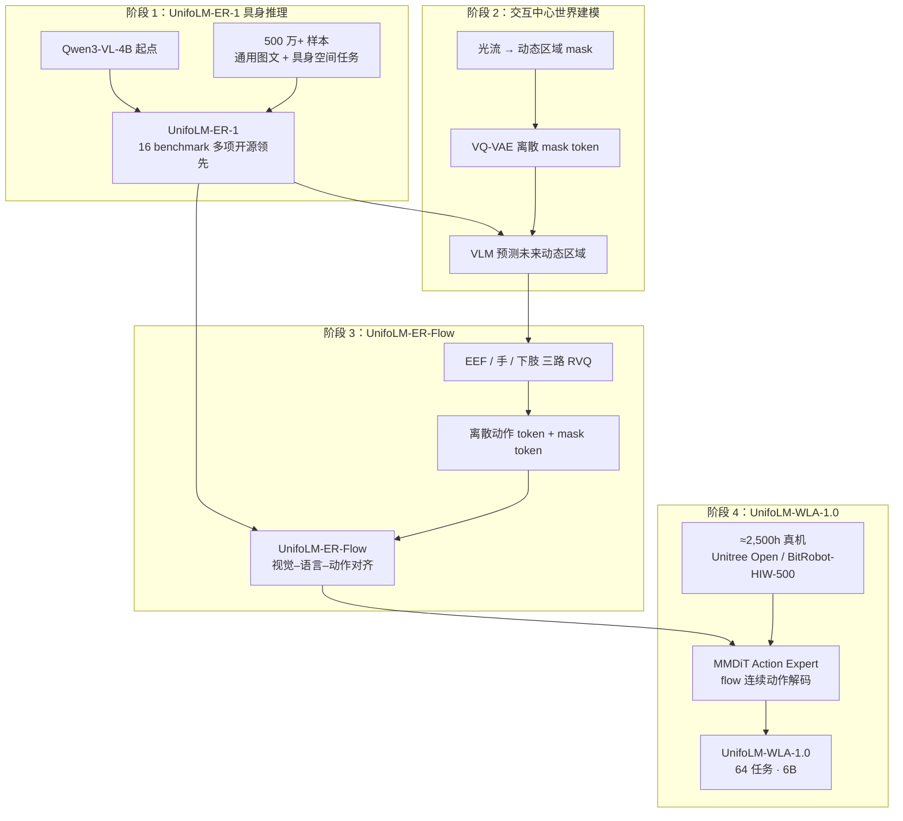

# UnifoLM-WLA-1.0（unifolm-wla）

**UnifoLM-WLA-1.0** 是 UnifoLM 家族全面升级后的 **6B 通用人形机器人基础模型**（**Whole-body Language-Action，WLA**）：在具身推理骨干上联合 **交互中心世界建模** 与 **flow 动作解码**，单模型统筹 **64 项** 桌面与全身操作任务。

## 一句话定义

官方 6B 人形 WLA：Qwen3-VL 系具身推理（ER-1）→ 未来动态区域 + 三路 RVQ 离散动作（ER-Flow）→ MMDiT 动作专家（WLA-1.0）；真机评测覆盖 G1 与多种末端执行器。

## 英文缩写速查

| 缩写 | 英文全称 | 简要说明 |
|------|----------|----------|
| WLA | Whole-body Language-Action | 本系列全身协调语言–动作大模型 |
| ER | Embodied Reasoning | 具身推理子模型（UnifoLM-ER-1） |
| VLA | Vision-Language-Action | 视觉–语言–动作；ER-Flow 对齐此表征 |
| VLM | Vision-Language Model | 视觉语言模型；骨干基于 Qwen3-VL-4B |
| RVQ | Residual Vector Quantization | 对 EEF / 手 / 下肢动作序列的残差向量量化 |
| MMDiT | Multimodal Diffusion Transformer | WLA 侧连续动作 flow 解码的动作专家 |
| EEF | End-Effector | 末端执行器位姿通道 |
| HF | Hugging Face | 权重与数据集托管 |

## 为什么重要

- 宇树把 **VLA-0 / WMA-0** 之后的第三代 UnifoLM 叙事收束到 **「单模型驱动桌面 + 全身」**，是站内 [VLA](../methods/vla.md) 与 [World Action Models](../concepts/world-action-models.md) 的 **官方最新实例**。
- **中间产物已可下载**：`UnifoLM-ER-1`、`UnifoLM-ER-Flow` 权重与 **UniBot-V1 Challenge Dataset** 已发布，便于先复现具身推理与动作 token 规范。
- 公开 [`docs/robot_action_state_processing_en.md`](https://github.com/unitreerobotics/unifolm-wla/blob/main/docs/robot_action_state_processing_en.md) 定义 **54 维统一动作 / 60 维统一状态**，跨 embodiment 混训的数据接口对社区有长期参考价值。

## 流程总览

## 核心原理

| 模块 | 说明 |
|------|------|
| **Embodied Reasoning** | 图像点预测、检测、多图推理、2D 轨迹、3D 检测、空间 QA 等与通用 VLM 能力 **共训**，强化具身空间理解 |
| **Dynamic Region Prediction** | 用光流监督提取「未来会变的区域」，VQ-VAE 编码为固定长度 mask token，聚焦交互主体引起的场景变化 |
| **Discrete Action Learning** | 统一动作空间拆 **EEF 位姿 / 末端关节 / 下肢关节**，各训独立 RVQ；时间步对齐后送入 VLM |
| **WLA 训练目标** | 联合 **语言预测**、**离散动作 token** 与 **连续 flow 动作**（MMDiT 去噪）；默认 chunk 30 步 @ 30 Hz |

**规模与任务（上游）**：6B 参数；约 2,500 小时高质量真机数据；**10** 项全身操作 + **54** 项桌面操作；支持二指夹爪与多种五指灵巧手。

## 源码运行时序图

**不适用**（截至 2026-09-18）：[`unitreerobotics/unifolm-wla`](https://github.com/unitreerobotics/unifolm-wla) 仅含 README 与动作/状态处理规范，**Post-Train Code 未发布**，无 `train.py` / `eval.py` / 真机部署入口。待官方放出推理与部署脚本后，应按 ER-Flow → MMDiT 解码 → G1 控制链路补全本图。

## 工程实践

### 当前可获取资源

| 资源 | 链接 | 状态 |
|------|------|------|
| 项目页 | <https://unigen-x.github.io/unifolm-wla.github.io/> | 已发布 |
| GitHub 枢纽仓 | <https://github.com/unitreerobotics/unifolm-wla> | README + 规范文档 |
| UnifoLM-ER-1 | <https://huggingface.co/unitreerobotics/UnifoLM-ER-1> | 权重已发布（Apache-2.0，Qwen3-VL 系） |
| UnifoLM-ER-Flow | <https://huggingface.co/unitreerobotics/UnifoLM-ER-Flow> | 权重已发布 |
| UnifoLM-WLA-Base | HF Collection | **待发布** |
| UniBot-V1 Challenge Dataset | [HF Collection](https://huggingface.co/collections/unitreerobotics/unibot-v1-challenge-dataset) | 已发布 |

### 数据接口（统一动作空间）

官方规范将各 embodiment 映射为：

- **动作** `a[t,k]`：54 维；EEF / 基座位姿为相对当前状态的 SE(3)；默认 chunk `H=30`，`target_fps=30`。
- **状态** `s[t]`：60 维；配套 54/60 维有效性 mask。
- **归一化**：相对位姿默认 global Z-score；其余模块默认 1/99 分位 min-max。

详见仓库 [`docs/robot_action_state_processing_en.md`](https://github.com/unitreerobotics/unifolm-wla/blob/main/docs/robot_action_state_processing_en.md)。

### 与 sibling 路线分工

| 路线 | 仓库 | 侧重点 |
|------|------|--------|
| [UnifoLM-VLA-0](./unifolm-vla.md) | `unifolm-vla` | 较早一代操作 VLA；训练/推理代码 **已全开源** |
| [UnifoLM-WMA-0](./unifolm-world-model-action.md) | `unifolm-world-model-action` | 显式 **世界模型** 仿真 + 决策双模式；部署栈已开源 |
| **UnifoLM-WLA-1.0**（本页） | `unifolm-wla` | **6B 统一 WLA** + ER 系列中间权重；**后训练与 WLA 权重待发布** |

## 局限与风险

- **复现窗口不完整**：WLA-Base 权重与 Post-Train Code 均未发布，目前只能下载 ER-1/ER-Flow 与部分数据集，**不能端到端复现 64 任务策略**。
- **环境依赖未钉扎**：全量训练栈（CUDA、FlashAttention、LeRobot 等）待官方 README 更新后再对齐；勿假设与 VLA-0 环境相同。
- **benchmark 口径**：项目页表格含 †/‡ 等脚注（API 测试、子任务平均等），跨模型对比需读原始报告。
- **与 WMA/VLA 非替代关系**：需要 **交互式世界模型仿真** 时仍看 WMA；需要 **已可跑通的 VLA 训练链** 时仍看 VLA-0。

## 关联页面

- [Unitree](./unitree.md)
- [UnifoLM-VLA-0](./unifolm-vla.md)
- [UnifoLM-WMA-0](./unifolm-world-model-action.md)
- [Unitree G1](./unitree-g1.md)
- [VLA](../methods/vla.md)
- [Manipulation](../tasks/manipulation.md)

## 参考来源

- [sources/repos/unifolm-wla.md](../../sources/repos/unifolm-wla.md)
- [sources/sites/unifolm-wla-github-io.md](../../sources/sites/unifolm-wla-github-io.md)
- 上游：<https://github.com/unitreerobotics/unifolm-wla>

## 推荐继续阅读

- 项目页：<https://unigen-x.github.io/unifolm-wla.github.io/>
- HF Collection：<https://huggingface.co/collections/unitreerobotics/unifolm-wla-10>
- 演示视频：<https://www.youtube.com/watch?v=GHySQMMrIa4>
