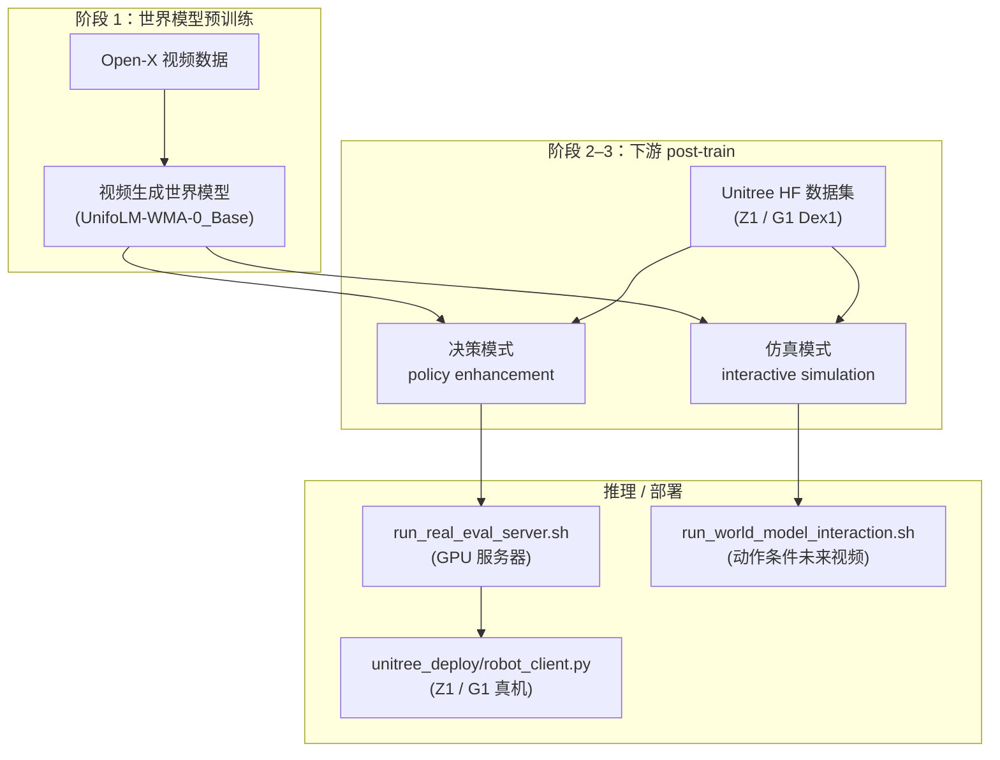
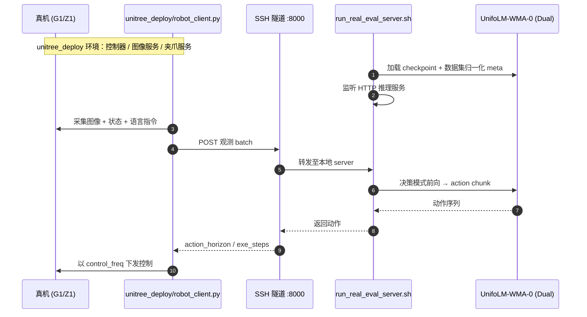

# UnifoLM-WMA-0（unifolm-world-model-action）

**UnifoLM-WMA-0** 是 UnifoLM 家族中的 **World-Model–Action（WMA）** 架构：核心世界模型理解机器人与环境的物理交互，并提供 **仿真引擎** 与 **策略增强** 两种用法；官方 **Training / Inference / Checkpoints / Deployment** 均已开源。

## 一句话定义

用世界模型预测未来交互，既合成数据又辅助动作头决策；同一 checkpoint 可在 **决策模式**（真机策略）与 **交互仿真模式**（动作条件视频生成）间切换。

## 英文缩写速查

| 缩写 | 英文全称 | 简要说明 |
|------|----------|----------|
| WMA | World-Model-Action | 世界模型–动作联合架构 |
| VLA | Vision-Language-Action | 同家族 UnifoLM-VLA 路线 |
| HF | Hugging Face | 权重与数据集托管 |
| IL | Imitation Learning | 下游微调常见设定 |
| Open-X | Open X-Embodiment | Base 模型预训练数据来源 |
| G1 | Unitree G1 Humanoid | 真机演示与 Dex1 数据集平台 |
| DM | Decision-Making | 世界模型辅助动作解码的模式 |

## 为什么重要

- 宇树官方把「世界模型当模拟器」与「世界模型助决策」写进 **同一框架**，是站内 [World Action Models](../concepts/world-action-models.md) 的 **可复现开源实例**（非论文占位）。
- **Open-Source Plan 四项全勾**：含 2025-09-22 发布的 `unitree_deploy/` 真机 client/server 分离部署栈。
- 真机演示覆盖 Z1 堆叠/清理与 G1 装相机等，并链到 **LeRobot v2.1** 数据格式与 Unitree HF 数据集，便于与 [`unitree_lerobot`](./unitree-lerobot.md) 对照。

## 流程总览



## 核心原理

| 功能 | 说明 |
|------|------|
| Simulation Engine | 给定当前图像 + 未来动作序列，生成交互可控 / 长程环境反馈（项目页对比原视频） |
| Policy Enhancement | 世界模型预测未来物理交互，条件化动作头优化决策（决策模式真机部署） |

**权重（HF Collections）**：

|  checkpoint | 用途 |
|-------------|------|
| `UnifoLM-WMA-0_Base` | Open-X 微调，作下游起点 |
| `UnifoLM-WMA-0_Dual` | 五个 Unitree 开源集上 **决策+仿真** 双模式 |

**实验数据（README 列举）**：Z1_StackBox、Z1 双臂 StackBox/Cleanup_Pencils、G1_Pack_Camera；另有 G1 Dex1 多样化操作集（128×128 / 256×256，单/双臂，~30s/episode）。

## 源码运行时序图

**决策模式真机部署**（README `run_real_eval_server.sh` + `unitree_deploy`）：



**交互仿真模式**：客户端侧仅准备 `examples/world_model_interaction_prompts/`（图像 + transition + CSV），由 `run_world_model_interaction.sh` 驱动世界模型 rollout，无真机 IO。

## 工程实践

### 环境安装

```bash
conda create -n unifolm-wma python==3.10.18 && conda activate unifolm-wma
conda install pinocchio=3.2.0 ffmpeg=7.1.1 -c conda-forge -y
git clone --recurse-submodules https://github.com/unitreerobotics/unifolm-world-model-action.git
cd unifolm-world-model-action && pip install -e .
cd external/dlimp && pip install -e .
```

### 训练

1. 自定义数据先转 **LeRobot v2.1** → `prepare_data/prepare_training_data.py`；
2. 调整 `configs/train/config.yaml`（`agent_state_dim` / `agent_action_dim` 默认 16 DoF 上限）、`meta.json`、`dataset_and_weights`；
3. `bash scripts/train.sh`（可先只训决策模式，再训仿真模式）。

### 真机部署（决策模式）

| 侧 | 步骤 |
|----|------|
| **Server** | 配置 `run_real_eval_server.sh` + `configs/inference/world_model_decision_making.yaml` → `bash scripts/run_real_eval_server.sh` |
| **Client** | 按 `unitree_deploy/README.md` 启 G1 Dex1 / Z1 控制器与图像服务 → SSH `-L 8000:127.0.0.1:8000` → `python scripts/robot_client.py --robot_type g1_dex1 ...` |

项目页：<https://unigen-x.github.io/unifolm-world-model-action.github.io>。

## 局限与风险

- **环境钉扎**：pinocchio / ffmpeg / 子模块 `dlimp`；部署侧另需 `unitree_sdk2_python` 与真机网络拓扑（与 [`xr_teleoperate`](./xr-teleoperate.md) 图像服务流程耦合）。
- **演示窗口右上角** 为未来动作 **世界模型预测视频**，不等于开环一定成功；决策模式仍依赖 server–client 延迟与 `action_horizon` 设定。
- **与 VLA 分工**：[`unifolm-vla`](./unifolm-vla.md) 走视觉–语言–动作；本仓强调 **显式世界动态** 与 **仿真数据合成**，选型看是否需要交互式 WM 而非比星标。

## 关联页面

- [UnifoLM-VLA](./unifolm-vla.md)
- [World Action Models](../concepts/world-action-models.md)
- [Generative World Models](../methods/generative-world-models.md)
- [Z1 软件栈](./z1-sdk.md)
- [unitree_lerobot](./unitree-lerobot.md)
- [Unitree](./unitree.md)

## 参考来源

- [sources/repos/unifolm-world-model-action.md](../../sources/repos/unifolm-world-model-action.md)
- [sources/sites/unifolm-world-model-action-github-io.md](../../sources/sites/unifolm-world-model-action-github-io.md)
- 上游：<https://github.com/unitreerobotics/unifolm-world-model-action>

## 推荐继续阅读

- HF Collections：<https://huggingface.co/collections/unitreerobotics/unifolm-wma-0-68ca23027310c0ca0f34959c>
- 项目页：<https://unigen-x.github.io/unifolm-world-model-action.github.io>
