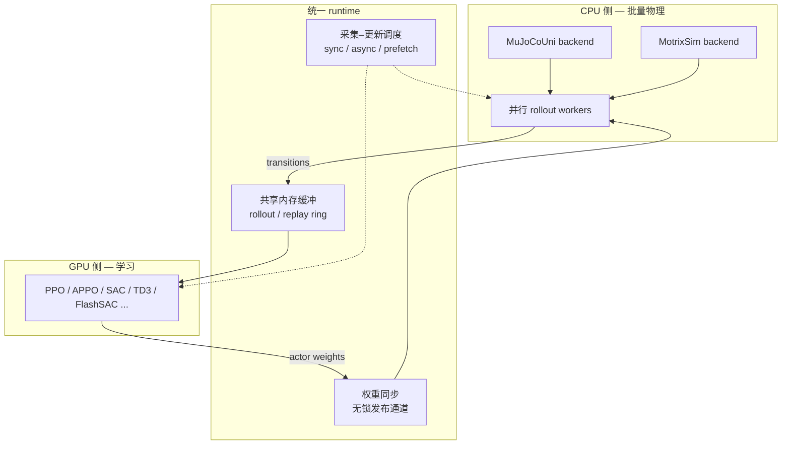

# UniLab：异构 CPU 仿真 / GPU 学习的机器人 RL 训练系统

**UniLab**（arXiv:2605.30313，清华等联合）质疑仿真主导机器人 RL 的默认前提：**高效训练是否必须把物理放在 GPU 上**。论文将问题重述为 **仿真–学习闭环的系统组织**：CPU 侧 **MuJoCoUni** 或 **MotrixSim** 做批量刚体 rollout，GPU 侧跑 PPO / SAC / TD3 / APPO / FlashSAC 等，经 **统一 runtime** 管理缓冲、调度与参数同步；在代表任务上报告 **3–10×** 端到端墙钟增益，并展示 **macOS（MPS/MLX）、AMD ROCm、Intel XPU** 可训练性。

## 一句话定义

> **把「谁算物理」和「谁算梯度」拆开，用低开销 runtime 让采集与 learner 在墙钟上重叠**——GPU 驻留仿真是一条高效路径，但不是必要条件。

## 为什么重要

- **打破 GPU 仿真默认：** [Isaac Gym / Isaac Lab](./isaac-gym-isaac-lab.md)、MJX Playground、[mjlab](./mjlab.md)、ManiSkill3、Genesis 等证明 GPU 并行环境极快，但也把实验栈绑在 **NVIDIA CUDA 生态**；UniLab 给出 **CPU 物理 + GPU 学习** 的完整工程反例。
- **闭环视角：** 机器人 RL 是 **数据生成 ↔ 策略更新 ↔ 同步约束** 的系统；on-policy（PPO）与 replay-based（SAC/TD3/FlashSAC）对 **采集–学习耦合度** 不同，异构拆分在 **可重叠** 的算法上收益更大。
- **平台多样性：** 项目页强调 **Apple Silicon 一等目标**——对无法或不愿维护 Linux/CUDA 训练机的团队，这是与「仅评估、不训练」的折中不同的选项。
- **与 Motrix / MuJoCo 生态衔接：** 双后端共享 task 契约，利于 **MJCF 资产** 与 [Motrix](./motrix.md) 工业 CPU 仿真叙事对齐。

## 流程总览

### 采集–更新 timing（论文 §3.2）

| 算法族 | timing | 要点 |
|--------|--------|------|
| **PPO** | 同步 rollout → update | CPU 仿真与 GPU learner 墙钟接近时，**CPU 物理未必是瓶颈**（与 MjLab 同步 PPO 对比实验） |
| **APPO** | 异步 on-policy | CPU 持续写固定 horizon rollout + V-trace；GPU 消费可用 batch；**墙钟重叠** |
| **SAC / TD3 / FlashSAC** | replay | 采集写 replay；learner 多步更新；优化路径可 **预取下一 device batch** 与当前 update 重叠 |

## 核心结构

| 模块 | 作用 |
|------|------|
| **CPU physics backends** | **MuJoCoUni**（arXiv:2605.24922）与 **MotrixSim** 在统一契约下批量步进环境 |
| **Task / DR 接口** | 状态、动作、观测、reset/interval 随机化、地形、回放——由训练系统调度而非散落脚本 |
| **GPU learner** | 密集策略/价值更新；可映射 CUDA / MPS / ROCm / XPU |
| **Unified runtime** | 同一栈承载 sync / loose coupling；连接资产、任务配置、后端与算法 |

## 实验结论（归纳）

- **默认硬件：** RTX 4090 + Ryzen 9 9950X3D + 64GB；任务覆盖 locomotion、motion tracking、manipulation、loco-manipulation；机体含四足、轮足、人形、灵巧手。
- **端到端：** 相对 GPU 驻留基线 **约 3–10×** 墙钟（项目页举例：G1 Flip 3.3×、Walk Flat 8.4×、Motion Tracking 11.0×）。
- **CPU 吞吐：** 批量 CPU 仿真在研究的 env 规模下可为异构路径提供足够 **steps/s**；复杂接触/灵巧操作场景 CPU 相对 GPU 仿真优势更明显（论文 Figure 4 / Table 2）。
- **可移植性：** M5 Max、AMD 8060S、ROCm、Intel Arc 等有训练曲线与墙钟表（附录细节以论文为准）。
- **To-real：** 六类真机任务概览（仿真效率为主结论，迁移需单独实验）。

## 与相邻栈怎么选

| 场景 | 更可能选 UniLab | 更可能选 GPU 驻留栈（Isaac Lab / MJX / mjlab 等） |
|------|----------------|--------------------------------------------------|
| 单机 1 GPU + 强 CPU，replay / 异步 on-policy | ✓ 重叠采集与 learner | 同卡上仿真与学习争用加速器 |
| 必须 macOS / ROCm / 非 CUDA 训练 | ✓ 一等支持叙事 | 生态仍以 Linux CUDA 为主 |
| 需要 Omniverse 传感器/渲染/大场景 | 非主战场 | ✓ |
| 严格同步 PPO、仿真已 GPU 饱和 | 增益可能有限（论文：与 MjLab 可比） | 若已有成熟 GPU 管线可继续 |
| 视觉主导、渲染/感知占主导 | 收益可能变小（论文 Discussion） | 视具体栈 |

## 常见误区

1. **「反对 GPU 仿真」：** 论文明确 **不** 宣称 GPU 仿真过时；当仿真不再是瓶颈或需超大 GPU 集群时，GPU 驻留仍可能更优。
2. **「等于换了个 MuJoCo wrapper」：** 贡献在 **端到端 runtime 与异构调度**，不是单点加速物理引擎。
3. **「任意任务都 10×」：** 强同步 PPO、视觉主导 workload 可能看不到同等幅度增益。
4. **「替代 Isaac 传感器仿真」：** UniLab 聚焦 **刚体、仿真主导控制**；可变形体/流体未覆盖。

## 关联页面

- [Isaac Gym / Isaac Lab](./isaac-gym-isaac-lab.md)、[mjlab](./mjlab.md) — GPU 驻留 / MuJoCo GPU 路径对照
- [Motrix](./motrix.md)、[MuJoCo](./mujoco.md)、[MuJoCo MJX](./mujoco-mjx.md) — 物理后端与批量仿真语境
- [仿真器选型指南](../queries/simulator-selection-guide.md)、[MuJoCo vs Isaac Lab](../comparisons/mujoco-vs-isaac-lab.md)
- [Reinforcement Learning](../methods/reinforcement-learning.md)、[Locomotion](../tasks/locomotion.md)、[Unitree G1](./unitree-g1.md)

## 英文缩写速查

| 缩写 | 英文全称 | 简要说明 |
|------|----------|----------|
| CPU | Central Processing Unit | 中央处理器 |
| GPU | Graphics Processing Unit | 图形处理器，大规模并行仿真训练的算力基础 |
| RL | Reinforcement Learning | 通过与环境交互最大化长期回报来学习策略的范式 |
| PPO | Proximal Policy Optimization | 人形/足式 locomotion 中最常用的 on-policy 策略梯度算法 |
| SAC | Soft Actor-Critic | 连续控制常用的 off-policy 最大熵算法 |
| Isaac Gym | NVIDIA Isaac Gym | GPU 并行刚体仿真训练环境 |
| Isaac Lab | NVIDIA Isaac Lab | 基于 Omniverse 的机器人学习训练框架 |
| MJX | MuJoCo JAX | MuJoCo 的 JAX/XLA 后端，支持可微与批量仿真 |
| CUDA | Compute Unified Device Architecture | NVIDIA GPU 通用并行计算平台 |
| MuJoCo | Multi-Joint dynamics with Contact | 接触丰富的刚体物理仿真引擎 |
| MJCF | MuJoCo XML Format | MuJoCo 的模型与场景描述格式 |
| DR | Domain Randomization | 训练时随机化仿真参数以提升跨域鲁棒迁移 |
| G1 | Unitree G1 Humanoid | 宇树入门级教育科研人形平台 |
| Locomotion | Robot Locomotion | 足式/人形等无轮移动能力的总称 |

## 参考来源

- [UniLab 论文摘录](../../sources/papers/unilab_arxiv_2605_30313.md)（arXiv:2605.30313）
- [UniLab 官方仓库](../../sources/repos/unilab.md)
- [UniLab 项目页](../../sources/sites/unilabsim-project.md)
- Jia et al., *UniLab: A Heterogeneous Architecture for Robot RL Beyond GPU-Dominant Paradigms* (2026)

## 推荐继续阅读

- [arXiv:2605.30313](https://arxiv.org/abs/2605.30313) — 系统消融与跨平台附录
- [项目主页](https://unilabsim.github.io) — 对比表、浏览器 demo、to-real 视频
- [GitHub: unilabsim/UniLab](https://github.com/unilabsim/UniLab) — 安装与任务入口
- [MuJoCoUni（arXiv:2605.24922）](https://arxiv.org/abs/2605.24922) — UniLab CPU 后端之一
