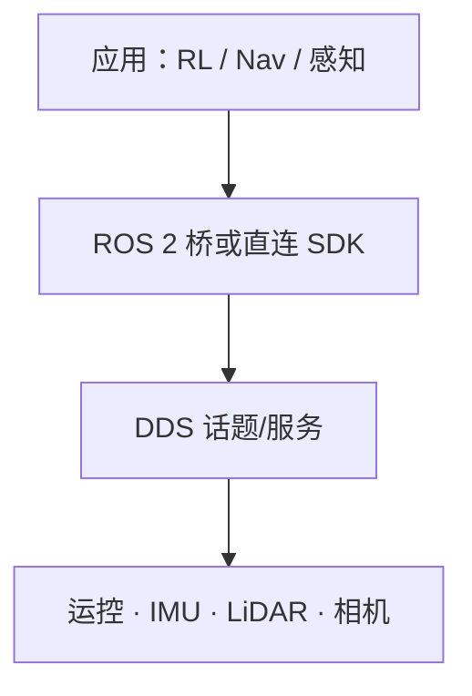

# Unitree G1 软件服务栈

## 一句话定义

**G1 软件服务栈**指在 [Unitree G1](./unitree-g1.md) 上通过 **unitree_sdk2 / DDS**（及可选 ROS 2 桥）暴露的 **低层运控、传感器流与外设服务**，是课程仿真遥控、策略部署与导航节点对接的统一接口面。

## 英文缩写速查

| 缩写 | 英文全称 | 简要说明 |
|------|----------|----------|
| SDK | Software Development Kit | 宇树官方 C++/Python 开发包 |
| DDS | Data Distribution Service | G1 机载通信中间件 |
| ROS 2 | Robot Operating System 2 | 常用科研桥接层 |
| RL | Reinforcement Learning | 策略常经 ONNX/自研部署接到低层 |
| API | Application Programming Interface | 高层应用调用的服务/话题面 |

## 为什么重要

- 硬件页讲「有什么传感器」；本页讲 **如何订阅读写**——否则 Ch2 策略与 Ch3 LiDAR 节点无法闭环。
- 课程实践「仿真环境搭建与运动控制」的核心就是弄清 **仿真桥 ↔ 真机服务** 的同构接口。

## 核心原理

典型能力分层：

1. **运动服务**：站立、速度指令、关节/力矩模式切换（以官方 SDK 文档为准）。
2. **状态流**：IMU、关节状态、电池/故障码。
3. **感知流**：机载 LiDAR / 深度相机话题（型号因配置而异）。
4. **仿真同构**：MuJoCo / Isaac 等通过插件或官方仿真包镜像部分服务，降低 Sim2Real 接口差。

## 工程实践

- 先读 [Unitree 品牌/SDK 总览](./unitree.md)，再落到 G1 具体包版本；旧 [unitree-ros](./unitree-ros.md) 偏 ROS1/Gazebo 遗产，新课优先 SDK2。
- 调试检查：时钟同步、QoS、仿真与真机 **坐标系命名** 是否一致（接 [感知坐标后处理](../concepts/perception-coordinate-postprocessing.md)）。

## 局限与风险

- 官方服务名与频率随固件变更，wiki 不锁定具体 topic 字符串；以当时 SDK 文档为准。
- 高动态力矩模式有安全风险，课程应保留软限位与急停流程。

## 关联页面

- [Unitree G1](./unitree-g1.md)
- [人形系统课程策展](./humanoid-system-curriculum.md)
- [ROS 2 基础](../concepts/ros2-basics.md)

## 参考来源

- [深蓝学院人形系统课程大纲](../../sources/courses/shenlan_humanoid_system_theory_practice.md)
- [unitree 仓库归档](../../sources/repos/unitree.md)

## 推荐继续阅读

- Unitree 开发者文档（SDK2 / G1）：以官网 Developer 入口为准
