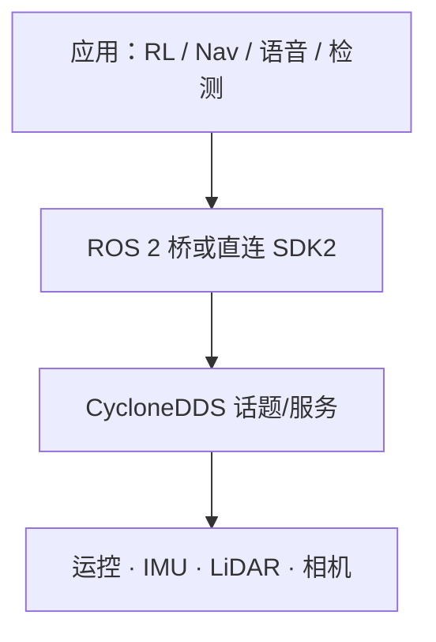

# Unitree G1 软件服务栈

## 一句话定义

**G1 软件服务栈**指在 [Unitree G1](./unitree-g1.md) 上通过 **unitree_sdk2 / CycloneDDS**（及可选 ROS 2 桥）暴露的 **运控、状态与传感器服务**，是课程仿真遥控、策略部署、导航与语音技能对接的统一接口面——第 1.4 节。

## 英文缩写速查

| 缩写 | 英文全称 | 简要说明 |
|------|----------|----------|
| SDK2 | Unitree SDK v2 | 官方 C++/Python 开发包 |
| DDS | Data Distribution Service | 机载通信（CycloneDDS） |
| ROS 2 | Robot Operating System 2 | 常用科研桥接层 |
| RL | Reinforcement Learning | 策略常经 ONNX 等到低层 |
| Sim2Sim | Simulation to Simulation | MuJoCo/Isaac 等同构验证 |
| API | Application Programming Interface | 高层可调用的服务/话题 |

## 为什么重要

- 硬件页讲「有什么传感器」；本页讲 **如何订阅读写**——否则 Ch2 策略与 Ch3 LiDAR 节点无法闭环。
- 实践「仿真环境搭建与运动控制」的核心是弄清 **仿真桥 ↔ 真机服务** 的同构接口。
- 导航 [DWA](../methods/dwa.md) / 语音技能最终都要落到 **速度或高层运动服务**，而非直接写关节角（除非力矩模式实验）。

## 核心原理

### 分层架构

| 层 | 代表组件 | 职责 |
|----|----------|------|
| 应用 | 策略、Nav2、ASR 技能 | 任务逻辑 |
| 中间件 | SDK2 Python/C++、`unitree_ros2` | 序列化与发现 |
| 传输 | CycloneDDS | 机载实时通信 |
| 设备 | 运控板、传感器 | 执行与传感 |

### 能力面（逻辑分组）

1. **运动服务**：站立、速度指令、模式切换（以官方文档为准）。
2. **状态流**：IMU、关节、电池/故障。
3. **感知流**：LiDAR / RealSense 等（配置相关）。
4. **仿真同构**：`unitree_mujoco`、Isaac/mjlab 训练栈经同一 DDS 语义做 Sim2Sim（见 [unitree 组织归档](../../sources/repos/unitree.md)）。

## 工程实践

### 课程入门路径

| 步骤 | 动作 |
|------|------|
| 1 | 读 [Unitree 开发者文档](https://support.unitree.com/home/zh/developer) SDK2 入口 |
| 2 | 本地跑 SDK2 例程：读状态、发底层指令（急停就绪） |
| 3 | 仿真：官方 MuJoCo / 课程指定仿真与真机对齐话题名 |
| 4 | 部署 RL：按 [unitree_rl_gym](./unitree.md) / [mjlab](./unitree-rl-mjlab.md) 文档 ONNX→C++/Python |
| 5 | 导航桥：`cmd_vel` → G1 速度接口（限幅、坐标系） |

### 与旧栈区别

| 栈 | 适用 | 注意 |
|----|------|------|
| SDK2 + DDS | G1/H1/Go2 等新机 | **课程优先** |
| [unitree-ros](./unitree-ros.md) | ROS1 Gazebo 遗产 | 勿与 SDK2 话题假设混用 |
| `unitree_ros2` | 直接吃 Unitree DDS msg | Humble 等发行版对齐 |

### 调试清单

| 检查 | 工具/现象 |
|------|-----------|
| 参与者可见 | DDS 发现、防火墙/网卡 |
| 时钟 | 仿真与桥时间戳 |
| 模式 | 未切到允许的控制模式则指令无效 |
| 安全 | 软限位、绳索、急停 |

### 对接上层模块

| 上层 | 接口要点 |
|------|----------|
| PPO 行走 | obs 语义与训练一致；动作限幅 |
| Nav2/DWA | 速度指令频率与足迹 |
| 语音技能 | 白名单动作 → 运动服务 |
| 足球感知 | 相机 TF 随头关节更新 |

## 局限与风险

- 服务名/频率随固件变更，wiki **不锁定**具体 topic 字符串。
- 高动态力矩模式有摔机风险；课程应默认安全模式。
- **误区**：在应用层硬编码仿真话题，真机换名后「策略坏了」——应集中配置。

## 关联页面

- [Unitree G1](./unitree-g1.md)
- [Unitree 品牌/组织](./unitree.md)
- [ROS 2 基础](../concepts/ros2-basics.md)
- [DWA](../methods/dwa.md)
- [人形语音交互](../methods/humanoid-voice-interaction.md)
- [人形系统课程策展](./humanoid-system-curriculum.md)

## 参考来源

- [深蓝学院人形系统课程大纲](../../sources/courses/shenlan_humanoid_system_theory_practice.md)
- [unitree 组织归档](../../sources/repos/unitree.md)

## 推荐继续阅读

- Unitree SDK2 开发者文档与 `unitree_sdk2` / `unitree_sdk2_python` README
- `unitree_mujoco` Sim2Sim 流程说明
