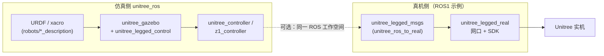

# unitree_ros（Unitree 官方 ROS1 / Gazebo 栈）

**unitree_ros** 与配套的 **unitree_ros_to_real** 代表宇树在 **ROS1 + Gazebo** 时代的官方开源组合：前者提供多机型 **URDF/xacro**、Gazebo 世界与关节控制器；后者提供 **ROS ↔ 真机** 的消息与桥接节点（含 `unitree_legged_msgs`，也被仿真仓列为依赖）。

## 一句话定义

用经典 catkin 工作流把 Unitree 机型搬进 Gazebo8，并在关节空间做力矩/位置/速度级实验；**行走等高层行为不在 Gazebo 仿真包承诺范围内**，真机侧需走 `unitree_ros_to_real` 与对应 **`unitree_legged_sdk`** 版本组合。

## 为什么重要

- **URDF 资产入口**：大量 `*_description` 包集中维护网格与模型文件，是社区做 RViz/Gazebo、SLAM 与视觉实验时的常见引用源（与 MuJoCo/Isaac 资产可对照，但坐标与关节命名需自行对齐）。
- **仍可见的部署范式**：以太网静态 IP、高低层控制分模式 launch、手柄介入安全流程——在 newer SDK2 + DDS 栈普及后，这些仍是理解「从笔记本到腿机」工程摩擦的参照。
- **与当前主线并存**：官方较新的 RL 训练与 ONNX 部署多围绕 **mjlab / unitree_sdk2**；本栈属于 **ROS1 遗产主线**，选型时不可与 ROS2 或 MuJoCo 管线混为一谈。

## 流程总览

## 核心结构

| 组件 | 作用 |
|------|------|
| `robots/*_description` | 各机型 mesh、URDF、xacro；README 列出的型号覆盖四足、人形、双臂、手爪等描述包 |
| `unitree_legged_control` | Gazebo 关节控制器插件，支持位置 / 速度 / 力矩模式（示例代码见仓库内 `servo.cpp`） |
| `unitree_gazebo` | 世界与 launch；`normal.launch` 的 `rname` / `wname` 选择机器人与世界 |
| `unitree_ros_to_real` | 独立仓库：消息定义 + `real.launch` 的 high/low level 切换与示例 walk / state 订阅 |

## 常见误区或局限

- **把 Gazebo 当成完整 locomotion 仿真器**：上游 README 写明 Gazebo **不能**做高层行走仿真；策略级 locomotion 需换用 MuJoCo、Isaac 等环境或自研控制器。
- **忽略 SDK/ROS 发行版绑定**：`unitree_ros_to_real` 文档仍围绕 **Ubuntu 18.04 + Melodic + unitree_legged_sdk** 组合；新机型/新通信栈应优先查 **SDK2 / ROS2** 文档而非硬套本仓 launch。
- **消息包来源混淆**：`unitree_legged_msgs` 不在 `unitree_ros` 根目录，而在 `unitree_ros_to_real`；漏克隆会导致 catkin 依赖失败。

## 推荐继续阅读

- [unitreerobotics/unitree_ros README（raw）](https://raw.githubusercontent.com/unitreerobotics/unitree_ros/master/README.md)
- [unitreerobotics/unitree_ros_to_real README（raw）](https://raw.githubusercontent.com/unitreerobotics/unitree_ros_to_real/master/README.md)
- [unitreerobotics/unitree_mujoco](https://github.com/unitreerobotics/unitree_mujoco) — 与官方 MuJoCo 仿真验证链路常一起出现（参见 [unitree_rl_mjlab](./unitree-rl-mjlab.md) 部署叙述）

## 参考来源

- [sources/repos/unitree_ros.md](../../sources/repos/unitree_ros.md)
- [sources/repos/unitree_ros_to_real.md](../../sources/repos/unitree_ros_to_real.md)

## 关联页面

- [Unitree](./unitree.md) — 硬件与开源生态总入口；本页仅覆盖 **ROS1 + Gazebo8** 描述与关节级仿真/桥接。
- [unitree_rl_mjlab](./unitree-rl-mjlab.md) — **并行官方路线**：GPU 并行 MuJoCo 训练与 ONNX→SDK2 部署；与 ROS1 Gazebo 资产互补而非替代。
- [Unitree G1](./unitree-g1.md) — `g1_description` 等模型在 ROS 描述包中的工程落点。
- [四足机器人](./quadruped-robot.md) — README 中 `rname` 示例多面向四足机型（a1、go1、laikago 等）。
- [Sim2Real](../concepts/sim2real.md) — 从 Gazebo 关节仿真到真机以太网/SDK 链路的系统摩擦与验证口径。
- [Locomotion](../tasks/locomotion.md) — 任务层注意：Gazebo 包不承诺高层行走仿真。
- [ROS 2 基础](../concepts/ros2-basics.md) — 代际对照：本栈为 ROS1，不等同于 ROS2 驱动与 launch 习惯。
