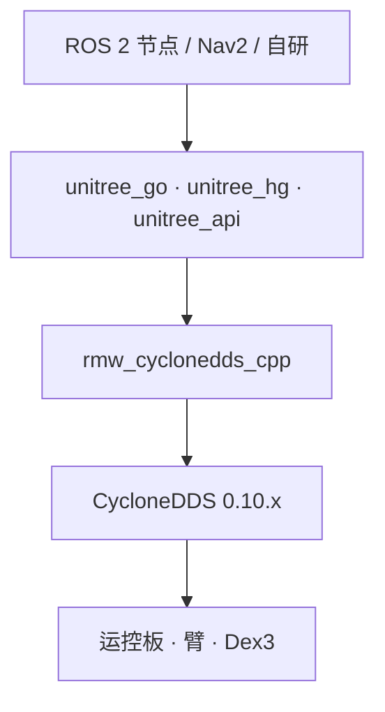

# unitree_ros2

**unitree_ros2** 是宇树官方 ROS 2 功能包：底层与 SDK2 一样走 [Cyclone DDS](./cyclone-dds.md)，因此 **ROS 2 msg 可直接用于通信与控制**，而不必把每个调用再 wrap 一层 C++ SDK。当前版本锚点为 **[v0.3.0](https://github.com/unitreerobotics/unitree_ros2/releases/tag/v0.3.0)**（2025-08-15）：G1 从「能读低层状态」扩到 **双臂轨迹、Dex3 灵巧手、高层 Arm SDK / Loco / 音频**。

## 一句话定义

在 ROS 2 工作空间里编译 Unitree 的 `unitree_go` / `unitree_hg` / `unitree_api` 等包，使 Nav、可视化与自研节点能以标准 ROS 2 话题/服务对接真机 DDS；v0.3.0 起 G1 双臂与 Dex3 走与 SDK2 同构的 `unitree_hg` 消息。

## 英文缩写速查

| 缩写 | 英文全称 | 简要说明 |
|------|----------|----------|
| ROS 2 | Robot Operating System 2 | 机器人中间件；推荐 Humble |
| DDS | Data Distribution Service | ROS 2 与 SDK2 共用的通信层 |
| RMW | ROS Middleware | 需切换到 `rmw_cyclonedds_cpp` |
| IDL | Interface Definition Language | Unitree 自定义 msg 生成来源 |
| SDK2 | Unitree SDK version 2 | 并行的非 ROS 控制入口；v0.3.0 手部 msg 与其对齐 |
| G1 | Unitree G1 Humanoid | 人形平台；双臂/Dex3 示例在 v0.3.0 补齐 |
| Dex3 | Unitree Dex3 Dexterous Hand | 7 电机灵巧手；原生 DDS，不是 Serial 桥 |

## 为什么重要

- 实验室大量工具（RViz2、rosbag2、Nav2）默认 ROS 2；本仓是「不丢弃 ROS 生态」时的官方入口。
- 与 [`unitree_sdk2`](./unitree-sdk2.md) **同语义**：选型是语言/生态偏好，不是两套互斥协议。v0.3.0 把 `HandCmd` / `HandState` / `PressSensorState` **对齐 SDK2**，混用旧 ROS 2 消息会静默错位。
- 对照 [`unitree_ros`](./unitree-ros.md)（ROS1 + Gazebo）可清晰划分 **遗产仿真栈** vs **现行真机 ROS 2 栈**。
- G1 双臂与 Dex3 不再只存在于 C++/Python SDK 示例：ROS 2 节点可直接订 `/arm_sdk`、`/dex3/*/cmd` 等主题，便于和 Nav2 / 采数管线拼在同一进程图里。
- 底层实现细节见 [Cyclone DDS](./cyclone-dds.md) 实体页（版本钉定、Domain 隔离）。

## 核心原理

| 目录/包 | 作用 |
|---------|------|
| `cyclonedds_ws` | 工作空间；`unitree_go`（四足）、`unitree_hg`（G1/H1 人形）、`unitree_api`（请求–响应） |
| `example` | 示例工作空间；v0.3.0 起含完整 G1 子树 |
| RMW 切换 | `ros-$DISTRO-rmw-cyclonedds-cpp`；Foxy 常需自编译匹配 0.10.2 的 cyclonedds |

**已测组合（上游）**：Ubuntu 20.04 + Foxy；Ubuntu 22.04 + **Humble（推荐）**。可用 `.devcontainer` / Dockerfile。

**历史仓说明（不单独成 wiki 节点）**：[unitree_ros2_to_real](https://github.com/unitreerobotics/unitree_ros2_to_real) 面向 **Go1** 的 ROS 2 真机示例（最近推送 2023），归档见 [`sources/repos/unitree_ros2_to_real.md`](../../sources/repos/unitree_ros2_to_real.md)；新机型请用本仓而非该遗产示例。

### v0.3.0：G1 双臂、Dex3 与 SDK2 对齐

README 引言仍写「Supports Go2, B2, and H1」——**以 Release 与 `example/src/g1/` 为准**，不要据此判断 G1 未支持。

| 可执行文件 | 通信面 | 读法 |
|------------|--------|------|
| `g1_dual_arm_example` | `lowcmd` / `lowstate`（`unitree_hg`） | 先 `ReleaseMode` 关掉运控服务，3 s 插值回零，再按 `.seq` 跟踪双臂（29-DoF；臂关节从 `LEFT_SHOULDER_PITCH=15` 起）；控制周期 2 ms |
| `g1_arm_sdk_dds_example` | 发布 `/arm_sdk`，订 `/lowstate` | **不要**直接抢 `lowcmd`。编译期选 `G1ARM5`（13 关节）或 `G1ARM7`（17 关节）；未用关节的 `q` 作权重，淡出到 0 交还运控 |
| `g1_arm_action_example` | `/api/arm/request` · `/api/arm/response` | 预置动作：API `7106` 执行、`7107` 列表。FSM 须在 `{500, 501, 801}`；`rt/armsdk` 被占会报 7400 |
| `g1_dex3_example` | `/dex3/{left\|right}/cmd` · `/lf/dex3/{left\|right}/state` | **原生 DDS** 7 电机 + 9 压感，不是 [Serial↔DDS 手部服务](./unitree-dexterous-hand-services.md)。左右手 URDF 限位镜像；`mode` 低 4 位是电机 id |
| `g1_loco_client_example` | LocoClient | CLI：`--get_fsm_id`、`--set_velocity=`、`--move=`、`--sit` / `--stand_up`、`--wave_hand` |
| `g1_audio_client_example` | Audio client | TTS、音量、**16 kHz 单声道 PCM**、LED |
| `g1_ankle_swing_example` | `unitree_hg` 低层 | 踝摆；与双臂示例同属低层 `LowCmd` 路径 |

**手部消息破坏性变更（相对 v0.2.0，对齐 SDK2）：**

| 消息 | 关键差异 |
|------|----------|
| `HandCmd` | 追加 `uint32[4] reserve` |
| `HandState` | `press_sensor_state` **挪到** `imu_state` 之前；新增 `system_v` / `device_v` / `error[2]` |
| `PressSensorState` | 追加 `lost`、`reserve` |

上游明确：**没有推荐迭代方法**。只按旧字段顺序 memcpy / 手写反序列化的桥会 **静默错位**（压感与 IMU 对调），而不是编译失败。

## 工程实践

1. 安装 `ros-$DISTRO-rmw-cyclonedds-cpp`、`rosidl-generator-dds-idl`、`libyaml-cpp-dev`。Dex3 示例另需 Eigen3。
2. **Foxy**：在未 source ROS 的终端中先编译与机器人一致的 CycloneDDS 0.10.x，再 source ROS 编译 Unitree 包；**Humble** 可跳过自编译 DDS 步骤（以上游 README 为准）。v0.3.0 已把 Humble 侧 `header.stamp` 判断补到 Foxy。
3. `colcon build` `cyclonedds_ws` 后 source，再进 `example` 编示例。按文档改 `setup.sh` 网口与 `RMW_IMPLEMENTATION=rmw_cyclonedds_cpp`。
4. **G1 双臂低层**：`g1_dual_arm_example ./behavior_lib/ motion`。未 `ReleaseMode` 时运控仍占着关节，轨迹发了也不动。
5. **G1 高层臂**：优先 `/arm_sdk` 或 `/api/arm/*`，不要和低层 `lowcmd` 同时写同一组臂关节。
6. **Dex3**：`g1_dex3_example L eth0`（或 `R`）。左手限位与右手镜像；停机时把 `timeout` 位置 1。
7. 同网段若同时跑 [`unitree_mujoco`](./unitree-mujoco.md) 仿真，注意 DDS 域与真机冲突。

## 局限与风险

- **发行版绑定**：Foxy 的 DDS 自举步骤繁琐，优先 Humble。
- **不是 Gazebo 高层行走包**：仿真 URDF/Gazebo 仍看 `unitree_ros`；本仓主攻真机 ROS 2 通信。
- **与 ROS1 桥不可混搭消息定义**。
- **v0.3.0 手部 msg 破坏兼容**：钉 v0.2.0 的自定义 Dex3 节点必须改字段顺序与新增标量，否则压感/IMU 会读错。
- **双通道互斥**：`/arm_sdk` 与低层 `lowcmd`、以及预置 `arm action`（`rt/armsdk`）不能同时当主人。
- **开源状态：** **已开源**（BSD-3-Clause；Release 页即项目页）。

## 关联页面

- [unitree_sdk2](./unitree-sdk2.md)
- [unitree_ros（ROS1）](./unitree-ros.md)
- [unitree_mujoco](./unitree-mujoco.md)
- [Unitree G1](./unitree-g1.md)
- [G1 软件服务栈](./unitree-g1-software-stack.md)
- [灵巧手 Serial↔DDS 服务](./unitree-dexterous-hand-services.md) — Dex1/Inspire 等串口桥；Dex3 走本仓原生 DDS
- [Cyclone DDS](./cyclone-dds.md)
- [DDS 通信机制](../concepts/dds-communication.md)
- [ROS 2 基础](../concepts/ros2-basics.md)
- [Unitree](./unitree.md)

## 参考来源

- [sources/repos/unitree_ros2.md](../../sources/repos/unitree_ros2.md) — v0.3.0 Release 与示例源码摘录
- [sources/repos/unitree_ros2_to_real.md](../../sources/repos/unitree_ros2_to_real.md)
- [sources/repos/cyclonedds.md](../../sources/repos/cyclonedds.md) · [cyclonedds.io](../../sources/sites/cyclonedds-io.md)
- 上游仓：<https://github.com/unitreerobotics/unitree_ros2>
- Release v0.3.0：<https://github.com/unitreerobotics/unitree_ros2/releases/tag/v0.3.0>

## 推荐继续阅读

- SDK2 文档：<https://support.unitree.com/home/zh/developer>
- G1 运动服务 / FSM：<https://support.unitree.com/home/en/G1_developer/sport_services_interface>
- Cyclone 文档索引：<https://cyclonedds.io/docs/>
