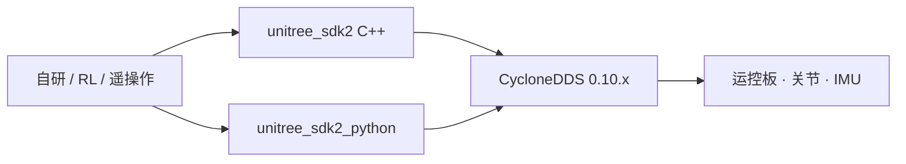

# unitree_sdk2（含 Python 绑定）

**unitree_sdk2** 是 Unitree 面向 Go2 / B2 / H1 / G1 等新机型的 **SDK v2（C++，CycloneDDS）**；官方同步维护 **unitree_sdk2_python**（同 IDL / 高低层语义）。本页把 C++ 与 Python 视为**同一通信面的两种语言入口**，避免拆成重复节点。

## 一句话定义

用 CycloneDDS 在以太网调试链路上读写 **LowCmd / LowState / SportMode** 等主题，把自研控制器、RL 导出策略或 ROS 2 桥接到真机；Python 绑定用于快速原型，C++ 用于部署与官方示例主线。

## 英文缩写速查

| 缩写 | 英文全称 | 简要说明 |
|------|----------|----------|
| SDK2 | Unitree SDK version 2 | 基于 CycloneDDS 的现行官方开发包 |
| DDS | Data Distribution Service | 分布式实时通信；实现常用 Eclipse CycloneDDS 0.10.x |
| IDL | Interface Definition Language | 消息结构定义；Go 系 `unitree_go` 与人形 `unitree_hg` 分族 |
| API | Application Programming Interface | 请求–响应与主题订阅/发布接口 |
| ROS 2 | Robot Operating System 2 | 可与 SDK2 共用 DDS 语义的集成层 |
| G1 | Unitree G1 Humanoid | 人形平台；低层多用 `unitree_hg` IDL |

## 为什么重要

- **代际分界**：新机型默认走 SDK2 + DDS，而不是 `unitree_legged_sdk` 的 UDP 遗产栈；混用会导致「话题通了但机型 IDL 不对」。
- **Sim2Real 同构**：[`unitree_mujoco`](./unitree-mujoco.md) 与真机共享同一套 LowCmd/LowState，策略验证可先在仿真订同一主题。
- **语言分工明确**：脚本化采数 / 调试用 Python；C++ `make install` 后供 ONNX 部署与第三方工程 `find_package`。

## 核心原理



| 组件 | 职责 |
|------|------|
| `unitree_sdk2` | C++ 库与 example；`cmake && make install`（常用前缀 `/opt/unitree_robotics`） |
| `unitree_sdk2_python` | `pip install -e .`；依赖 **cyclonedds==0.10.2**、numpy、opencv |
| 高低层接口 | High-level：运动服务（起立、速度、姿态等）；Low-level：关节力矩/位置 |
| 周边仓（不单独成页） | `unitree_dds_wrapper` 薄封装；`unitree_actuator_sdk` 电机/执行器调试 |

**预构建环境（上游 README）**：Ubuntu 20.04 LTS；CPU aarch64 / x86_64；gcc 9.4.0；CMake ≥ 3.10。

## 工程实践

### C++ 快速路径

```bash
apt-get install -y cmake g++ build-essential libyaml-cpp-dev libeigen3-dev \
  libboost-all-dev libspdlog-dev libfmt-dev
mkdir build && cd build && cmake .. && make
# 系统安装（供其它工程 find_package）
cmake .. -DCMAKE_INSTALL_PREFIX=/opt/unitree_robotics && sudo make install
```

参考 `example/cmake_sample` 导入 SDK。完整 API 与机型说明以 [Unitree 开发者文档](https://support.unitree.com/home/zh/developer) 为准。

### Python 快速路径

1. 编译安装 CycloneDDS 0.10.x，并设置 `CYCLONEDDS_HOME`。
2. `pip3 install -e .` 安装本仓。
3. 按文档配置网口后运行 `example/helloworld`、`high_level/`、`low_level/` 示例（需传入网卡名，如 `enp2s0`）。

### 选型对照

| 需求 | 入口 |
|------|------|
| 新机型真机 / 自研 C++ 控制器 | 本页 C++ SDK2 |
| 快速脚本、采数、教学演示 | `unitree_sdk2_python` |
| ROS 2 系统集成 | [`unitree_ros2`](./unitree-ros2.md)（直接吃 DDS msg） |
| Go1 旧 UDP 栈 | [`unitree_legged_sdk`](./unitree-legged-sdk.md) |

## 局限与风险

- **CycloneDDS 版本钉死**：Python 绑定要求 0.10.2；与系统其它 DDS 发行混装易导致发现失败。
- **高低层安全**：低层关节控制前必须按文档进入调试模式并做好吊装/急停；示例程序不是生产控制器。
- **不要与 SDK1/ROS1 消息混用**：`unitree_ros_to_real` / `unitree_legged_msgs` 属于另一代通信约定。

## 关联页面

- [Unitree](./unitree.md) — 组织枢纽与仓清单
- [unitree_ros2](./unitree-ros2.md) — ROS 2 + 同 DDS 语义
- [unitree_mujoco](./unitree-mujoco.md) — Sim2Sim 同构验证
- [G1 软件服务栈](./unitree-g1-software-stack.md) — 课程向分层接口面
- [unitree_legged_sdk](./unitree-legged-sdk.md) — 旧代 UDP SDK
- [Sim2Real](../concepts/sim2real.md)

## 参考来源

- [sources/repos/unitree_sdk2.md](../../sources/repos/unitree_sdk2.md)
- [sources/repos/unitree_sdk2_python.md](../../sources/repos/unitree_sdk2_python.md)
- [sources/repos/unitree_dds_wrapper.md](../../sources/repos/unitree_dds_wrapper.md)
- [sources/repos/unitree_actuator_sdk.md](../../sources/repos/unitree_actuator_sdk.md)
- 上游：<https://github.com/unitreerobotics/unitree_sdk2> · <https://github.com/unitreerobotics/unitree_sdk2_python>

## 推荐继续阅读

- 开发者文档：<https://support.unitree.com/home/zh/developer>

