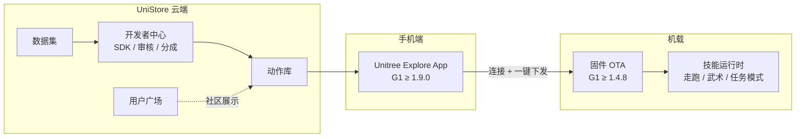

# UniStore（宇树应用平台）

**UniStore**（<https://unistore.unitree.com/>）是宇树科技推出的 **机器人任务与动作应用商店**。用户无需手写底层控制代码，即可像安装手机 App 一样，从云端为已购宇树机器人 **下载、审核通过后部署** 舞蹈、武术、表演及任务类运动算法包。

## 一句话定义

**把宇树机型的运动技能从「实验室自研管线」变成「平台分发商品」——硬件出货之后的官方软件生态入口。**

## 英文缩写速查

| 缩写 | 英文全称 | 简要说明 |
|------|----------|----------|
| OTA | Over-The-Air | 机器人固件无线升级；G1 部署动作前需 ≥ 1.4.8 |
| SDK | Software Development Kit | 开发者中心提供的动作封装与上架工具链 |
| G1 | Unitree G1 Humanoid | 公测期代表机型；走跑与武术模式可一键切换 |
| App Store | Application Store | 官方类比：云端技能包分发与安装 |
| API | Application Programming Interface | 微服务后端与机载运行时的接口层（公开报道口径） |
| Sim2Real | Simulation to Real | 开发者可用共享数据集迭代后再上架真机技能 |

## 为什么重要

- **降低非研发用户的技能门槛：** 在 [Unitree G1](./unitree-g1.md) 大量用于 RL / 模仿学习论文的语境之外，UniStore 面向 **已购机用户** 提供 **零代码** 技能安装路径，把「会不会写控制器」从消费体验中剥离。
- **硬件公司的平台化转折：** 2025-12 内测仅少量动作包；**2026-05-07 全面开放** 后上线开发者入驻、收益分成与用户广场——标志宇树从 **单机交付** 走向 **软硬一体生态运营**（见 [来源归档](../../sources/sites/unitree-unistore.md)）。
- **研究侧的新变量：** 动作库与 **数据集** 模块把真机采集数据与算法包放在同一门户，可能影响 **motion tracking / 技能复现** 的数据来源与 baseline 选择；与自研 [CLAW](../methods/claw.md) 等 **合成数据管线** 形成「平台分发 vs 自训练」对照轴。
- **娱乐与工业并行：** 公开报道同时列举 **李小龙武术** 等 C 端技能与 **物流调度、焊接质检** 等 B 端应用——选型时需区分「观赏动作包」与「产线任务应用」两类商品。

## 流程总览

## 核心结构

### 四大模块

| 模块 | 作用 |
|------|------|
| **用户广场** | 用户与开发者展示、分享技能的社区入口 |
| **动作库** | 浏览、获取、安装官方与用户上传的 **运动算法包** |
| **数据集** | 上传或下载真机数据，支撑训练与算法优化 |
| **开发者中心** | SDK、原创动作上架、**1–5 工作日** 审核、收益分成 |

### 适配机型与代表技能

| 机型 | 语境 |
|------|------|
| **G1** | 全面开放公告中版本门槛最明确（App / OTA 见下表） |
| **H1** | 与 G1 并列的公测适配机型 |
| **B2 / Go2** | 四足/轮足线亦在官方适配列表中 |

**2026-05 开放日动作库（24 个限时免费体验，报道枚举）：** 杰克逊舞、扭扭舞、欢呼、蹦迪、比心、螳螂拳、查尔斯顿舞等。

**2025-12 公测首发三连：** 搞笑动作、扭扭舞、**李小龙截拳道**（可在常规走跑与武术状态间切换）。

### G1 部署前置条件（2026-05 官方公告）

| 检查项 | 最低版本 |
|--------|----------|
| **Unitree Explore**（手机 App） | **≥ 1.9.0** |
| **G1 机载 OTA** | **≥ 1.4.8** |

### 与 [Unitree](./unitree.md) 其他能力的关系

| 能力线 | 与 UniStore 的分工 |
|--------|-------------------|
| **GitHub / SDK / ROS** | 研发者自研全栈、仿真训练与底层驱动 |
| **UniStore** | 终端用户与生态开发者 **分发成品技能包** |
| **[REK](./rek.md) 等娱乐产品** | 第三方联赛/租赁；可与平台动作包叠加，但非官方商店本体 |

## 常见误区

1. **以为 UniStore 等于宇树全部开源代码：** 商店分发的是 **封装后的技能商品**，不替代 [unitree_ros](./unitree-ros.md)、[unitree_rl_mjlab](../../sources/repos/unitree_rl_mjlab.md) 等研发仓库。
2. **以为所有上架应用都是舞蹈武术：** 2025 年底报道中 **物流/制造类应用占多数**，娱乐动作是拉新与演示抓手。
3. **忽略版本门槛：** G1 若 App 或 OTA 低于公告版本，会出现无法安装或模式切换失败——应先对照 App 内机器人信息页。
4. **把「全球首个」等同于「生态已成熟」：** 全面开放初期开发者规模、审核周期与付费模式仍在演进，科研复现应锁定 **具体动作包版本** 与 **固件快照**。

## 与其他页面的关系

- [Unitree](./unitree.md) — 品牌与硬件主线；UniStore 是其 **软件分发层**。
- [Unitree G1](./unitree-g1.md) — 公测与开放公告中最常提及的部署平台。
- [Locomotion](../tasks/locomotion.md) — 走跑模式与武术/舞蹈技能包的 **模式切换** 属于运动能力商品化。
- [Sim2Real](../concepts/sim2real.md) — 开发者可用平台数据集迭代后再上架；终端用户则直接跳过训练链。
- [REK](./rek.md) — 人形娱乐化的 **赛事/租赁** 路径，与 **应用商店装技能** 互补。

## 推荐继续阅读

- UniStore 门户：<https://unistore.unitree.com/>
- 宇树官网：<https://www.unitree.com/>
- 全面开放报道（交叉核对）：[智东西 2026-05-07](https://zhidx.com/p/555813.html)、[与非网 2026-05-09](https://www.eefocus.com/article/2009304.html)
- 首发生态数据（第三方）：[36Kr — Unitree Robot App Store](https://eu.36kr.com/en/p/3595494143311879)

## 参考来源

- [UniStore 官方门户归档](../../sources/sites/unitree-unistore.md)
- 智东西：《刚刚，王兴兴给机器人搞的 App Store，开放了》（2026-05-07）
- 与非网：《宇树全面开放 UniStore，人形机器人迈入「APP 时代」》（2026-05-09）
- 36Kr / 车智：《Unitree Launches the World's First Robot App Store》（2025-12-15）

## 关联页面

- [Unitree（宇树科技）](./unitree.md)
- [Unitree G1](./unitree-g1.md)
- [unitree_ros（ROS1 / Gazebo）](./unitree-ros.md)
- [Locomotion](../tasks/locomotion.md)
- [REK（人形格斗联赛）](./rek.md)
